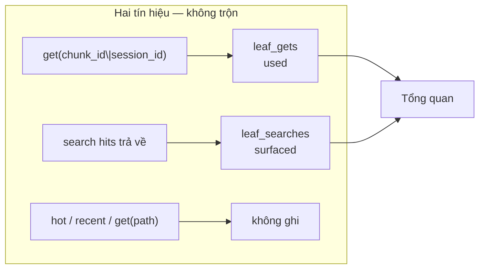
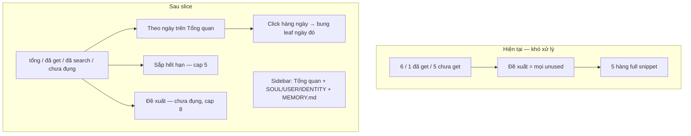
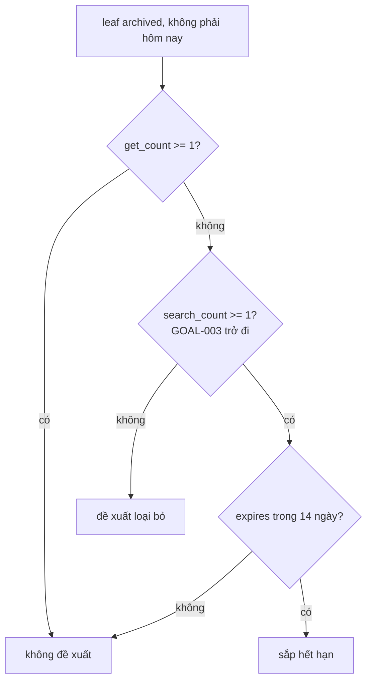

# Memories Tổng quan — bảng điều khiển, không đổ kho

## Summary

Màn `Tổng quan` hiện là dump: 3 số get-only + toàn bộ leaf `get_count=0` (trừ hôm nay) dưới **Đề xuất loại bỏ**. Live 6 leaf / 1 get → 5 hàng full text. Agent đúng thiết kế chỉ `get` khi cần chi tiết; search đủ để trả lời tổng quan — nên “chưa get ≈ đề xuất xóa” không quản lý được.

Slice này **không** đổi retrieval, **không** dạy agent, **không** nút xóa, **không** trộn search vào `used`. Hai tín hiệu tách:

| Tín hiệu | Ý nghĩa | TTL | `used` |
|---|---|---|---|
| `memory_get(chunk_id\|session_id)` | đã đọc đủ | slide (đã có) | có |
| hit trong `SearchResult.hits` | đã hiện ra agent | không | không |
| hot inject / `recent` / `get(path)` | không đếm | không | không |

Phaser: sửa IA overview **trước** (GOAL-001, không schema). Cột search **sau** (GOAL-002/003). Daily **không** còn trang sidebar — xem từng ngày ngay trên Tổng quan.

Supersede trong `memory-usage-stats.md`: assumption “không đếm search hit” (chỉ đúng với `used`); TASK-006 “suggest = mọi unused trừ hôm nay” — hàng đợi suggest bị thay rule + cap. `used`/`unused`/`leaf_gets` giữ nguyên.







Trước GOAL-003 (chưa có search): đề xuất tạm = unused ∩ ¬today, **cap 8**, sort `expires_at ASC` — hết dump cả kho.

## Tasks

### GOAL-001: Tổng quan là dashboard + chỗ xem từng ngày

Không schema. Chủ yếu `webui/js/memories.js` + CSS compact trong `workspace.css`. Sidebar Memories **bỏ** card daily (`2026-08-22.md` / `21` / `20` trong ảnh). Xem mem theo ngày = bung hàng trên Tổng quan, không đổi `activePageIndex`.

| ID | Task | Done | Date |
|----|------|------|------|
| TASK-001 | Overview **không** render toàn bộ `suggest_removal`. Khối: (1) chú thích 1 câu (2) `stat-row` tổng / đã get / chưa get (3) **Theo ngày** (4) **Đề xuất loại bỏ** cap 8. Bỏ progress bar “Đã get 1/6” trên overview — tỉ lệ get thấp là đúng thiết kế, bar làm như hệ thống hỏng | x | 2026-08-22 |
| TASK-002 | **Theo ngày** = index + viewer. Group `stats.leaves` bằng `fileKey`, chỉ daily (`YYYY-MM-DD.md`), sort ngày mới trước. Hàng đóng: tên file, `N leaf · G đã get`, tag `hôm nay` / `daily`. Click **một** hàng → bung `mem-entry` của đúng ngày đó ngay dưới hàng (accordion, tối đa một ngày mở). Click lại để đóng. Không snippet trên hàng đóng. `MEMORY.md` không nằm đây | x | 2026-08-22 |
| TASK-003 | **Đề xuất** (tạm, get-only): `suggest_removal` API cũ, **cắt 8** trên UI, mỗi hàng `topic · day · hết hạn` — **không** dán full `snippet`. Empty: “Không có gợi ý.” Copy: “Chưa get, không gồm hôm nay. Chỉ gợi ý — không xóa từ đây.” | x | 2026-08-22 |
| TASK-004 | ~~Trang file daily giữ inventory~~ — **superseded 2026-08-22**: daily không còn `filePage` trên sidebar. `leafEntry` (Get + Hết hạn, chưa Search) render **trong** accordion Tổng quan. Canonical (`SOUL.md` / `USER.md` / `IDENTITY.md`) và `MEMORY.md` (nếu có leaf `memory#`) vẫn là page sidebar riêng | | |
| TASK-012 | `pagesFromStats` = overview + `canonicalPages` + tối đa một page `MEMORY.md` khi có leaf `memory#`. Không emit page `YYYY-MM-DD.md`. Poll `hydrateMemories({keepPage})` giữ ngày đang mở (`openDay` trên module, không phải page index). `listLabel` sidebar: “Canonical”. Mock `data.js` bỏ daily pages mẫu | x | 2026-08-22 |

Xong khi: sidebar Memories không còn `2026-08-2*.md`; Tổng quan có 3 hàng ngày; click `2026-08-20.md` bung 2 leaf tại chỗ; đề xuất tối đa 8 dòng không full text; mock tĩnh không throw.

### GOAL-002: Đếm search hit (backend)

Additive, gương `leaf_gets`. Không đụng TTL.

```sql
CREATE TABLE IF NOT EXISTS leaf_searches(
  chunk_id        TEXT PRIMARY KEY,
  session_id      TEXT NOT NULL,
  search_count    INTEGER NOT NULL CHECK(search_count >= 1),
  last_search_at  TEXT NOT NULL
);
```

`SCHEMA_VERSION` `"4"` → `"5"`. Migrate v4→v5 = `CREATE TABLE` + `meta.schema_version=5`. Không đi path drop-all của v1/v2. Không FK sang `chunks`.

| ID | Task | Done | Date |
|----|------|------|------|
| TASK-005 | Schema v5 + migrate như trên. `ArchiveStore.record_searches(chunk_ids, session_id, now)` upsert `search_count = search_count + 1`. `leaf_search_map()` / `keep_searches(live)` giống get. `forget` / `purge` / `_refresh_index` xóa hàng search của leaf không còn trên markdown | x | 2026-08-22 |
| TASK-006 | `MemoryFacade.search`: **sau** `hits = with_counts(dedup_siblings(...)[:limit])`, với mỗi hit gọi `record_searches`. Một leaf trong một `SearchResult` → +1. Hai search song song cùng leaf → +2. Không ghi: query rỗng, `timeline_day` invalid, 0 hit, `recent()`, `get`, hot inject, ứng viên FTS/trigram bị cắt trước `[:limit]` | x | 2026-08-22 |

Xong khi: test — search 1 hit +1 đúng leaf; search lần 2 +2; `get`/`path`/`recent`/hot không đổi `leaf_searches`; miss/empty không tạo hàng; forget xóa; v4 file → v5 giữ `chunks` + `leaf_gets`.

### GOAL-003: Stats + API + cột Search

`used` vẫn `get_count>=1`. Search là số riêng.

| ID | Task | Done | Date |
|----|------|------|------|
| TASK-007 | `LeafStat` thêm `search_count: int`, `last_search_at: str \| None` (0 / None khi chưa có hàng). `MemoryStatsResult` thêm `searched` (`search_count>=1`) và `untouched` (`get_count==0` và `search_count==0`). Giữ `unused` = `get_count==0` (không đổi nghĩa) | x | 2026-08-22 |
| TASK-008 | `suggest_removal` mới: archived, ¬today, `get_count==0`, `search_count==0`, sort `expires_at ASC` (NULL cuối), `chunk_id ASC`. **Không cap ở API** — UI cap 8. Today unused không vào. Leaf chỉ bị search (chưa get) **không** vào đề xuất | x | 2026-08-22 |
| TASK-009 | Overview `stat-row`: tổng / đã get / đã search / chưa đụng (`untouched`). Chú thích: “Get = đọc đủ. Search = đã hiện trong kết quả. Hot không đếm. Không xóa từ đây.” Đề xuất dùng list API mới + copy “Chưa get và chưa từng hiện trong search…” | x | 2026-08-22 |
| TASK-010 | Accordion ngày + page `MEMORY.md`: `leafEntry` thêm hàng `Search` cạnh `Get`. Hàng đóng Theo ngày: `N leaf · G đã get · S search` | x | 2026-08-22 |

Xong khi: live sau phiên 21/08 (2 search, 0 get trên 2 leaf 20/08) → leaf đó `search_count>=1`, `used` không tăng, **không** nằm đề xuất; leaf chưa bao giờ hit search + chưa get vẫn đề xuất.

### GOAL-004: Sắp hết hạn (chỉ đọc)

| ID | Task | Done | Date |
|----|------|------|------|
| TASK-011 | Overview thêm khối **Sắp hết hạn** giữa Theo ngày và Đề xuất. Nguồn: `leaves` archived, `expires_at` không NULL và `expires_at <= now+14d`, sort `expires_at ASC`, UI cap 5. Một dòng: topic · day · hết hạn · `get/search`. Không gọi `forget`. Không API field mới nếu JS lọc được từ `leaves` | x | 2026-08-22 |

Xong khi: leaf exp trong 14 ngày hiện ở khối này kể cả khi đã search; leaf exp xa hơn không hiện.

## Test Plan

- `tests/test_memory_stats.py`: giữ contract get (`used`/`unused`, get +1, path/search-cũ không +get). Đổi assert `len(suggest_removal)==3` sau TASK-008 — 3 unused + 0 search vẫn 3; sau khi `search` một leaf, suggest còn 2.
- Test mới cùng file: TASK-006 record rules; TASK-007 `searched`/`untouched`; TASK-008 suggest loại leaf đã search; today không suggest; forget xóa `leaf_searches`; migrate v4→v5 giữ chunks + `leaf_gets`.
- `tests/test_memory_lifecycle.py`: TTL slide khi get — search không slide (assert `expires_at` sau search không đổi).
- `tests/test_serve_memory_stats.py`: JSON có `searched`/`untouched`; POST vẫn 405; mock tĩnh không throw. Parse `memories.js`: có “Theo ngày”; `pagesFromStats` không tạo title khớp `^\d{4}-\d{2}-\d{2}\.md$`.
- `uv run pytest -q`. Không live LLM. Không browser E2E.

## Assumptions

1. Overview = điều khiển **và** chỗ xem daily. Sidebar Memories = Tổng quan + persona + `MEMORY.md`. Không nhân bản daily thành page-card.
2. `used` = đã get. Search không bao giờ cộng `used` hay slide TTL.
3. Đếm search = leaf **có trong payload trả agent** (`SearchResult.hits` sau dedup + limit), không phải mọi ứng viên FTS.
4. Hai `memory_search` song song cùng leaf = +2. Đúng “đã hiện”, không phải “đã dùng”.
5. `recent` / hot / `get(path)` không ghi `leaf_searches`.
6. Suggest sau GOAL-003 = chưa get ∧ chưa search ∧ ¬today. Leaf đã lọt search nhưng chưa get **không** xóa-gợi-ý — đúng câu “hỏi chi tiết mới get”.
7. Cap 8 / 5 / cửa sổ 14 ngày chỉ trên UI. API trả list đủ (trừ today) để test.
8. Không POST, không `memory_forget` tool, không dạy prompt/tool description (TASK-112/113 L2 vẫn mở, plan khác).
9. Không theme mới, không Hallmark rebuild. Token / `.book-reading` giữ. Accordion ngày: một ngày mở, mặc định đóng hết (dashboard sạch).
10. `python -m http.server --directory webui` = mock; field mới optional — JS `Number(...) \|\| 0`.
11. Linux, `~/.thyca/memory.sqlite`, bind loopback như `thyca --serve`.
12. Không hỏi thêm: cap 8, cửa sổ hết hạn 14 ngày, bảng `leaf_searches` riêng (không nhét cột vào `leaf_gets` vì `CHECK get_count >= 1` và forget độc lập).
