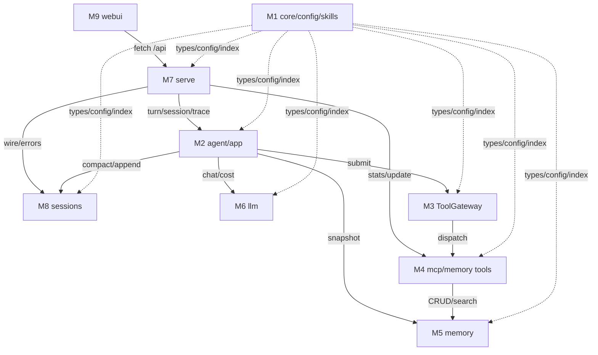

# Module-by-module review: bugs, mirrors, redundant logic + interaction map

## Summary

Read-only review of every Thyca module, one unit at a time, to surface bugs,
mirrored/duplicated logic, and redundant/dead code — plus a verified map of
how modules interact. Output is a ranked fix list; all fixes happen in a
follow-up plan the user scopes after seeing findings. No code changes here.

Units (grounded 2026-09-25; backend ~12.3K lines + WebUI 6 pages):

- M1 foundation: `core/` + `config/` + `skills/` (~1.6K lines)
- M2 runtime spine: `agent/` + `app/` (~2.1K lines)
- M3 execution plane: `tools/gateway/` + `tools/builtin/` + registry +
  task_store + path_guard
- M4 integration plane: `tools/mcp.py` (single file, not a package) + memory facade + memory_tools
- M5 memory: `memory/` (~1.8K lines)
- M6 llm: `llm/` clients + factory + prompts (~1.4K lines)
- M7 serving: `serve/` (~2K lines)
- M8 sessions: `sessions/` (~1.1K lines)
- M9 webui: 6 pages + shared (JS/HTML/CSS)

Execution: two waves (W1 = M1..M5, W2 = M6..M9) with a parent checkpoint
between — the user can stop or redirect after W1. One
`meta/muse-spark-1.3` max agent per unit (user-approved), all read-only and
parallel-safe within a wave. A synthesis agent (same model) then dedups,
ranks, and maps interactions. Parent spot-verifies and presents.

Per-unit report contract (each <1000 words, fixed headings):

1. Bugs — severity (blocker/major/minor) + file:line + trigger/repro.
2. Mirrors — duplicated logic (where × where) + unification proposal.
3. Redundant — dead/unnecessary code + safe-removal note.
4. Interactions — what this unit calls and what calls it (named
   functions/files, not dumps).
5. Test gaps — uncovered behavior worth a test (proposals only).

Success criteria: all 9 units covered; every finding has file:line; final
list deduped and ranked (P0/P1/P2 + effort S/M/L); interaction map covers
all units; suite still 815; tree untouched except this plan file.

## Tasks

### GOAL-001: Wave 1 reviews (foundation, runtime, data)

| ID | Task | Done | Date |
|----|------|------|------|
| TASK-001 | M1 review (`core/` + `config/` + `skills/`) per report contract | x | 2026-09-25 |
| TASK-002 | M2 review (`agent/` + `app/`) per report contract | x | 2026-09-25 |
| TASK-003 | M3 review (execution plane) per report contract; gateway residuals seeded as known | x | 2026-09-25 |
| TASK-004 | M4 review (integration plane) per report contract | x | 2026-09-25 |
| TASK-005 | M5 review (`memory/`) per report contract | x | 2026-09-25 |

### GOAL-002: Wave 2 reviews (llm, serving, frontend)

| ID | Task | Done | Date |
|----|------|------|------|
| TASK-006 | M6 review (`llm/`) per report contract | x | 2026-09-25 |
| TASK-007 | M7 review (`serve/`) per report contract | x | 2026-09-25 |
| TASK-008 | M8 review (`sessions/`) per report contract | x | 2026-09-25 |
| TASK-009 | M9 review (`webui/`) per report contract | x | 2026-09-25 |

### GOAL-003: Synthesis

| ID | Task | Done | Date |
|----|------|------|------|
| TASK-010 | Synthesis agent: dedup + rank (P0/P1/P2, effort S/M/L) + cross-module mirrors + compact interaction map (mermaid) + proposed fix batches; appended to this plan as Findings | x | 2026-09-25 |

### GOAL-004: Parent verify + present

| ID | Task | Done | Date |
|----|------|------|------|
| TASK-011 | Parent: spot-verify sample findings, full suite (must stay 815), confirm tree clean, present ranked list for fix-scope decision | x | 2026-09-25 |

### GOAL-005: Major fixes, interleaved (added 2026-09-25)

| ID | Task | Done | Date |
|----|------|------|------|
| TASK-012 | Fix agent: 6 wave-1 majors only + regression tests each; full suite green | x | 2026-09-25 |
| TASK-013 | Independent re-review of the fix diff (read-only) | x | 2026-09-25 |
| TASK-014 | Parent: verify both fix streams (suite + probes), checkpoint commit | x | 2026-09-25 |
| TASK-015 | Fix agent: 2 wave-2 majors + regression tests; full suite green | x | 2026-09-25 |
| TASK-016 | Independent re-review of the wave-2 fix diff (read-only) | x | 2026-09-25 |

### GOAL-006: B1 fixes (approved 2026-09-25)

| ID | Task | Done | Date |
|----|------|------|------|
| TASK-017 | B1a fix (runtime+serve): F1, F2, F9, F11, F12, F14, F15, F30, F31 + tests | x | 2026-09-25 |
| TASK-018 | B1b fix (memory+sessions): F3, F8, F16–F20, F22, F28, F29, F32, F33, M4-safe-half + tests | x | 2026-09-25 |
| TASK-019 | B1c fix (config+frontend): F4, M9-P2s + tests | x | 2026-09-25 |
| TASK-020 | Independent re-review of B1 diff (read-only) | x | 2026-09-25 |
| TASK-021 | Parent: verify (suite), checkpoint commit | x | 2026-09-25 |

### GOAL-007: Centralize packaged seeds (SUPERSEDED by GOAL-008 2026-09-25)

| ID | Task | Done | Date |
|----|------|------|------|
| TASK-022 | Agent: move seed content to `thyca/seeds/{prompts,skills,guides}/`, update loaders + packaging + tests (struck: GOAL-007 superseded by GOAL-008, done there) | - | 2026-09-25 |
| TASK-023 | Parent: verify (suite), checkpoint commit (struck: GOAL-007 superseded by GOAL-008) | - | 2026-09-25 |

### GOAL-008: Seeds redo + install-time seeding (approved 2026-09-25)

| ID | Task | Done | Date |
|----|------|------|------|
| TASK-024 | Agent: `thyca/seeds/` redo + `thyca --seed` + install.sh hook + tests; suite green | x | 2026-09-25 |
| TASK-025 | Parent: verify (suite), checkpoint commit | x | 2026-09-25 |

### GOAL-009: Code tidies (approved 2026-09-25)

| ID | Task | Done | Date |
|----|------|------|------|
| TASK-026 | Agent: move `agent/skill_event.py` → `skills/skill_event.py` + unify grammar + tests | x | 2026-09-25 |
| TASK-027 | Agent: move `tools/builtin/background.py` → `tools/gateway/background.py` + imports + tests | x | 2026-09-25 |
| TASK-028 | Parent: verify both (suite), checkpoint commit | x | 2026-09-25 |

### GOAL-010: Memory service consolidation (approved 2026-09-25)

| ID | Task | Done | Date |
|----|------|------|------|
| TASK-029 | Agent: move facade+rank → `memory/`, specs stay, imports + tests | x | 2026-09-25 |
| TASK-030 | Parent: verify (suite), checkpoint commit | x | 2026-09-25 |

### GOAL-011: Delete dead repo-root skills/ (done 2026-09-25)

| ID | Task | Done | Date |
|----|------|------|------|
| TASK-031 | Parent direct: delete superseded `skills/create-mcp-tool.md` + dir; verify no refs + suite; commit | x | 2026-09-25 |

### GOAL-012: Delete user-confirmed dead weight (approved 2026-09-25)

| ID | Task | Done | Date |
|----|------|------|------|
| TASK-032 | Agent: inline echo fixture, drop retitle script + asserts, drop hallmark log; suite green | x | 2026-09-25 |
| TASK-033 | Parent: verify (suite), checkpoint commit | x | 2026-09-25 |

### GOAL-013: softTimeoutS-live fix (approved 2026-09-25)

| ID | Task | Done | Date |
|----|------|------|------|
| TASK-034 | Agent: apply softTimeoutS to live gateway + regression test | x | 2026-09-25 |
| TASK-035 | Parent: verify (suite), checkpoint commit | x | 2026-09-25 |

### GOAL-014: Live dev rebuild + acceptance (approved 2026-09-25)

| ID | Task | Done | Date |
|----|------|------|------|
| TASK-036 | Parent direct: wipe live install + ~/.thyca, reinstall dev, seed, verify markers | x | 2026-09-25 |
| TASK-037 | Browser TASK-010 rerun (+TASK-013 if key provided); seed-case tests | x | 2026-09-25 |
| TASK-038 | Parent direct: `muse-spark-1.3-contributor` pricing entry + test | x | 2026-09-25 |

### GOAL-015: B3+B5 fixes (approved 2026-09-25)

| ID | Task | Done | Date |
|----|------|------|------|
| TASK-039 | Agent: B3 memory/session integrity (F13,F21,F23,F34,F35,X1,X10,X13) + tests | x | 2026-09-25 |
| TASK-040 | Agent: B5 webui unification (X28 + dead CSS/JS) — webui only | x | 2026-09-25 |
| TASK-041 | Independent re-review of B3+B5 diff (read-only) | x | 2026-09-25 |
| TASK-042 | Parent: verify (suite), checkpoint commit | x | 2026-09-25 |

### GOAL-016: B4 backend unification (queued after B3)

| ID | Task | Done | Date |
|----|------|------|------|
| TASK-043 | Agent: B4 mirrors (X2–X9,X14–X17,X19–X27 + leftover backend P2s) + tests | x | 2026-09-25 |
| TASK-044 | Independent re-reviews of B4 diff, split ×4 by plane (read-only) | x | 2026-09-25 |
| TASK-045 | Parent: verify (suite), checkpoint commit | x | 2026-09-25 |

### GOAL-017: B2 contract fixes (queued after B4, needs user rulings)

| ID | Task | Done | Date |
|----|------|------|------|
| TASK-046 | Agent: B2 fixes per locked rulings + tests | x | 2026-09-25 |
| TASK-047 | Independent re-review of B2 diff (read-only) | x | 2026-09-25 |
| TASK-048 | Parent: verify B2, commit | x | 2026-09-25 |

### GOAL-018: B6 leftover micro-mirrors + final close (queued after B2)

| ID | Task | Done | Date |
|----|------|------|------|
| TASK-049 | Agent: 9 unnumbered mirrors (dup-name, PathGuard.key, home-dir, meta-cap, last-user, meta-payload, turn-count, ts-parse, canonical-list) + tests | x | 2026-09-25 |
| TASK-050 | Independent re-review of B6 diff (read-only) | x | 2026-09-25 |
| TASK-051 | Parent: final full-suite + report ALL-DONE for key rotation | x | 2026-09-25 |

## Test Plan

- Reviewers may run targeted `pytest` (single files) to confirm a
  suspected bug; full suite is parent-only.
- No new tests in this phase; test proposals go into reports.
- Parent close-out: `uv run --offline pytest -q` (expect 815),
  `git status` (expect clean except this plan), `git diff --check`.

## Assumptions

- Strictly read-only: no edits, commits, or installs by review agents;
  temp-root probes only; no live `~/.thyca`.
- All agents `meta/muse-spark-1.3` max (standing user rule); no
  contributor variant for any role.
- Gateway residual follow-ups (7 items in the archived ToolGateway plan)
  are seeded into M3 as already-known; re-report only if worse found.
- Interaction map is a synthesis artifact, not a call-graph dump; detail
  lives in per-unit reports.
- Fix scope is decided by the user after TASK-011; fixes get their own plan.
- Baseline: checkpoint `b18ab91`, suite 815 passed.
- Interleave 2026-09-25 (user order): fix the 6 wave-1 majors now (fix +
  re-review + parent verify + checkpoint), run wave 2 in parallel (no file
  overlap: fixes touch M1/M2/M4/M5 only, reviews read M6-M9 only). Minors,
  mirrors, redundant items still go through synthesis ranking (TASK-010)
  before any fix-scope decision.
- Wave-2 majors (user order 2026-09-25): same rule — fix the 2 majors now
  (TASK-015/016) in parallel with the wave-1 fix stream (no file overlap:
  wave-2 fixes touch serve trace + dashboard JS only).
- Fix scope 2026-09-25 (user order): B1 approved (GOAL-006, 3 parallel
  streams by file area, no overlap). B2–B5 pending later decision.
- Seeds centralization (user order 2026-09-25): `thyca/seeds/prompts/`
  (from `llm/prompts/`), `thyca/seeds/skills/` (from
  `skills/skills_templates/`), `thyca/seeds/guides/read_before_config.md`
  (from `config/`). Loaders stay in owner modules (path updates only);
  no shared seeds API. Agent executes (TASK-022) strictly AFTER the B1
  checkpoint — B1 streams touch llm/config/memory now.
- Seeds REDO (user order 2026-09-25, supersedes GOAL-007): factory-box
  `thyca/seeds/{prompts,skills,guides}/`; old `skills_templates/` removed
  (`skills/store.py` code stays); install-time `thyca --seed` + install.sh
  hook (copy-if-missing, never overwrite); first-run seeding stays as
  backstop. Skill discovery stays runtime (live scan of ~/.thyca/skills),
  NOT part of seed/install.

## Findings (TASK-010 synthesis 2026-09-25, `meta/muse-spark-1.3` max)

Excluded as already-fixed (not ranked): 8 majors (store save-merge,
chat_app _cfg seed, loop compact-then-snapshot, mcp _failure,
keep_details, canonical# prefix, trace_api lock, usage.js guard) + 3
minors (unused import, explicit-"" assert, _failure reset).
Verification: 25+ refs spot-checked vs HEAD — all match (M7 line numbers
corrected for drift; gateway residuals folded into F35/P2).

### P0 (data loss / security)

- F1 key redaction gaps — only streaming reasoning redacts; non-stream
  reasoning, all content, split-chunk keys persist unredacted
  (`llm/streaming.py:68`, `openai_parse.py:147`,
  `responses_parse.py:157`). M. Fix at ChatReply/persist boundary.
- F2 omitted `apiKey` wipes secret — `_merge_saved_key` keeps only
  exact-`""` (`serve/config_api.py:~24`). S. Likely mitigated by the
  store merge fix — verify first, harden regardless.
- F3 duplicate session ids mutated wholesale — `map_heading`/
  `_remove_session` never break on first match (`memory/writer.py:46-76,
  227-258`). M. Fixed by X11.
- F4 secret file world-readable window — temp under umask, chmod after
  (`config/store.py:150`). S. Use O_CREAT|O_EXCL 0600.

### P1 (selection; full list in synthesis transcript)

Config/validation: F5 provider effort/URL unchecked (S, strictness risk),
F6 unknown keys dropped (M, warn-first?), F7 registry ignores schema types
(M, rejects coerced args), F8 serve drops mistyped fields (S, via X18), F9
_BODY_CAP vs 4000-emoji (S), F10 ValueError→400 masks bugs (M, contract
decision), F11 non-ConfigError escapes save (S). Runtime: F12 content-only
port loses on_content (S), F13 None dispatcher kills act() (M), F14 silent
cancel (S), F15 usage by reference (S). Memory: F16 remember indent+blanks
(S, via X12), F17 invisible-leaf counts (S), F18 raw UnicodeDecodeError (S),
F19 negative limit (S), F20 reinforce ValueError leak (S), F21 usage-txn +
sqlite races (M), F22 purge swaps symlinks (S), F23 locate outside lock (S,
via X13). LLM contracts: F24 truncated SSE (M), F25 failed→success (S),
F26 input drops (M), F27 array content (S) — all need pin-down decisions.
Serve/sessions: F28 stat races (S), F29 missing→corrupt (S), F30 null-byte
(S), F31 daemon double-start (S), F32 rewrite TypeError (S), F33 retitle
hijack (S), F34 limit=all unbounded (S), F35 gateway/_locks eviction (M),
F36 write_spec overclaim (S, enforce-or-reword), F37 blank line bricks
session (M, salvage decision). P2: ~70 cleanup/unification/dead-code items
(M1–M9 §3 + gateway residuals + M9 dead CSS/JS).

### Cross-module mirrors (28; owners)

X1 sessions wire canonicalization, X2 turn-option validation (app), X3
registry enforces types (tools, fixes F7), X4 key merge (config, fixes F2),
X5 one redact/cap (llm), X6 truncate_to_cap (core), X7 one atomic write
(config, folds F4), X8 canonical reader (memory), X9 day() (memory), X10
visibility predicate (memory), X11 block iterator (memory, fixes F3), X12
format_body (memory, fixes F16), X13 writer owns locking (memory, fixes
F23), X14 absolutize (tools), X15 BaseConnect+shared parsers (llm), X16
PromptManager sole loader (llm), X17 token estimator (core), X18 normalize
in facade (memory, fixes F8), X19 skill grammar (skills), X20 turn registry
(app), X21 build_agent_loop (app), X22 onboarding request helper (app), X23
Delta base (agent), X24 meta builder (agent), X25 range table (config), X26
serve helpers, X27 execution.py helpers (tools), X28 shared/js (webui).

### Interaction map

### Proposed fix batches

- B1 safe correctness first (P0 + race/error-shape P1s, no contract
  change): F1–F4, F8–F9, F11–F12, F14–F20, F22, F28–F33 + safe halves.
- B2 contract decisions (ruling before code): F5,F6 (F7 via B4/X3), F10, F24–F27,
  F36–F37 + residuals (paged cursor, hard≤soft). Behavior-change risk here.
- B3 memory/session integrity (M, after B1): F13, F21, F23, F33–F35 +
  X10–X13, X1 wire part.
- B4 backend unification (L, mechanical): X2–X9, X14–X17, X19–X27. (X3 implements locked F7-strict, consuming F7 from B2; X19 already done in the skill_event move — excluded.)
- B5 WebUI unification + dead code (M): X28 + dead CSS/JS + M9 P2s +
  leftover P2 one-liners.

## B2 rulings (locked 2026-09-25, parent-decided per user delegation)

Binding for TASK-046. Rationale: fail fast where the input could never
work; warn where forward-compat matters; never silently corrupt.
- F5 provider effort/URL: STRICT like ModelCfg (scheme must be http(s);
  effort vs global set only when the model declares no own set; error
  names the fix). A non-http URL or junk effort never worked — late
  failure is worse.
- F6 unknown config keys: WARN listing the keys, keep ignoring (never
  reject — newer-config-on-older-binary must not break). Agent picks
  the warning channel (parse is pure).
- F7 registry types: STRICT. Reject mistyped args with a clear arg
  error instead of coercing. MCP specs included only where their own
  schemas declare types; handlers keep domain validation.
- F10 ValueError→400: TYPED. Known validation failures → 400 with a
  reason (empty/too-long/invalid); unexpected ValueErrors → 500 + log.
  Audit every ValueError on the turn path.
- F24 truncated SSE (clean EOF, no DONE): ERROR (provider-incomplete),
  parity with the Responses path. Partial turns must not masquerade.
- F25 failed/incomplete status without error object: RAISE as provider
  error. Failed means failed; no silent empty turns.
- F26 Responses input drops: RAISE on tool-result-without-id (always a
  bug); pass None-content/empty-system through as empty (provider
  decides, mirroring the chat path).
- F27 array SSE content: ERROR, parity with the non-stream path that
  already raises on the same shape. No silent text loss.
- F36 write overclaim: REWORD description to match allow-behavior (the
  test locks allow; enforcing would break agent-assisted config edits).
  No new denial anywhere, auth.json included.
- F37 blank line bricks session: SKIP blank/whitespace-only lines on
  load (sessions self-heal; a blank line carries no information).
- Paged-vs-check cursor: DOCUMENT independence (tool_read description
  + code comment). No behavior change — naive advancing would skip
  unseen bytes on non-contiguous pages.
- Hard≤soft edge: ACCEPT + one-line comment citing the 59–60s
  boundary. Deterministic beats restoring a corner guarantee.
