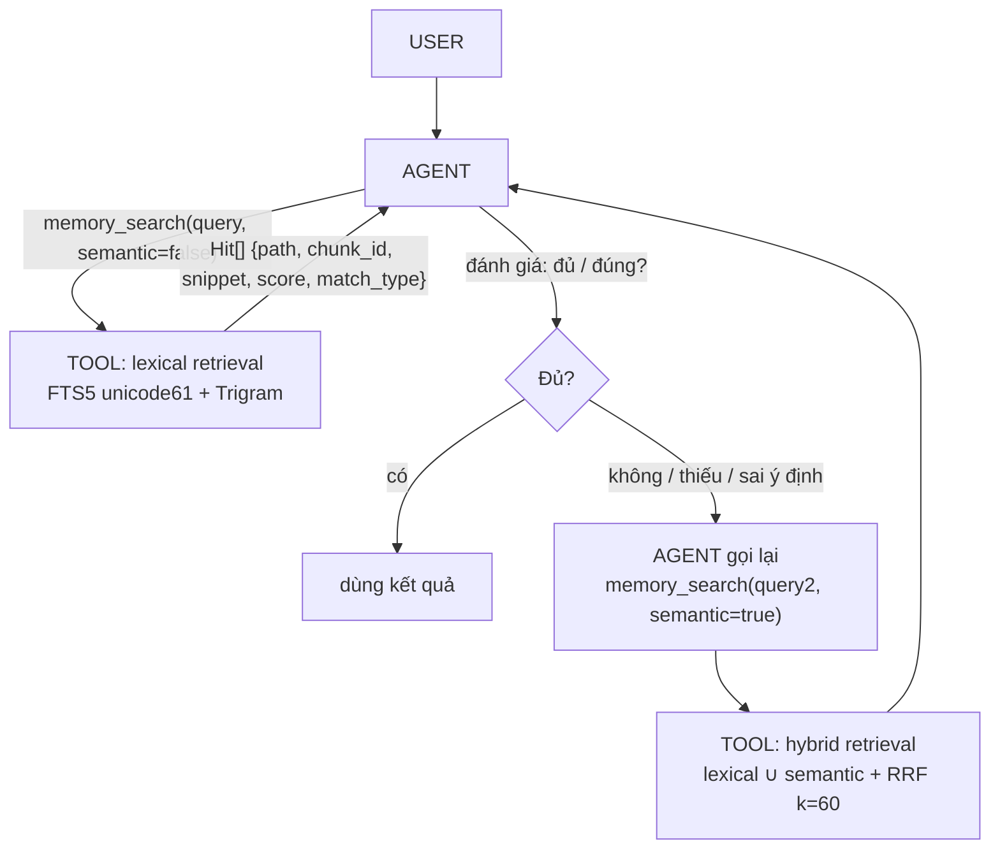
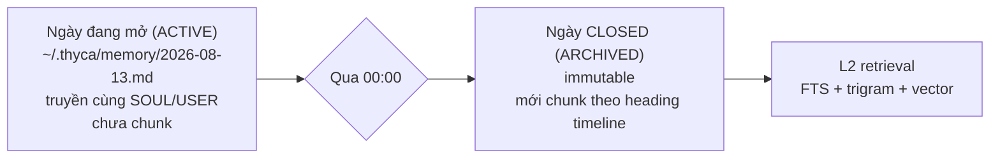
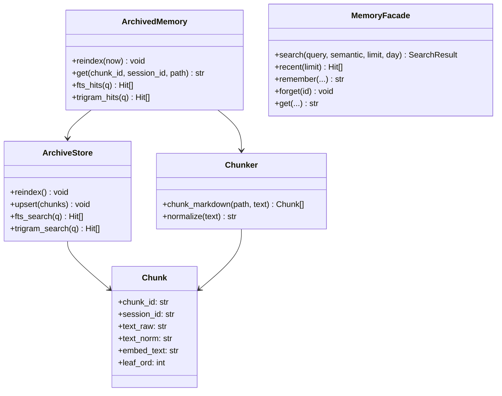
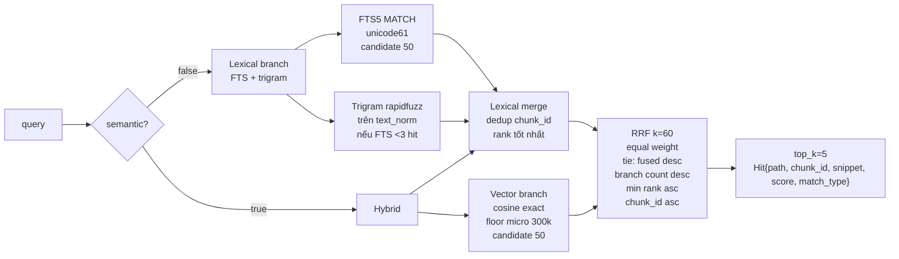

# L2 Memory — Agentic Retrieval (Agent là controller)

## Summary

Mở rộng GOAL-006 thành **L2 hybrid retrieval** do agent điều khiển. **Code v1 hiện tại chỉ chạy lexical** (FTS5 + trigram). Kiến trúc `semantic=true` (lexical + exact vector + RRF) giữ trong plan này, chưa implement lại: 2026-08-19 gỡ numpy/onnxruntime/tokenizers/sqlite-vec và revert runtime về `16aa38e`. Tool không tự fallback ngầm. Markdown vẫn là source of truth; SQLite chỉ là derived index.

Flow chốt (agent là retrieval controller):



Tool chỉ trả **evidence + score + match_type**, không trả `confidence 0-1`. Tham chiếu `another-brain`: `unicode61 remove_diacritics 2`, RRF `k=60`, `candidate_limit=50`, `top_k=5`, `cosine_floor=0.30`, safe MATCH — tái dùng.

> `TASK-014/015` trong `thyca-harness-v1.md` là lịch sử FTS-only và đã được supersede; contract thi công hiện tại nằm ở plan này.

---

## L2 là gì — Active vs Archived

- **Active** (`thyca/memory/active.py`): `SOUL.md` + `USER.md` **cả file** mỗi lượt. `MEMORY.md` + daily hôm nay = tail `hotTailKB`. Hôm qua tail capture một lần lúc `open_session` / `--continue`. **Không chunk, không embed**. Full `MEMORY.md` khi cần: `memory_get(path)`. Chi tiết ở `services/memory.md`.
- **Archived** (`thyca/memory/archived.py` + `chunk.py`): daily đã **đóng ngày** (`timeline_day < hôm nay`) qua `memory_search` / `memory_recent` / `memory_get`. Hôm qua vừa active (tail lúc mở session) vừa archived (được index). File hôm nay không index. `SOUL.md`, `USER.md`, `MEMORY.md` luôn indexable, `timeline_day=NULL`.
- Khi semantic model unavailable, `semantic=true` trả lexical results kèm warning; không crash và không giả vector score.



> Vì sao không chunk luôn: tránh duplicate (hot đã chứa) + tránh n lần embed khi append daily. Trong ngày LLM thấy raw nên paraphrase tự xử. Vector chỉ cứu ngày cũ / hot bị `compaction` cắt (v1 daily vài trăm dòng, không cắt).

## Class — Archived lexical (4 class SOLID)

Chốt 2026-08-17. Slice đầu = GOAL-002. Không gộp remember / vector / model pull vào đây.

| Class | File | Trách nhiệm |
|-------|------|-------------|
| `Chunk` | `chunk.py` | Entity 1 leaf |
| `Chunker` | `chunk.py` | Policy: `## HH:mm` → leaf, split/gộp |
| `ArchiveStore` | `archived.py` | I/O: schema SQLite, reindex, FTS |
| `ArchivedMemory` | `archived.py` | Kho: reindex, get theo id. Search/recent ở `MemoryFacade` |

`Hit` / `SearchResult` là dataclass trả về, không phải class SOLID thứ 5.

Ngoài slice: `memory_remember` → Tools. Vector/Harrier/`model pull` → GOAL-003 (`Embedder` lúc đó).



`semantic=true` ở slice này: lexical + warning `semantic unavailable` nếu chưa có Embedder. Không giả vector score.

SQL sống ở `thyca/memory/schema.sql`. `ArchiveStore` chỉ `executescript` file đó.

### Lifecycle — remember / forget / reinforce / TTL

Chốt 2026-08-17. Code ở Tools facade (`thyca/tools/memory.py`) + `ArchiveStore` lọc/cập nhật index. Markdown là nguồn. Không daemon.

Heading do code ghi (một comment):

```md
## 08:00 — ăn sáng bún bò <!-- thyca:a1b2c3d4 imp=3 exp=2026-11-15T00:00:00Z -->
```

`imp` 1..5 → TTL: `1=3 ngày, 2=1 tuần, 3=1 tháng, 4=3 tháng, 5=6 tháng`. Default `imp=3` (1 tháng). `exp` = UTC `YYYY-MM-DDTHH:mm:ssZ`. `SOUL.md` / `USER.md` không TTL, không `forget` cả file. `get` reset TTL.

Một mốc: `expires_at`. Hết hạn hoặc `forget` → xóa heading+leaf trên markdown rồi reindex. Không `forgotten_at`, không grace 30 ngày.

```python
def memory_remember(
    topic: str,
    summary: str,
    content: str = "",
    target: Literal["daily", "user", "memory", "soul"] = "daily",
    importance: int = 3,
) -> str:
    # daily|memory: append ## HH:mm — topic <!-- thyca:entry_id imp exp -->
    # user|soul: atomic rewrite, no TTL
    # return session_id (daily/memory) hoặc canonical#name

def memory_forget(session_id: str) -> None:
    # daily|memory only. Gắn forgotten=now trên heading, reindex.
    # Search/get ẩn ngay. Reject canonical#soul|#user.

def memory_reinforce(session_id: str, importance: int | None = None) -> str:
    # Xóa forgotten nếu còn grace. Đặt lại exp từ imp (giữ hoặc đổi).
    # return exp mới. Reject nếu đã purge hoặc không tìm thấy.

def memory_get(chunk_id=None, session_id=None, path=None) -> str:
    # đúng một selector. Expired/forgotten → not found.
    # chunk_id|session_id: gia hạn exp (sliding, cùng imp). path: không gia hạn từng entry.

def memory_search(...) -> SearchResult:
    # không gia hạn. không trả expired/forgotten.
```

Hết hạn vs forget:

| Trạng thái | Search/get | Markdown |
|---|---|---|
| còn hạn | hiện | nguyên |
| `exp <= now`, chưa forget | ẩn | nguyên |
| `forget`, grace ≤30 ngày | ẩn | heading còn, có `forgotten=` |
| `forgotten + 30 ngày` | ẩn | `reindex` xóa cả heading+leaf |

`reinforce` trong grace hoàn tác forget. Quét purge chỉ lúc `reindex`/startup. `search` không đụng TTL.

Keyed lock theo file path cho mọi mutate (`remember`/`forget`/`reinforce`/`get`-touch heading).

---

## Kiến trúc Chunking (chốt — lazy day-close)

### ⚠️ Hierarchy — ĐỪNG QUÊN KHI CODE

```
memory/2026-08-13.md              ← TIMELINE (1 file = 1 ngày, partition)
│  # 2026-08-13
├─ ## 08:00 — ăn sáng bún bò      ← SESSION TOPIC (1 heading = 1 session, do code tạo)
│   ├─ - Ăn bún bò Huế ở quán X, khá ngon   ← LEAF 1 (1 chunk = 1 leaf, đơn vị index)
│   └─ - Nói chuyện với Luna về đồ án       ← LEAF 2 (1 chunk)
├─ ## 19:30 — ăn thịt quay Q1     ← SESSION TOPIC
│   ├─ - 19:30 ăn thịt quay với bạn ở Q1    ← LEAF 3 (chunk)
│   └─ - 20:30 bàn mai thử đồ nướng         ← LEAF 4 (chunk)
└─ ## 21:00 — bàn mai ăn gì       ← SESSION TOPIC
    └─ - chốt mai ăn đồ nướng Hàn           ← LEAF 5 (chunk)
```

- **Timeline**: file `memory/YYYY-MM-DD.md` + header `# YYYY-MM-DD`. Là partition cho `WHERE timeline_day = ?`.
- **Session topic**: heading `## HH:mm — <title 3-8 từ>`. Chính là `topic` của `another-brain`. Do **code sinh** từ `memory_remember(topic)`, không cho LLM tự `write` raw.
- **Leaf (chunk)**: mỗi `bullet (-/* /1.)` / `paragraph` / `code fence` dưới heading là một chunk. FTS/trigram chạy trên leaf body; heading giữ ở metadata và được prepended **chỉ cho `embed_text`** để semantic retrieval có context mà lexical ranking không bị cùng một heading lặp trên mọi sibling.

### Vì sao không `1 file = 1 hàng` hay `1 session = 1 chunk`

|  | 1 file = 1 embedding | 1 session = 1 chunk (300-600 từ) | **1 leaf + heading copy (chốt)** |
|---|---|---|---|
| **Semantic** | Loãng, `thịt quay` chìm → cosine tụt | Ổn nhưng 2 ý trong 1 chunk → nhiễu | Mỗi leaf ngắn ~20-150 từ; `embed_text` có heading prefix để giữ context |
| **FTS** | `snippet()` trả cả file | Trả cả session | **Index leaf raw**, snippet đúng leaf, heading trả riêng trong Hit |
| **Trigram** | Nhiễu | Trung bình | **So trên leaf ngắn** → `cafee` vs `cà phê` score cao |
| **Reindex** | Re-embed cả file mỗi append | Re-embed cả session | **Mỗi leaf hash riêng** → qua ngày chỉ embed leaf mới |

Tham chiếu `another-brain`: không chunk nhưng bù bằng `topic(12t) + summary(256t)` làm payload. Thyca copy: `topic = session heading`.

### Luồng ghi — LLM chỉ gọi `remember`, CODE tự quăng vào md

```
LLM (quyết WHAT)              CODE (quyết HOW)                     FILE
"nên nhớ bữa sáng"  →  remember(topic, summary, content)  →  append vào memory/{today}.md:

remember(
  topic="ăn sáng bún bò",              →  heading_raw = "## 08:00 — ăn sáng bún bò"  (HH:mm = now, code tự lấy)
  summary="Ăn bún bò Huế ở quán X",    →  leaf_raw    = "- Ăn bún bò Huế ở quán X, khá ngon"
  content="khá ngon, 45k"  (optional)  →  leaf_raw   += "\n  khá ngon, 45k"
)
                                                                    ↓
                                                          # 2026-08-13
                                                          ## 08:00 — ăn sáng bún bò
                                                          - Ăn bún bò Huế ở quán X, khá ngon
                                                            khá ngon, 45k
```

**Contract `memory_remember` (coder phải enforce):**

```python
def memory_remember(
    topic: str,
    summary: str,
    content: str = "",
    target: Literal["daily", "user", "memory", "soul"] = "daily",
) -> str:
    # topic: 3-8 từ, ≤12 Harrier tokens; thành heading cho target=daily
    # summary: 1-2 câu tự chứa, ≤256 tokens — leaf chính
    # content: chi tiết ≤1024 ký tự — continuation của leaf, không embed riêng
    # timeline_day + HH:mm: code lấy theo configured timezone, LLM không truyền
    # target canonical dùng atomic rewrite; target=daily dùng locked append
    # return stable path + generated session_id
```

- **CẤM** builtin `write`/`edit` đụng mọi resolved path dưới `~/.thyca`; `memory_remember` là tool writer duy nhất cho memory files. Internal Config/Session/Memory writers không đi qua builtin guard. Path ngoài `~/.thyca` vẫn theo product tool contract.
- Memory mutation dùng keyed lock theo canonical target path. Hai remembers cùng daily phải tạo hai complete entries, không interleave/mất dữ liệu.
- Trong ngày daily là **HOT** — nhét raw tail vào prompt, chưa chunk. Qua `00:00` thành **COLD** mới tách leaf → FTS/trigram/vector.
- Nếu LLM lười không `remember`, harness chỉ **nhắc** khi session close (`gap >2h` / exit): `system: tóm session này thành remember?` — vẫn LLM quyết, không daemon tự ghi.

### Đơn vị chunk = 1 leaf + heading copy

File daily sau khi đóng ngày (ví dụ đã chốt của bạn):

```md
# 2026-08-13
## 08:00 — ăn sáng bún bò
- 08:00 ăn sáng với bún bò - nội dung ...................
- nói chuyện với Luna

## 19:30 — bàn đồ nướng
- 19:30 ăn thịt quay với bạn ở Q1, quán đông lắm
- 20:30 bàn mai rủ Luna thử đồ nướng

## 21:00 — bàn xem mai ăn gì
- xem menu, chốt mai ăn đồ nướng Hàn
```

Sẽ thành 5 chunks (mỗi `- ...` là 1 chunk):

| chunk_id | session_id | session_title | leaf_raw |
|---|---|---|---|
| `2026-08-13#a1b2c3d4#1` | `2026-08-13#a1b2c3d4` | `ăn sáng bún bò` | `- 08:00 ăn sáng với bún bò - nội dung ...` |
| `2026-08-13#a1b2c3d4#2` | `2026-08-13#a1b2c3d4` | `ăn sáng bún bò` | `- nói chuyện với Luna` |
| `2026-08-13#e5f6a7b8#1` | `2026-08-13#e5f6a7b8` | `bàn đồ nướng` | `- 19:30 ăn thịt quay với bạn ở Q1` |
| `2026-08-13#e5f6a7b8#2` | `2026-08-13#e5f6a7b8` | `bàn đồ nướng` | `- 20:30 bàn mai thử đồ nướng` |
| `2026-08-13#c9d0e1f2#1` | `2026-08-13#c9d0e1f2` | `bàn xem mai ăn gì` | `- xem menu, chốt mai ...` |

`session_id = timeline_day#entry_id` (`entry_id` = 8 hex trong heading `<!-- thyca:entry_id -->`). `chunk_id = session_id#leaf_ord`. Không dùng `HH-mm` trong id — hai heading cùng phút vẫn tách.

Quy tắc tách (deterministic, theo thứ tự):

1. **Split theo `## HH:mm` heading**: mỗi `##` + body đến `##` kế tiếp là 1 session. Header `# YYYY-MM-DD` là container, không phải chunk.
2. **Tách leaf trong session**: mỗi `bullet` / `paragraph` / `code fence` là một chunk. `heading_raw/session_title` là metadata; heading chỉ prepend vào `embed_text`, không lặp vào FTS/trigram body.
3. **Gộp mảnh vụn**: leaf <20 ký tự (sau strip) gộp với leaf kế tiếp cùng session.
4. **Cắt khi quá dài**: nếu leaf > 800 ký tự **hoặc** >256 tokens (`BUDGET_DOCUMENT` Harrier) → cắt body theo câu (`\.!?`/`。`) hoặc dòng, không overlap, mỗi mảnh giữ `heading prefix`. Không silent truncate.
5. **Chuẩn hóa**: `text_raw` giữ leaf gốc và là cột FTS để `snippet()` trả tiếng Việt có dấu. `text_norm = NFD strip combining + lowercase` chỉ dùng cho rapidfuzz. FTS tự xử lý không dấu bằng tokenizer `unicode61 remove_diacritics 2`. `embed_text = normalize(session_title) + "\n" + normalize(summary/leaf)`; content continuation dài vẫn nằm trong `text_raw` nhưng không làm loãng embedding.

Ví dụ case giết lexical (file 2026-08-13 đã đóng):

```
leaf chunk "## 19:30 — Q1 với bạn\n- Ăn thịt quay"
  FTS payload  "- Ăn thịt quay"
  embed_text  "q1 voi ban\nan thit quay"
query "món nướng hôm nọ" → "mon nuong hom no"
  FTS: 0 hit | trigram dưới threshold | vector semantic cứu
```

Fallback: file cũ không có `##` → mỗi `bullet`/`paragraph` là 1 chunk với `session_title = ""`, vẫn index được.

### Schema (source metadata + chunks + FTS external-content)

```sql
PRAGMA foreign_keys = ON;

CREATE TABLE source_files(
  path          TEXT PRIMARY KEY,
  source_kind   TEXT NOT NULL CHECK(source_kind IN ('daily','canonical')),
  timeline_day  TEXT,                         -- NULL cho SOUL/USER/MEMORY
  mtime_ns      INTEGER NOT NULL,
  size_bytes    INTEGER NOT NULL,
  CHECK((source_kind='daily' AND timeline_day IS NOT NULL)
     OR (source_kind='canonical' AND timeline_day IS NULL))
);

CREATE TABLE chunks(
  row_id         INTEGER PRIMARY KEY,
  chunk_id       TEXT NOT NULL UNIQUE,
  path           TEXT NOT NULL REFERENCES source_files(path) ON DELETE CASCADE,
  source_kind    TEXT NOT NULL CHECK(source_kind IN ('daily','canonical')),
  timeline_day   TEXT,                         -- NULL cho canonical
  session_id     TEXT NOT NULL,                -- daily: timeline_day#entry_id ; canonical: canonical#name
  session_title  TEXT NOT NULL,
  heading_raw    TEXT NOT NULL,
  leaf_ord       INTEGER NOT NULL,
  line_start     INTEGER NOT NULL,
  line_end       INTEGER NOT NULL,
  text_raw       TEXT NOT NULL CHECK(length(text_raw)>0),
  text_norm      TEXT NOT NULL CHECK(length(text_norm)>0),   -- rapidfuzz only
  embed_text     TEXT NOT NULL CHECK(length(embed_text)>0),
  content_hash   TEXT NOT NULL,                 -- sha256 structural raw chunk
  embedding_hash TEXT NOT NULL,                 -- sha256(profile_id + NUL + embed_text)
  profile_id     TEXT NOT NULL,                 -- provider/model/dim/prompt revision
  embedding      BLOB,                          -- NULL while unavailable/pending
  UNIQUE(path, session_id, leaf_ord)
);
CREATE INDEX chunks_day ON chunks(timeline_day, session_id, leaf_ord);
CREATE INDEX chunks_path ON chunks(path);
CREATE INDEX chunks_content_hash ON chunks(content_hash);
CREATE INDEX chunks_profile ON chunks(profile_id, embedding_hash);

-- FTS indexes raw text so snippet() returns Vietnamese with accents.
-- unicode61 handles accent-insensitive matching; text_norm stays for trigram.
CREATE VIRTUAL TABLE chunks_fts USING fts5(
  text_raw,
  content='chunks', content_rowid='row_id',
  tokenize='unicode61 remove_diacritics 2'
);
CREATE TRIGGER chunks_ai AFTER INSERT ON chunks BEGIN
  INSERT INTO chunks_fts(rowid, text_raw) VALUES (new.row_id, new.text_raw);
END;
CREATE TRIGGER chunks_ad AFTER DELETE ON chunks BEGIN
  INSERT INTO chunks_fts(chunks_fts, rowid, text_raw) VALUES ('delete', old.row_id, old.text_raw);
END;
CREATE TRIGGER chunks_au AFTER UPDATE ON chunks BEGIN
  INSERT INTO chunks_fts(chunks_fts, rowid, text_raw) VALUES ('delete', old.row_id, old.text_raw);
  INSERT INTO chunks_fts(rowid, text_raw) VALUES (new.row_id, new.text_raw);
END;

-- Trigram v1: rapidfuzz in-memory trên chunks.text_norm (<10k chunks).
-- Nếu benchmark >50ms: evaluate an FTS5 trigram table in a later measured task.
-- Vector: exact cosine, sqlite-vec when available, NumPy fallback.
```

- `memory.sqlite` chỉ là index. Xóa md → transaction reindex xóa `source_files` + cascaded chunks/FTS → hết hit.
- Daily hôm nay không có chunk cho đến ngày sau. Canonical files có `source_kind='canonical', timeline_day=NULL` và được reindex khi mtime/size đổi.
- `memory_get(chunk_id)` đọc một leaf; `memory_get(session_id)` reconstruct heading + leafs theo `leaf_ord`. HOT today đã ở prompt nhưng direct get vẫn validate ID/path nếu được gọi.

### Raw context meta & chunk mẹ (code tự quản — đừng quên)

> **Nguyên tắc:** FTS/trigram chỉ index leaf body; `embed_text` có heading + leaf summary. Không branch nào nhúng cả `session_raw`, vì sibling vectors sẽ bị đồng hóa. Chunk mẹ chỉ được reconstruct khi agent gọi `memory_get(session_id)`.

1. **Cấu trúc mẹ/con:** không tạo bảng `sessions` ở v1. Reconstruct trực tiếp:
   ```sql
   SELECT heading_raw, group_concat(text_raw, '\n' ORDER BY leaf_ord) AS session_raw
   FROM chunks WHERE session_id=? GROUP BY session_id
   ```
2. **Stable session ID:** `memory_remember` tạo `entry_id` random 8 hex và ghi vào heading comment `## HH:mm — topic <!-- thyca:entry_id -->`; `session_id = timeline_day#entry_id`. Parser legacy không có comment dùng deterministic hash của path + heading occurrence. Hai entries cùng phút không collision.
3. **Khi retrieval:** `memory_search` trả leaf + `session_id/leaf_ord/session_leaf_count/has_more`; FTS/trigram không chứa heading, vector chỉ chứa heading + leaf summary, không chứa `session_raw`.
4. **Khi cần ngữ cảnh:** agent thấy snippet mơ hồ hoặc `has_more=true` → gọi `memory_get(session_id)`. Giới hạn tối đa 10 leaf và cap serialized result theo tool-result budget; nếu lớn hơn trả continuation metadata thay vì silent truncate.
5. **Không eager expand:** search không tự trả siblings. Chỉ đổi policy sau metric thật; không tạo bảng/cache mẹ speculative trong v1.

### Reindex (lazy day-close, hash per leaf)

```
today = timeline_day(config.timeline.timezone)
profile = embedding_profile(provider, model, dimension, query_prompt_revision)
scan exact sources:
  canonical = ~/.thyca/{SOUL,USER,MEMORY}.md       # always index, timeline_day=NULL
  daily     = ~/.thyca/memory/YYYY-MM-DD.md       # strict filename/header agreement

for path:
  classify source_kind/timeline_day
  if daily.timeline_day >= today: skip             # HOT/future; do not index
  stat mtime_ns,size; unchanged source_files row -> skip lexical parse
  if unchanged but any chunk.profile_id != profile.id:
    update embedding_hash/profile_id for existing chunks; set embedding=NULL; enqueue
  parse -> leaf chunks when source content changed
  content_hash   = sha256(structural raw chunk)
  embedding_hash = sha256(profile.id + NUL + embed_text)
  diff by stable chunk_id:
    same content_hash + embedding_hash -> keep row/vector
    content changed -> update raw/FTS; vector=NULL if embedding_hash changed
    profile changed -> keep lexical data, set new profile/hash and vector=NULL
    removed -> DELETE
  transaction: upsert source_files/chunks + FTS triggers; commit
  outside transaction: batch embed pending rows
  short transaction: UPDATE embedding only WHERE chunk_id/profile_id/embedding_hash still match

delete source_files rows for disappeared exact sources -> cascade chunks/FTS
```

Chạy lúc startup, timezone day rollover, và sau `memory_remember` cho canonical targets. Daily hôm nay chỉ được indexed sau rollover/startup ngày kế tiếp. DB mutation dùng `BEGIN IMMEDIATE` + bounded busy retry; file read được xác nhận stat trước/sau để tránh index snapshot đang đổi.

> Nếu sau này daily phình >1000 từ gây hot truncation → đổi `>=` thành `>` (eager: session close → chunk) không đổi schema.

### Retrieval trên chunk (lexical + trigram + vector → RRF)



- **Safe MATCH**: normalize/split non-alnum/dedup, escape each term as an FTS phrase, join `OR`. Punctuation-only → no FTS; `semantic=false` returns empty + validation hint, `semantic=true` may still run vector for the non-empty stripped query.
- **FTS**: query `chunks_fts.text_raw`, join `chunks` by rowid, use `bm25(chunks_fts)` and `snippet(chunks_fts, 0, '⟨', '⟩', '…', 6)`. No day filter includes canonical + all closed daily; explicit `timeline_day` restricts to daily rows of that date. Order `bm25 ASC, chunk_id ASC`, cap 50.
- **Trigram**: when FTS has <3 candidates, run rapidfuzz on `chunks.text_norm`; explicit day filter follows FTS scope. Threshold is benchmarked but locked for release; no unmeasured automatic schema switch.
- **Vector**: exact cosine only over rows with `embedding IS NOT NULL AND profile_id=current_profile`; validate BLOB dimension before scoring. `micro_key=round(cosine*1e6)`, floor 300000, order desc + chunk_id, cap 50. sqlite-vec and NumPy must return the same ordering.

> ⚠️ Nhánh vector là kiến trúc frozen từ GOAL-007 (580ae03 đã gỡ embedding runtime và cột vector khỏi `schema.sql` v3; `chunks.embedding` không còn tồn tại). Không implement lại như đã có — nếu làm lại, bắt đầu từ plan này + decision `../decisions/2026-08-18-l2-embedding-blob.md` (superseded).
- **Fusion**: `rrf_fuse(lexical, vector, k=60, top_k=limit)`, equal weight, deterministic tie-break. Lexical-only hits are not cosine-gated. If siblings from one session occupy multiple final slots, keep highest-ranked leaf and expose `session_leaf_count/has_more`; do not eager merge content.
- **Snippet**: FTS snippet comes from raw accented `text_raw`; trigram/vector-only uses first 250 characters + heading metadata. Tool-result cap applies after serialization.
- **Expansion**: Hit contains `session_id`; agent calls `memory_get(session_id)` only when it needs mother context. No eager siblings.
- **Filter ngày**: `timeline_day` accepts strict `YYYY-MM-DD`. Canonical chunks have `timeline_day=null` and appear only when no date filter is supplied.

### Trả về

```python
SearchResult = {
  hits: list[Hit],
  warnings: list[str],             # e.g. semantic unavailable -> lexical fallback
  semantic_requested: bool,
  semantic_used: bool,
}
Hit = {
  path: str,
  source_kind: "daily" | "canonical",
  chunk_id: str,
  timeline_day: str | None,        # NULL for SOUL/USER/MEMORY
  session_id: str,                 # daily#entry_id or canonical#name
  heading: str,
  snippet: str,                    # raw accented leaf evidence
  score: float,
  match_type: "fts"|"trigram"|"semantic"|"hybrid",
  bm25: float | None,
  vector_score: float | None,
  profile_id: str | None,          # set when vector branch contributed
  leaf_ord: int,
  session_leaf_count: int,
  has_more: bool,
  line_start: int,
  line_end: int,
}
# Search never includes session_raw. Expand only with memory_get(session_id).
```

```python
# Exactly one selector is required. `path` must be one of the exact memory markdown sources.
def memory_get(
    chunk_id: str | None = None,
    session_id: str | None = None,
    path: str | None = None,
) -> str | list[dict]:
    # chunk_id: one indexed leaf
    # session_id: ordered mother context, capped with continuation metadata
    # path: canonical/closed-daily raw markdown only; reject config/session/arbitrary path
```

### So sánh với another-brain

| Điểm | another-brain | Thyca L2 (này, lazy) |
|---|---|---|
| Đơn vị | 1 row = 1 entry (`topic+summary` curated) | 1 row = 1 leaf dưới `## HH:mm` (topic = heading) |
| Embed payload | `topic + "\n" + summary` (content không embed) | `normalize(session_title) + "\n" + normalize(summary/leaf)`; content dài chỉ FTS |
| FTS | `topic, summary, content` weight `5:3:1` | raw leaf body, `unicode61 remove_diacritics 2`; raw accented snippet |
| Trigram | không | rapidfuzz trên `text_norm` khi FTS thiếu |
| Vector | Harrier q4 640d exact cosine | exact cosine cùng profile; daily lazy + canonical always |
| Chunking | reject over budget, không chunk | daily heading→leaf; canonical paragraph/leaf; >800c/256t split |
| Fusion | RRF k=60, candidate 50, top 5, floor 0.30 | giữ nguyên + sibling dedup |
| Lifecycle | `remember` xong search được ngay | canonical reindex ngay; daily hôm nay HOT, qua ngày mới L2 |

---

## Local model identity and install contract

Thyca owns its manifest; it must not import another project's runtime manifest. Locked Harrier profile:

- repository: `onnx-community/harrier-oss-v1-270m-ONNX`
- revision: `d59c919d0159aea2c19ed7d04288fcdd048d0f9c`
- dimensions/dtype/normalization: `640 / float32 / unit_l2`
- input version: `2`
- query prompt: `Instruct: Given a web search query, retrieve relevant passages that answer the query\nQuery: `
- query prompt SHA-256: `df4b2898bf22e00bacddddd489243a3f8793730e38b842ec10161cebd94d36d6`
- document payload: normalized `session_title + "\n" + summary/leaf`; no query prompt for documents
- files:
  - `onnx/model_q4.onnx`: `228dca2603b907d673dd99cf89c309c0ca68baeed127416a5e027a48e62b0f49`
  - `onnx/model_q4.onnx_data`: `b5a15487360f5341659480ae4b5ad60028d5f865bd329196ec8d5708bbed3118`
  - `config.json`: `5366f9919a82aaeceb6707bf218c5769f414d60f5dbaf781fa07e5465487fd7c`
  - `tokenizer.json`: `ec95be298bea26f90370854faa650744c9fb0a04ca5e5ff95dd3913393ac5e45`
  - `tokenizer_config.json`: `135405f3479eaebc473e2e78593f2195c7598948a215ee748758def426b30f59`

`thyca model pull` downloads only after explicit user invocation, under a file lock, verifies every hash, then atomically installs. It never bundles model weights in the wheel or downloads during normal startup. `profile_id` is SHA-256 of deterministic canonical JSON containing every field above plus the byte-exact query prompt/document template.

---

## Tasks

### GOAL-001: Contract tool & ownership

| ID | Task | Done | Date |
|----|------|------|------|
| TASK-101 | Implement contract `memory_search(query: str, semantic: bool=False, limit: int=5, timeline_day: str|None=None) -> SearchResult`. `semantic=false` = FTS+trigram; `semantic=true` = lexical+vector+RRF. Return leaf Hits + warnings/meta, no confidence, no eager siblings. Tool description teaches lexical-first, paraphrase second, and `memory_get(session_id)` expansion | | |
| TASK-102 | Implement `memory_remember(topic, summary, content="", target="daily")`: explicit target enum, generated stable entry ID/timestamp, locked append or atomic canonical rewrite. ~~Builtin write/edit block all `~/.thyca` paths~~ — **superseded 2026-08-20**: PathGuard chỉ L2 + session + config; xem `services/tools.md` TASK-310/325 | | |
| TASK-103 | Sync master/architecture/decision docs: supersede one-file FTS contract, lock L2 hybrid, canonical lifecycle and remember-only ownership | ✅ | 2026-08-15 |

Xong khi: schemas của `SearchResult/Hit/memory_get/memory_remember` có test; explicit target hoạt động; two concurrent remembers preserve both entries; every builtin path form dưới `~/.thyca` bị chặn.

### GOAL-002: Chunking + Lexical retrieval (4 class: Chunk, Chunker, ArchiveStore, ArchivedMemory)

| ID | Task | Done | Date |
|----|------|------|------|
| TASK-104 | `chunk_markdown`: daily heading→leaf + stable entry ID; canonical paragraph/leaf fallback; split >800 chars/256 tokens; keep raw/norm/embed payloads distinct; test duplicate minute headings, legacy headings, Vietnamese, code fence and fallback | x | 2026-08-17 |
| TASK-105 | Create `source_files/chunks/chunks_fts` schema + triggers exactly as above. Add migration/version gate and an executable in-memory schema smoke test proving tokenizer creation, raw accented snippet, insert/update/delete sync, canonical NULL day and cascade delete | x | 2026-08-17 |
| TASK-106 | Rapidfuzz trigram candidates on `text_norm` only when FTS <3; threshold locked at 70 without 10k bench (measure later). Merge/dedup deterministically; do not auto-create another table from runtime latency | x | 2026-08-17 |
| TASK-107 | Reindex exact canonical + daily sources with mtime_ns/size, stable IDs, content/profile hashes, day rollover, transactional lexical update and stale-checked embedding update. Canonical reindexes immediately; hot/future daily skip; deleted source cascades | x | 2026-08-17 |

Xong khi: schema smoke chạy trên SQLite thật; canonical search được; `ca phe` hit raw `cà phê`; typo hit trigram; raw snippet giữ dấu; duplicate minute headings không collision; xóa md cascade; daily hot không embed, rollover mới embed.

### GOAL-003: Semantic + Hybrid retrieval (L2-semantic, làm luôn nhưng lazy)

| ID | Task | Done | Date |
|----|------|------|------|
| TASK-108 | Embedding provider interface: local pinned Harrier q4 or OpenAI `/embeddings`; batch outside DB transaction; one failed chunk remains NULL. Compute immutable profile ID from provider/model/dimension/dtype/normalization/query prompt/input version | abandoned (2026-08-19: revert runtime; kiến trúc giữ) | 2026-08-19 |
| TASK-109 | Exact cosine over current-profile rows only, validate finite/unit norm/dimension/BLOB length; sqlite-vec and NumPy paths share `micro_key`/tie-break and parity tests. No ANN | | |
| TASK-110 | `semantic=true`: lexical and vector candidate branches, RRF k=60, deterministic tie-break, sibling dedup, SearchResult warnings/meta. Keep original bm25/vector score; no eager expansion | | |
| TASK-111 | Missing/corrupt model, missing OpenAI key, empty semantic index or per-chunk failure → lexical fallback + explicit warning; never mix profiles or fabricate semantic scores | | |

Xong khi: `semantic=false` không load/embed; `semantic=true` bắt paraphrase không có lexical overlap; profile change invalidates/rebuilds vectors; local model missing/corrupt and OpenAI key missing both fallback lexical; model pull verifies hashes and recovers interrupted/concurrent download.

### GOAL-004: Dạy agent & tích hợp loop

| ID | Task | Done | Date |
|----|------|------|------|
| TASK-112 | Tool description `memory_search` teaches lexical-first (`semantic=false`), when to paraphrase and retry semantic, timeline inference, limit 5, and how to interpret `SearchResult.warnings`/`Hit.has_more` | | |
| TASK-113 | System prompt few-shot: lexical miss → agent judges → semantic paraphrase; `memory_remember(topic, summary, target?)`; never builtin write/edit under `~/.thyca`; no planner/prefetch | | |
| TASK-114 | Integrate canonical `SearchResult`, `memory_recent` (canonical + daily mtime), `memory_get(chunk_id/session_id/path)` validation/caps, and ordered tool calls through the existing registry; no hidden fallback/dispatch | | |

Xong khi: agent tự chọn lexical trước, semantic retry chỉ khi cần; warning không bị nuốt; timeline filter đúng; memory get không path-traversal/arbitrary file; remember target đúng; loop/registry vẫn là một dispatch path.

### GOAL-005: Quan sát & giới hạn

| ID | Task | Done | Date |
|----|------|------|------|
| TASK-115 | Log `query, semantic, timeline_day, hit_count, match_type histogram, warnings, profile_id, top bm25/vector_score` vào session JSONL tool meta; không log embedding/API key/raw secret | | |
| TASK-116 | Limits: query empty → `SearchResult(hits=[], warnings=[...])`; limit clamp 1..10; lexical/vector cap 50; leaf split 800c/256 tokens without silent truncate; strict date validation; hot tail 4KB UTF-8-safe; result serialization cap | | |
| TASK-117 | Model lifecycle: own immutable Harrier manifest, opt-in `thyca model status/pull`, download five pinned files under a file lock to temp, SHA-256 verify, atomic install at `~/.thyca/models/harrier-q4/<revision>`; status must not import/load ONNX | | |

### GOAL-006: remember / forget / reinforce / TTL

| ID | Task | Done | Date |
|----|------|------|------|
| TASK-118 | Heading comment `thyca:id imp exp forgotten`; parse/write deterministic; schema v2 `expires_at`/`forgotten_at`; search/get ẩn hết hạn và forgotten | x | 2026-08-17 |
| TASK-119 | `memory_remember(..., importance=3)` set exp; `memory_forget(session_id)` soft; `memory_reinforce` gia hạn / undo forget trong grace | x | 2026-08-17 |
| TASK-120 | `memory_get(chunk_id\|session_id)` sliding TTL; `search`/`get(path)` không slide; purge heading+leaf khi `forgotten+30d` lúc reindex | x | 2026-08-17 |

Xong khi: remember daily có exp; get gia hạn; search không gia hạn; forget ẩn ngay; reinforce trong 30 ngày khôi phục; quá 30 ngày mất khỏi file; SOUL/USER reject forget.

### GOAL-007: v1 lexical-only (revert embedding runtime)

| ID | Task | Done | Date |
|----|------|------|------|
| TASK-121 | Gỡ `numpy`, `onnxruntime`, `tokenizers`, `sqlite-vec` khỏi `pyproject.toml` / `uv.lock`; `uv sync` sạch | x | 2026-08-19 |
| TASK-122 | Revert runtime/tests về `16aa38e`; xóa `thyca/memory/embedding/` và test semantic/ONNX. Giữ `.agents/plans` | x | 2026-08-19 |
| TASK-123 | Bỏ `sqlite_vec` load trong `ArchiveStore`. `semantic=true` vẫn warning `semantic unavailable` | x | 2026-08-19 |

Xong khi: pytest lexical (FTS + trigram) pass; không import numpy/onnx/sqlite-vec; plan L2 còn kiến trúc hybrid.

---

## Test Plan

Không dùng live model/network cho unit path. Mỗi GOAL có deterministic unit/integration tests; chỉ chạy model thật và MCP thật ở explicit E2E evidence.

- **GOAL-001:** `memory_search` trả `SearchResult`; `semantic=false` lexical, `semantic=true` hybrid hoặc warning fallback. `memory_remember(..., target="daily|user|memory|soul")` đúng file; two concurrent remembers giữ đủ entries; builtin write dưới `~/.thyca` bị chặn.
- **GOAL-002:** (a) daily headings + bullets → leafs/session IDs đúng; duplicate minute IDs không collision; (b) canonical files → `source_kind=canonical`, `timeline_day=NULL`; (c) `ca phe` hit raw `cà phê`; (d) typo trigram; (e) raw snippet giữ dấu; (f) >800c/256 tokens split; (g) delete source cascades chunks/FTS; (h) today skip, rollover indexes.
- **GOAL-003:** (a) `semantic=false` never loads/calls embedding; (b) stored `Ăn thịt quay` vs query `món nướng hôm nọ` has no lexical overlap but semantic hit when model exists; (c) missing/corrupt model and missing key return lexical + warning; (d) profile change re-embeds; (e) vector backend parity; (f) model pull hash/lock/interruption tests.
- **GOAL-004:** trace lexical → agent semantic retry with `query2 != query1`; timeline filter; warning/meta in JSONL; `memory_get(session_id)` capped and ordered.
- **GOAL-005:** empty query/limit/date validation, result cap, no secret/embedding logging, canonical/today hot refresh.

Bằng chứng mỗi GOAL: command + output + focused test report + relevant JSONL/SQLite counts. E2E live credentials/model are opt-in and never required for unit CI.

---

## Assumptions

1. Python 3.14 + uv; CLI only; one OpenAI-compatible LLM provider; `~/.thyca`; stdio MCP; v1 no gate; Linux.
2. Cold corpus <10k leafs; exact cosine + rapidfuzz sufficient; no ANN/vector DB.
3. Vietnamese no-diacritic FTS is baseline; trigram catches typo; hybrid catches paraphrase.
4. Markdown is source; `source_files/chunks/chunks_fts` are derived. Delete source → no hit.
5. `semantic=false` is default and never loads embedding; `semantic=true` may run vector only on current profile.
6. Daily day-close is lazy; canonical files always indexed with `timeline_day=NULL`.
7. Chunk is leaf body; heading metadata is embedding context only; no sliding window/session_raw embedding.
8. `memory_remember` stable entry ID + target enum; builtin write/edit block `~/.thyca`; mutations keyed-lock.
9. Embedding profile includes provider/model/dimension/dtype/normalization/query prompt/input version; profile changes invalidate vectors.
10. Local model artifacts are pinned/verified and opt-in installed; unavailable semantic path falls back lexical with warning.
11. `web_search` and L2 memory remain separate retrievals.
12. Safe FTS query uses quoted terms only; punctuation-only returns typed empty result; strict date format.
13. Determinism: bm25 asc, cosine micro-key desc, RRF k=60, tie-breaks include chunk_id; all backends parity-tested.
14. No watcher, prefetch, silent fallback escalation, or speculative mother table in v1.
