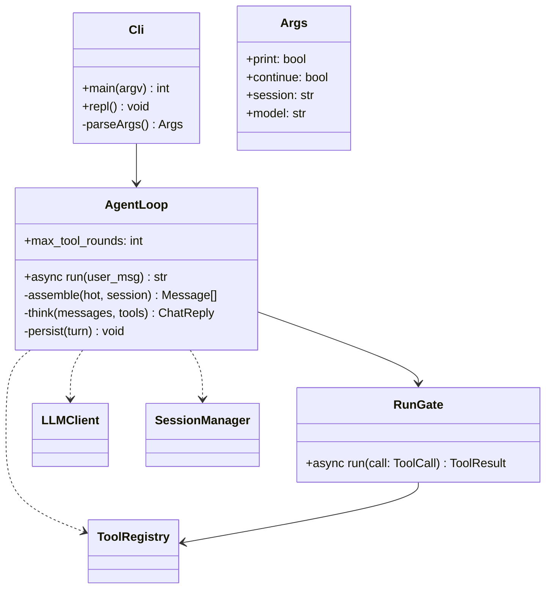

# Service — Agent Loop (`thyca/agent/loop.py` + `thyca/agent/run.py` + `thyca/cli.py`)

> 7/7. Thuộc `thyca-agent-architecture.md`. Chỉ code khi bạn duyệt `status: in-progress`.

## Summary

Harness loop `assemble -> think -> run(call) -> persist`, with read-only tool calls concurrent and mutating calls serialized by registry resource locks. `run` is the v1 pass-through seam for a later gate.

## Class trong module



## Contracts

```
assemble: refreshed system_prompt(hot) + session.messages + user_msg
for tool_round in range(1, limits.loopMax + 1):
  reply = await llm.chat(messages, tools)
  if not reply.tool_calls: persist assistant text; render; break
  results = await gather(*(run(c) for c in reply.tool_calls))
  messages += assistant_tool_call_message(reply) + results
  persist complete tool round in call order
if tool_round == limits.loopMax and reply still has tool_calls:
  append deterministic loop-limit error; persist; render safe stop
```

- `RunGate.run(call)`: v1 `await registry.dispatch(call)`; if `call.parse_error` then return complete `ToolResult(tool_call_id=call.id, name=call.name, content=..., is_error=True)` without handler. v2 gate plugs around this seam. Keep `ToolResult.tool_call_id == call.id`.
- `gather` preserves reply tool-call declaration order when appending assistant call + role=tool messages, regardless of completion order. Registry handles per-resource mutation locks; loop does not assume every tool is safe to parallelize.
- `loopMax` is the maximum number of tool-call rounds per user request, read from `Config.limits.loopMax`; exhaustion is a visible deterministic stop, not silent truncation.
- `Cli`: `--print/-p` one-shot, `--continue`, `--session <id>`, `--model <override>`, REPL with EOF/Ctrl-C handling. `--continue` and explicit `--session` are mutually exclusive. Empty `-p` exits 2; missing session ID exits non-zero; provider/tool failures render safely.
- `--model` is request-scoped and never mutates config; precedence is CLI override > config provider model.
- `thyca model status|pull` delegates to L2 model lifecycle. `status` is offline/lightweight; `pull` is explicit network activity and never runs during normal chat startup.
- Compaction runs before the next LLM request and uses Session service atomic turn-safe rewrite.
- Không planner, không prefetch, không subagent.

## Tasks

| ID | Task | Done | Date |
|----|------|------|------|
| TASK-315 | `thyca/agent/run.py`: async seam `run(call)` pass-through, malformed-call error, preserve ID | | |
| TASK-316 | `thyca/agent/loop.py`: refreshed prompt, canonical message serialization, bounded tool rounds, ordered gather, persist | | |
| TASK-317 | `thyca/cli.py`: argparse, REPL/EOF/Ctrl-C, one-shot/session/model precedence, `model status|pull`, render + shutdown | | |
| TASK-318 | Compaction wiring: `compact_if_needed` before request, atomic turn-safe rewrite, deterministic exhaustion stop | | |

Xong khi: REPL 2 turns; `--continue` nối; explicit session/model precedence đúng; 2 read-only calls overlap nhưng results giữ order; concurrent mutations không mất dữ liệu; malformed tool args không crash; loop limit dừng rõ; session compaction không orphan call/result.

## Test Plan

- REPL 2 turns + `--continue`; empty/missing/explicit session behavior.
- Gather 2 read-only calls giữ order; timing proves overlap.
- Two mutations same resource preserve both entries.
- Malformed args, unknown tool, MCP error, LLM error all become safe tool/assistant errors.
- Compaction trigger and loop max stop.
- `--model` override does not persist to config; `model status` is offline and `model pull` verifies install artifacts.

## Assumptions

- 1 provider; async; seam `run` cho gate sau; không hỏi ở v1.
