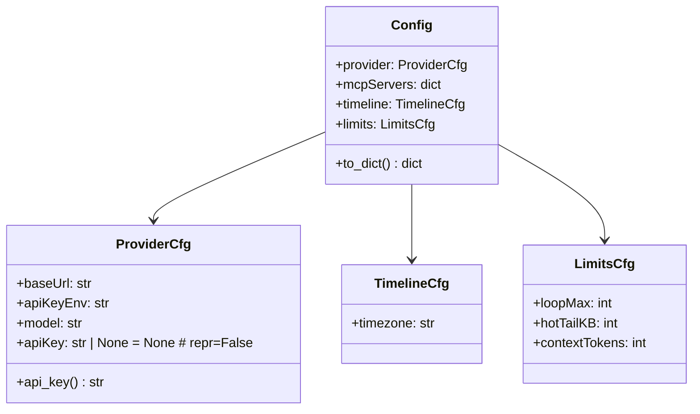

# Service — Config (`thyca/config.py`)

> 1/7. Thuộc `thyca-agent-architecture.md`. **Đã duyệt — chốt thiết kế.**

> **Chốt (2026-08-14, verified 2026-08-15):** JSON tập trung **1 file `~/.thyca/config.json`**. Dùng stdlib `json`, không thêm YAML/TOML parser; `filelock` bảo vệ atomic writes. Không tách per-service — code tách qua injection, file tập trung cho user.

## Summary

Đọc/ghi `~/.thyca/config.json`, resolve `apiKey`/`apiKeyEnv` tại thời điểm gọi, validate defaults, tạo file nếu thiếu. Là nguồn duy nhất cho `provider/mcpServers/timeline/limits`. Public API dùng Python snake_case ở module level: `load()`, `ensure_default()`, `save()`; dataclass giữ JSON field names hiện có để config tương thích.

## Class trong module



> Module-level API (`load`/`ensure_default`/`save`) là `ConfigIO` ẩn: chúng là hàm trong `thyca/config.py`, không phải class.

> `EmbeddingCfg` đã gỡ khỏi config cùng embedding runtime (580ae03). Không còn `embedding` section trong JSON.

## Contract

**Đọc ở `~/.thyca` — đúng.** `thyca/config.py` chỉ đọc `Path.home() / ".thyca" / "config.json"` (không đọc cwd, không đọc `./config.json`). Các service khác không tự `open()`, chỉ nhận `Config` injected: `Connect/OpenAIChat(cfg.provider)`, `MCPManager(cfg.mcpServers)`. Ghi cũng chỉ qua `config.py`.

`~/.thyca/config.json`:
```json
{
  "provider": { "baseUrl": "https://api.openai.com/v1", "apiKeyEnv": "OPENAI_API_KEY", "model": "gpt-4o-mini" },
  "mcpServers": { "echo": { "command": "python", "args": ["-m", "examples.echo"], "env": {} } },
  "timeline": { "timezone": "Asia/Ho_Chi_Minh" },
  "limits": { "loopMax": 10, "hotTailKB": 4, "contextTokens": 32000 }
}
```
- `ProviderCfg.api_key()` lấy `provider.apiKey` trong JSON trước; trống thì đọc `os.environ[apiKeyEnv]`. `apiKey` không hiện trong `repr` (field `repr=False`).
- Thiếu file → `ensure_default()` tạo `~/.thyca/config.json` default, không giả vờ đã có lệnh `thyca init`.
- `pyproject.toml` flat `packages = ["thyca"]` như `another-brain` (không `src/`).
- Ghi: `filelock` fail-closed; lock timeout/error trả `ConfigError`, không ghi không-lock. Temp cùng thư mục được mode 0600 trước `os.replace()`; custom test path không tạo side-effect ở `~/.thyca`.

## Tasks

| ID | Task | Done | Date |
|----|------|------|------|
| TASK-301 | `pyproject.toml` flat, Python >=3.14, locked dev test group, entry point `thyca`, package init/main | ✅ | 2026-08-15 |
| TASK-302 | `thyca/config.py`: strict load validation, call-time env resolution, defaults, `ensure_default()`, fail-closed locked atomic `save()` | ✅ | 2026-08-15 |

Xong khi: `thyca --help` chạy; thiếu `~/.thyca/config.json` tự tạo default; provider/embedding `apiKeyEnv` resolve đúng; OpenAI embedding config thiếu URL/key bị reject lúc load.

## Test Plan

- Thiếu file → tạo default, load lại pass schema.
- LLM `apiKeyEnv` set/missing → `api_key()` trả đúng / lỗi rõ.
- Embedding config validation (`embedding.provider="openai"` cần baseUrl/apiKeyEnv) — đã gỡ cùng embedding runtime (580ae03).
- Sai JSON type (null/list/number thay string, bool thay int), invalid timezone/limits/MCP shape → `ConfigError`, không coerce hoặc leak raw `ValueError`.
- Default home giữ mode directory 0700 và config 0600; failure to enforce permissions is an error.
- Save/load roundtrip, custom path không tạo default-home side effect, và lock failure không ghi fail-open.
- `uv sync --locked`, CLI help/version, và pytest chạy trong project environment.
- Không mock provider network vì Config không gọi network.

## Assumptions

- 1 provider OpenAI-compat; secret qua env; Linux target.
