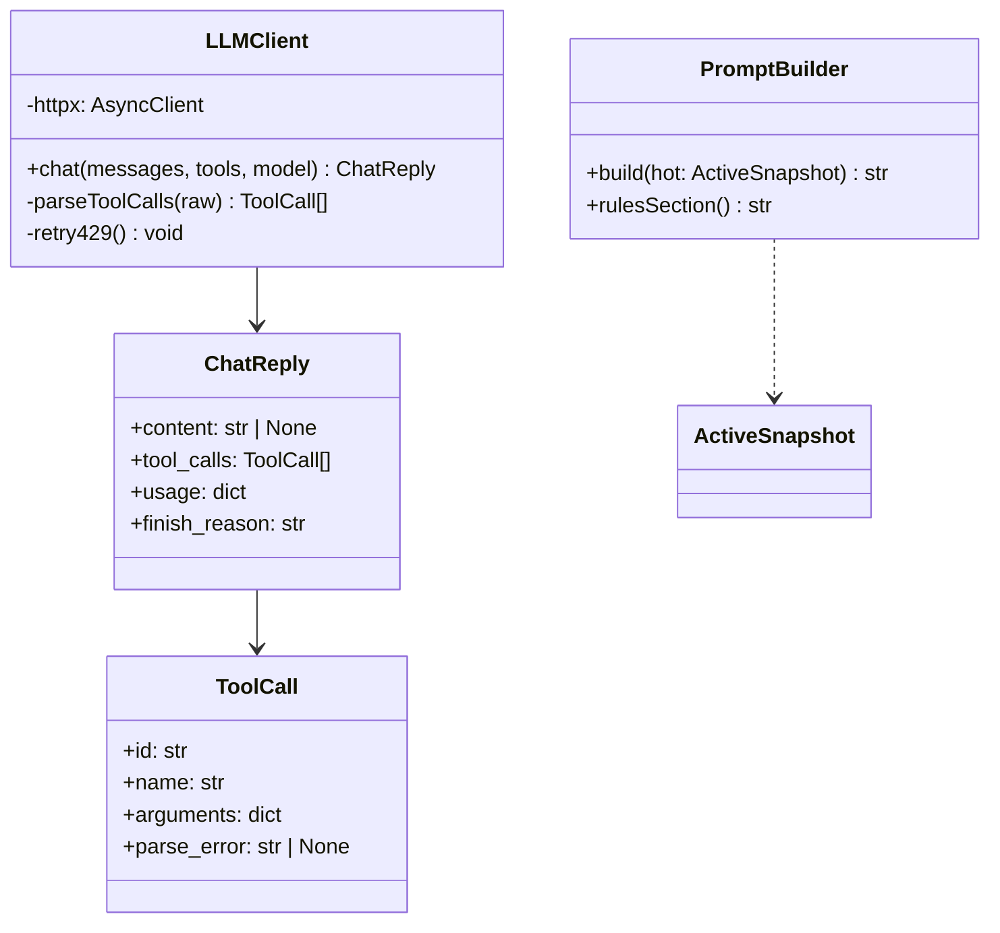

# Service — LLM (`thyca/llm/` + `prompt.py`)

> 4/7. Thuộc `thyca-agent-architecture.md`. Chỉ code khi bạn duyệt `status: in-progress`.

## Summary

Factory `ConnectFactory.create(kind)` → `Connect`. `OpenAIChat` (`/chat/completions`) đã có. `OpenAIResponses` (`/responses`) + `Google` / `Anthropic` stub. `PromptBuilder` chưa.

## Class trong module



## Contracts

- `PromptBuilder.build(hot)` được gọi trước mỗi user turn với canonical files + today đã refresh; yesterday lấy từ session-day state. Tool-result rounds trong cùng user turn reuse system prompt đó.
  ```
  <role> SOUL.md </role>
  <user> USER.md </user>
  <memory> MEMORY.md </memory>
  <today> daily tail </today>
  <yesterday> (chỉ open session) </yesterday>
  <rules> remember/search + guard </rules>
  ```
- `LLMClient.chat(messages, tools, model)`:
  - Join URL không tạo `//`; gửi `Authorization: Bearer <ProviderCfg.api_key()>`, JSON `{model, messages, tools, tool_choice:"auto"}` qua một owned `httpx.AsyncClient`.
  - Timeout tách connect/read/write/pool; read mặc định 60s. `aclose()` thuộc lifecycle CLI.
  - Parse `choices[0].message`. `content` được phép `null` khi có tool calls; empty choices/missing fields/HTTP error thành typed `LLMError` với body bị cap, không leak API key.
  - Canonical `ToolCall` giữ `id/name/arguments/parse_error`. JSON arguments invalid → `arguments={}`, `parse_error` set; loop tạo `ToolResult(is_error=True)` cùng ID và không dispatch handler.
  - Retry tối đa 1 lần cho 429/502/503/504 và connect/read timeout, tôn trọng bounded `Retry-After`; không retry các 4xx khác hay schema parse error.

## Tasks

| ID | Task | Done | Date |
|----|------|------|------|
| TASK-307 | `thyca/llm/prompt.py`: build refreshed hot snapshot → deterministic system prompt | | |
| TASK-308 | `Connect` + Factory + `OpenAICompat` (auth, parse, retry, redact). Google/Anthropic stub | x | 2026-08-19 |

Xong khi: mocked content/tool-call/null-content/error responses parse đúng; malformed arguments trở thành tool error cùng call ID; retry chỉ đúng status; live `thyca -p "ping"` trả text và prompt chứa refreshed SOUL/USER/MEMORY/today.

## Test Plan

- Mock HTTP: text, null-content tool calls, malformed arguments, empty choices, 401, 429 retry, 503 retry, timeout, capped error body.
- Verify API key không xuất hiện trong exception/log.
- Prompt refresh: canonical/today update xuất hiện ở user turn kế tiếp; yesterday snapshot ổn định trong cùng session day.
- E2E thật 1 lần với model trong config, ngoài unit test deterministic.

## Assumptions

- 1 provider; không `openai` SDK; async client. Tool concurrency policy thuộc registry, không thuộc LLM client.
