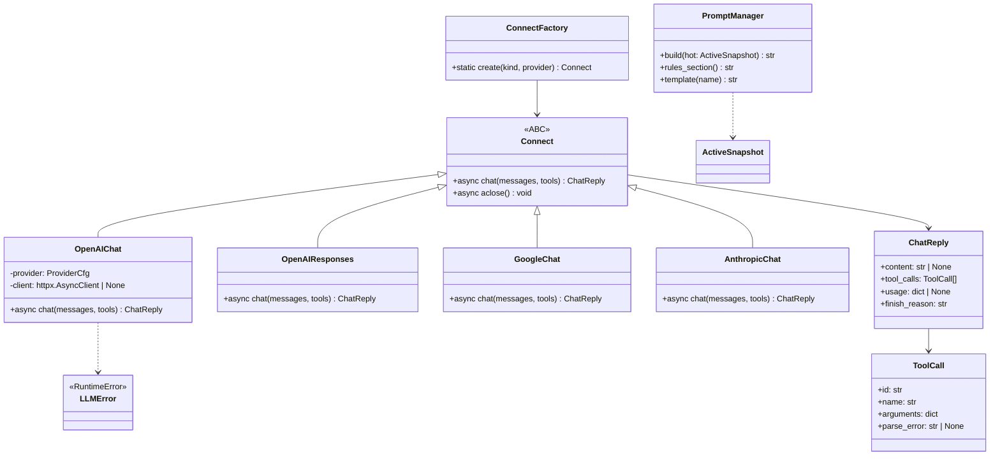

# Service — LLM (`thyca/llm/` + `prompt_manager.py`)

> 4/7. Thuộc `thyca-agent-architecture.md`. Chỉ code khi bạn duyệt `status: in-progress`.

## Summary

Factory `ConnectFactory.create(kind)` → `Connect`. `OpenAIChat` đã có. `PromptManager.build(hot)` gắn Assemble khi `hot` là `ActiveSnapshot`. Mẫu `prompts/soul.md` + `prompts/identity.md`. `USER.md` chỉ sinh lúc tương tác. Responses/Google/Anthropic stub.

## Class trong module



> `ChatReply`/`Connect`/`LLMError` định nghĩa ở `llm_base.py`; `think.py` (agent) import `ChatReply` từ đó. Stub `OpenAIResponses`/`GoogleChat`/`AnthropicChat` raise `NotImplementedError`.

## Contracts

- `PromptManager.build(hot)`: luôn nhét `prompts/identity.md`. `hot.soul` stub (`# Soul`) thì dùng `prompts/soul.md`. `hot.user` stub thì bỏ `<user>`. Yesterday rỗng thì bỏ section.
  ```
  <role> SOUL.md </role>
  <user> USER.md </user>
  <memory> MEMORY.md </memory>
  <today> daily tail </today>
  <yesterday> (chỉ open session) </yesterday>
  <rules> remember/search + guard </rules>
  ```
- `Connect.chat(messages, tools)` (không có `model` param — model nằm trong `ProviderCfg`):
  - Join URL không tạo `//`; gửi `Authorization: Bearer <ProviderCfg.api_key()>`, JSON `{model, messages, tools, tool_choice:"auto"}` qua một owned `httpx.AsyncClient` (timeout connect 10s/read 60s/write 30s/pool 10s; `aclose()` thuộc lifecycle, chỉ đóng client do `OpenAIChat` tự tạo).
  - Parse `choices[0].message`. `content` được phép `null` khi có tool calls; empty choices/missing fields/HTTP error thành typed `LLMError` với body bị cap, không leak API key.
  - Canonical `ToolCall` giữ `id/name/arguments/parse_error`. JSON arguments invalid → `arguments={}`, `parse_error` set; loop tạo `ToolResult(is_error=True)` cùng ID và không dispatch handler.
  - Retry tối đa 1 lần cho 429/502/503/504 và connect/read timeout, tôn trọng bounded `Retry-After`; không retry các 4xx khác hay schema parse error.

## Tasks

| ID | Task | Done | Date |
|----|------|------|------|
| TASK-307 | `prompt_manager.py` + mẫu `prompts/soul.md` `prompts/identity.md` | x | 2026-08-20 |
| TASK-308 | `Connect` + Factory + `OpenAIChat` (auth, parse, retry, redact). Google/Anthropic stub | x | 2026-08-19 |

> Kinds đã map trong factory: `openai`/`openai_chat`/`openai_compat` → `OpenAIChat`, `openai_responses`/`responses` → `OpenAIResponses`, `google` → `GoogleChat`, `anthropic` → `AnthropicChat`. `ProviderCfg.api_key()`: `apiKey` JSON thắng `apiKeyEnv`; `repr=False` cho `apiKey` (config.py:53).

Xong khi: mocked content/tool-call/null-content/error responses parse đúng; malformed arguments trở thành tool error cùng call ID; retry chỉ đúng status; `stage.tools` được nối (TASK-317/309) rồi mới có live `thyca -p "ping"` trả text và prompt chứa refreshed SOUL/USER/MEMORY/today.

## Test Plan

- Mock HTTP: text, null-content tool calls, malformed arguments, empty choices, 401, 429 retry, 503 retry, timeout, capped error body.
- Verify API key không xuất hiện trong exception/log.
- Prompt refresh: canonical/today update xuất hiện ở user turn kế tiếp; yesterday snapshot ổn định trong cùng session day.
- E2E thật 1 lần với model trong config, ngoài unit test deterministic.

## Assumptions

- 1 provider; không `openai` SDK; async client. Tool concurrency policy thuộc registry, không thuộc LLM client.
