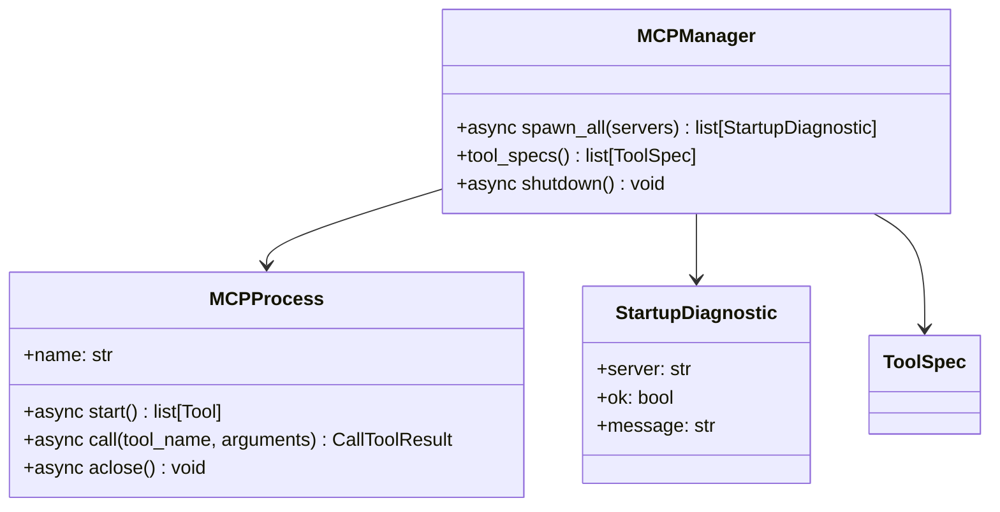

# Service — MCP (`thyca/tools/mcp.py`)

> 6/7. Thuộc `thyca-agent-architecture.md`. Chỉ code khi bạn duyệt `status: in-progress`.
>
> Viết lại 2026-08-24: tách TASK-312–314 (quá to) thành GOAL nhỏ, verify độc lập. Slice = CLI + `--serve`.

## Summary

Spawn MCP stdio bằng official SDK (`mcp` 1.29.0, `mcp>=1.0,<2` đã có trong `pyproject.toml`). Giữ `ClientSession` sống suốt đời process trên **một** asyncio loop. List tool dưới tên model `server__tool`, đăng ký `ToolSpec` vào registry hiện có. `Act` chỉ `registry.dispatch`. Lỗi một server không chết thyca.

Hai mặt loop:

- **CLI** (`Cli._run`): `asyncio.run` một lần cho cả process như hiện tại. `await spawn_all` trên loop đó. Không thêm thread. `finally` gọi `shutdown`.
- **`--serve`** (`ChatApp`): `ThreadingHTTPServer` + `turn()` đang `asyncio.run` mỗi POST (`chat_app.py`). Session MCP không sống sót cách đó. `ChatApp` spawn **một** loop thread lúc `__init__`; `spawn_all` một lần trên thread đó; `turn` = `run_coroutine_threadsafe`. `_turn_lock` vẫn serialize lượt chat. `serve.run` `finally` gọi `ChatApp.shutdown()`.

`mcpServers: {}` → 0 child. AgentLoop / `tools=7` (debug CLI) giữ như hiện tại.

**Vertical slice `--serve` gọi MCP** (thứ tự, chặn nếu bỏ):
`328 → 312 → 329 → 330 → 332 → 333`.
Xong khi: `ChatApp` spawn một lần, `dispatch` `echo__ping` qua hai `turn`, empty config 0 child. Chưa làm 331 (CLI), 313/334 (fault tinh), 314/335/336 (echo file + skill) — không chặn slice; 336 có thể làm cùng 332 nếu cần chứng minh hai turn.

## Class trong module

Hai class. Dataclass diagnostic được. Bắt đầu một file `thyca/tools/mcp.py`. Tách file chỉ khi một class ≥300 dòng.



Không có `MCPManager.call_tool` / `MCPProcess.call_tool(ToolCall)` — đó là dispatcher thứ hai; đã bỏ so với bản 15/08.

## Contracts

### Config

`config.mcpServers: {name: McpServerCfg(command, args, env)}` — `thyca/config.py`.

- Key server: `re.fullmatch(r"[A-Za-z0-9_-]+", name)` trong `_parse_mcp_servers`. Sai → `ConfigError` lúc `load`, không spawn. (Hiện chỉ cấm key rỗng.)
- Không thêm field timeout / cwd / transport. Timeout call cố định 30s trong code.
- `env` spawn = `get_default_environment() | server.env` (`mcp.client.stdio`). Không `os.environ.copy()`. SDK POSIX inherit đúng `HOME/LOGNAME/PATH/SHELL/TERM/USER`.
- `StdioServerParameters(command=..., args=..., env=merged)`. `stdio_client(params)` — `errlog` mặc định `sys.stderr` (inherit terminal). Không pipe stderr vào `ToolResult` / prompt.

### MCPProcess (I/O một child)

- `start`: `async with` stack riêng (`AsyncExitStack`): enter `stdio_client` + `ClientSession(read, write)`; `await session.initialize()` rồi `await session.list_tools()`. Trả `list[mcp.types.Tool]`.
- `call(tool_name, arguments)`: `await session.call_tool(tool_name, arguments, read_timeout_seconds=timedelta(seconds=30))`. `tool_name` **không** prefix.
- Timeout SDK: `anyio.fail_after` → `mcp.McpError` (`mcp/shared/session.py`). Không ngủ 30s trong test.
- `aclose`: đóng stack (stdin close → wait 2s → SIGTERM/SIGKILL theo SDK). Injected session (test) → no-op transport.
- Test: nhận `session=` giả (Protocol `initialize` / `list_tools` / `call_tool`) để khỏi spawn process.

### MCPManager

- `spawn_all(servers)`: `{}` → `[]`, không gọi `stdio_client`. Mỗi entry: tạo `MCPProcess`, `start`. Fail (OSError missing binary, initialize/list exception) → `aclose` server đó, `StartupDiagnostic(ok=False, message=...)` không chứa giá trị `env`, tiếp tục server khác. Thyca không chết.
- Caller in diagnostic fail ra **stderr thyca** (`Cli._stderr` / `sys.stderr` ở ChatApp).
- `tool_specs()`: chỉ server `start` thành công. Mỗi MCP tool → một `ToolSpec` (dưới). Tool name MCP không khớp `^[A-Za-z0-9_-]+$`, hoặc `f"{server}__{tool}"` dài >64, hoặc trùng tên đã register → bỏ tool đó + diagnostic, không fail cả server.
- `shutdown()`: `aclose` mọi server đã start. Idempotent. Reconnect = restart process thyca. Không hot reload.

### ToolSpec (không dispatcher mới)

`ToolSpec.resource_key` hiện là `Callable[[dict], str | None]` (`registry.py`). Không truyền string.

```python
ToolSpec(
    name=f"{server}__{tool.name}",          # model thấy echo__ping
    description=tool.description or tool.name,
    parameters=tool.inputSchema,            # JSON Schema passthrough
    handler=handler,                        # gọi session.call_tool("ping", args)
    parallel_safe=False,
    resource_key=lambda _: f"mcp:{server}",
)
```

Handler: `CallToolResult` → nối mọi block `type=="text"` (`"".join`); `isError` → `ToolResult(is_error=True)`. `tool_call_id`/`name` dummy được — `ToolRegistry._run` ghi đè từ `ToolCall`. Exception (`McpError` timeout, broken pipe, closed session) → registry đã bọc `is_error=True`. Không nhét stderr child vào content.

`Act` không đổi (`act.py` chỉ `dispatcher.dispatch`).

### CLI

Sau `register_file_tools` + `register_memory_tools`:

```python
manager = MCPManager()
try:
    for diag in await manager.spawn_all(cfg.mcpServers):
        if not diag.ok:
            print(diag.message, file=self._stderr)
    for spec in manager.tool_specs():
        registry.register(spec)
    schema = registry.to_openai_schema()
    # AgentLoop(..., tools=schema)
    ...
finally:
    await manager.shutdown()
    # aclose connect như hiện tại
```

`--debug` `tools=N` tự gồm MCP. `mcpServers: {}` → vẫn `tools=7` (`tests/test_cli.py`).

### ChatApp + serve

`ChatApp.__init__` (sync, chặn đến khi spawn xong):

1. Tạo `ToolRegistry`, register file + memory như hiện tại.
2. Start thread `thyca-mcp-loop` (`daemon=True`): `new_event_loop` + `run_forever`.
3. `run_coroutine_threadsafe(manager.spawn_all(cfg.mcpServers), loop).result()`; in diagnostic fail.
4. `register` `tool_specs()`; snapshot `to_openai_schema()`; `Act(registry)`.

`turn`: giữ `_turn_lock`; **cấm** `asyncio.run`. `run_coroutine_threadsafe(self._run_turn(...), loop).result()` — exception (`LLMError`, `SessionError`, `ValueError`) propagate như hiện tại (serve map HTTP).

`shutdown` (sync): `spawn` `manager.shutdown()` trên loop → `call_soon_threadsafe(loop.stop)` → `thread.join` (timeout 5s). `serve.run` `finally`: `chat.shutdown()` rồi `httpd.server_close()`. KeyboardInterrupt/`serve_forever` return đều đi vào `finally`.

CLI `--serve` không thêm thread riêng — thread nằm trong `ChatApp`.

Test hiện tại (`default_config()` → `mcpServers: {}`) không bắt `shutdown`; thread daemon + 0 child → không đổi hành vi. Test MCP phải `shutdown()` trong `finally`.

### Ngoài scope (plan này)

Resources, prompts, sampling, elicitation, HTTP/SSE, hot reload, search server, special-case another-brain, `bash`, L2 semantic, Trace, sửa README / architecture / `config.md` / `tools.md`.

## Tasks

IDs 312–314 giữ. Wording cũ quá to → thu hẹp. Chi tiết mới = TASK-327+.

### GOAL-001: Schema tên server + hợp đồng env/timeout

| ID | Task | Done | Date |
|----|------|------|------|
| TASK-327 | `_parse_mcp_servers`: key phải `^[A-Za-z0-9_-]+$`. Reject `echo.1`, `echo server`, rỗng (như cũ). Accept `echo`, `Echo_1`, `a-b`. Không đổi `McpServerCfg` fields | x | 2026-08-24 |
| TASK-328 | Helpers trong `thyca/tools/mcp.py`: `CALL_TIMEOUT = timedelta(seconds=30)`, `merge_env(server_env)`, `model_name(server, tool)`, `join_text_blocks(content)`. Test: `merge_env` không chứa biến lạ từ `os.environ`; `server.env` thắng key trùng; `join` chỉ text; không thêm field config | x | 2026-08-24 |

### GOAL-002: MCPProcess + Manager trên một event loop

| ID | Task | Done | Date |
|----|------|------|------|
| TASK-312 | ~~`thyca/tools/mcp.py`: Stdio + ExitStack + initialize/list + prefix + merge registry + async call~~ — **thu hẹp 2026-08-24**: chỉ `MCPProcess` — `start` (`stdio_client` + `ClientSession` + `initialize` + `list_tools`), `call(name, args)` unprefixed + 30s, `aclose`. Stack riêng từng child. `session=` giả cho test | x | 2026-08-24 |
| TASK-329 | `MCPManager.spawn_all` / `tool_specs` / `shutdown`. `{}` → 0 process, không gọi `stdio_client`. Fail một server không chặn server khác. `shutdown` idempotent | x | 2026-08-24 |

### GOAL-003: ToolSpec + wiring CLI

| ID | Task | Done | Date |
|----|------|------|------|
| TASK-330 | `tool_specs` → `ToolSpec` đúng contract (prefix, `inputSchema`, `parallel_safe=False`, `resource_key=lambda _: f"mcp:{server}"`, handler gọi tên không prefix, `isError` → `is_error`). Fake session: assert `call_tool` nhận `"ping"` và `read_timeout_seconds=timedelta(seconds=30)` | x | 2026-08-24 |
| TASK-331 | `Cli._run`: spawn → in diagnostic stderr → `register` → schema sau MCP → `finally` `shutdown`. Không đụng `Act`. `mcpServers: {}` giữ `tools=7` | | |

### GOAL-004: ChatApp loop-thread + shutdown serve

| ID | Task | Done | Date |
|----|------|------|------|
| TASK-332 | `ChatApp`: loop thread bền; `spawn_all` một lần trong `__init__`; `turn` dùng `run_coroutine_threadsafe`; xóa `asyncio.run` từng POST. `_turn_lock` giữ. CLI không thêm thread | x | 2026-08-24 |
| TASK-333 | `ChatApp.shutdown()`; `serve.run` `finally` gọi khi `chat` không `None`. Test serve cũ (empty MCP) vẫn pass không bắt shutdown | x | 2026-08-24 |

### GOAL-005: Fault

| ID | Task | Done | Date |
|----|------|------|------|
| TASK-313 | ~~Fault tolerance: startup + death + timeout + shutdown mọi process~~ — **thu hẹp 2026-08-24**: chỉ startup — missing binary / `initialize` fail → `StartupDiagnostic`, stderr thyca, 0 tool server đó, process thyca sống | | |
| TASK-334 | Call timeout (`McpError`) và session chết giữa chừng → `ToolResult.is_error`, AgentLoop sống. `mcpServers: {}` không spawn. `shutdown` đóng child (CLI `finally` + serve exit) | | |

### GOAL-006: examples/echo + skill + integration

| ID | Task | Done | Date |
|----|------|------|------|
| TASK-314 | ~~`skills/create-mcp-tool.md` + `examples/echo` + doc config/stderr/lifecycle~~ — **thu hẹp 2026-08-24**: chỉ `examples/echo.py` FastMCP 1 tool `ping` → `"pong"`, `mcp.run()` stdio. Không phải installed package — test/skill dùng `sys.executable` + path file | x | 2026-08-24 |
| TASK-335 | `skills/create-mcp-tool.md` mỏng: copy echo, thêm `mcpServers`, restart thyca (không hot reload), stderr child ra terminal không vào model. Không resources/HTTP/search/another-brain | | |
| TASK-336 | Integration (không live LLM): subprocess echo list+call+shutdown; missing binary; ChatApp hai turn `echo__ping` (`spawn_all` == 1); empty config không gọi `stdio_client` | | |

Xong khi (đo được):

1. `mcpServers: {}` → 0 child; CLI `--debug -p` in `tools=7`; test serve chat cũ pass.
2. Echo thật: schema có `echo__ping`; `dispatch` trả content chứa `pong`, `tool_call_id` giữ; `shutdown` xong không còn child echo.
3. Key `echo.1` → `ConfigError` lúc load.
4. Command không tồn tại → diagnostic stderr, 0 tool server đó, FakeLLM `-p` exit 0.
5. Fake timeout/death → `is_error`, loop không raise.
6. ChatApp 2 turn liên tiếp gọi `echo__ping` thành công; `spawn_all` đúng 1 lần.
7. `call_tool` luôn `read_timeout_seconds=timedelta(seconds=30)`; `merge_env` không leak `os.environ`.
8. `uv run pytest -q` không gọi LLM/network.

## Test Plan

Không live LLM. FakeLLM / Scripted `ChatReply` như `tests/test_serve_chat.py` và `tests/test_agent_loop.py`.

**Fake session (không process)** — `tests/test_mcp.py`:

- Prefix/schema: list tool `ping` + `inputSchema` → spec `echo__ping`, `parameters` giữ nguyên, OpenAI schema `function.name == "echo__ping"`.
- Handler gọi `call_tool("ping", ...)` không `"echo__ping"`.
- `read_timeout_seconds == timedelta(seconds=30)` (ghi nhận trên fake, không sleep).
- Fake raise `McpError` timeout / `RuntimeError("broken pipe")` → `ToolResult.is_error`, `tool_call_id` giữ.
- `join_text_blocks`: hai `TextContent` nối; image/resource bỏ.
- `merge_env`: monkeypatch `os.environ["SECRET"]`; kết quả không có `SECRET`; `{"FOO":"bar"}` có mặt.
- `spawn_all({})` không gọi `stdio_client` (monkeypatch).

**Subprocess thật** — `examples/echo.py` qua `sys.executable` + path tuyệt đối:

- `spawn_all` → `tool_specs()[0].name == "echo__ping"` → `dispatch({})` chứa `pong` → `shutdown`.
- Missing binary (`command="thyca-mcp-missing-xyz"`) → `ok is False`, `tool_specs()==[]`, message không chứa secret env.
- CLI FakeLLM + missing binary: exit 0, diagnostic trên stderr, `--debug` vẫn `tools=7`.

**ChatApp hai turn** (`tests/test_mcp_chat_app.py` hoặc cuối `test_serve_chat.py`):

- Config `echo` + Scripted LLM: lẻ = `ToolCall(name="echo__ping")`, chẵn = text `"done"`.
- `create` + `turn` + `turn`. Cả hai `reply=="done"`; session có tool result chứa `pong`.
- Monkeypatch đếm `MCPManager.spawn_all` == 1.
- `finally: app.shutdown()`.

**Config (thêm `tests/test_config.py`)**:

- Reject key không `[A-Za-z0-9_-]+`.
- Accept `echo` như test hiện tại.

**Regression**: `test_debug_prints_prompt_flags` (`tools=7`), `test_create_list_get_and_turn`, `test_create_waits_for_in_flight_turn` — không sửa trừ khi loop-thread bắt buộc (kỳ vọng: empty MCP, API sync `turn` giữ nguyên).

## Assumptions

Chốt 2026-08-24 — không hỏi lại.

1. Slice = CLI + `--serve`. Không CLI-only.
2. `--serve` không `asyncio.run` từng turn. `ChatApp` luôn có loop thread (kể cả `mcpServers: {}` — 0 child, một code path). CLI không thêm thread.
3. Không dispatcher thứ hai. `spawn_all` → `ToolSpec` → `registry.register`. `Act` không biết MCP.
4. `parallel_safe=False`. `resource_key` = `lambda _args: f"mcp:{server}"` vì `ToolSpec.resource_key` là callable (`registry.py:22,68`), không phải str.
5. Handler `call_tool` tên **không** prefix. Tên model = `f"{server}__{tool}"`.
6. Timeout 30s/`call` qua `read_timeout_seconds`. Không field config.
7. `env = get_default_environment() | server.env`. Không dump `os.environ`.
8. stderr child inherit terminal (`stdio_client` default `errlog=sys.stderr`). Không vào `ToolResult` / prompt.
9. `mcpServers: {}` → 0 process; CLI debug `tools=7`.
10. Binary thiếu / initialize fail → diagnostic stderr thyca, không đăng ký tool server đó, thyca không chết.
11. Server chết giữa chừng / timeout → `ToolResult.is_error`, loop sống. `shutdown` đóng hết child (CLI `finally` + serve process exit). Không reconnect.
12. Tên server `^[A-Za-z0-9_-]+$` lúc load. Tool MCP lệch pattern hoặc tên ghép >64 ký tự (giới hạn hàm OpenAI) → bỏ tool + diagnostic.
13. Kết quả = nối text block; `CallToolResult.isError` → `ToolResult.is_error`.
14. Tools-only. Không resources, prompts, sampling, elicitation, HTTP/SSE, hot reload.
15. `examples/echo.py` FastMCP 1 tool `ping` → `echo__ping`. Skill mỏng. Không ship search server. Không special-case another-brain. `examples/` không vào wheel; không dùng `-m examples.echo` trong test (`config.md` ví dụ `-m` không sửa — docs drift ngoài scope).
16. Không làm `bash`, L2 semantic, Trace, docs drift trong plan này.
17. Hai class: `MCPProcess`, `MCPManager`. Dataclass diagnostic được. Một file trừ khi class ≥300 dòng.
18. SDK đã verify trong `.venv`: `mcp` 1.29.0; `mcp.stdio_client` / `ClientSession` / `StdioServerParameters`; `mcp.client.stdio.get_default_environment()`; `ClientSession.call_tool(name, arguments, read_timeout_seconds=...)`; `mcp.server.fastmcp.FastMCP`; `FastMCP.run()` default `stdio`.
19. `ChatApp` giữ API sync `list_payload` / `create` / `turn`. Test HTTP cũ không cần LLM. Connect per-turn như hiện tại.
20. Mọi default trên là chốt.
