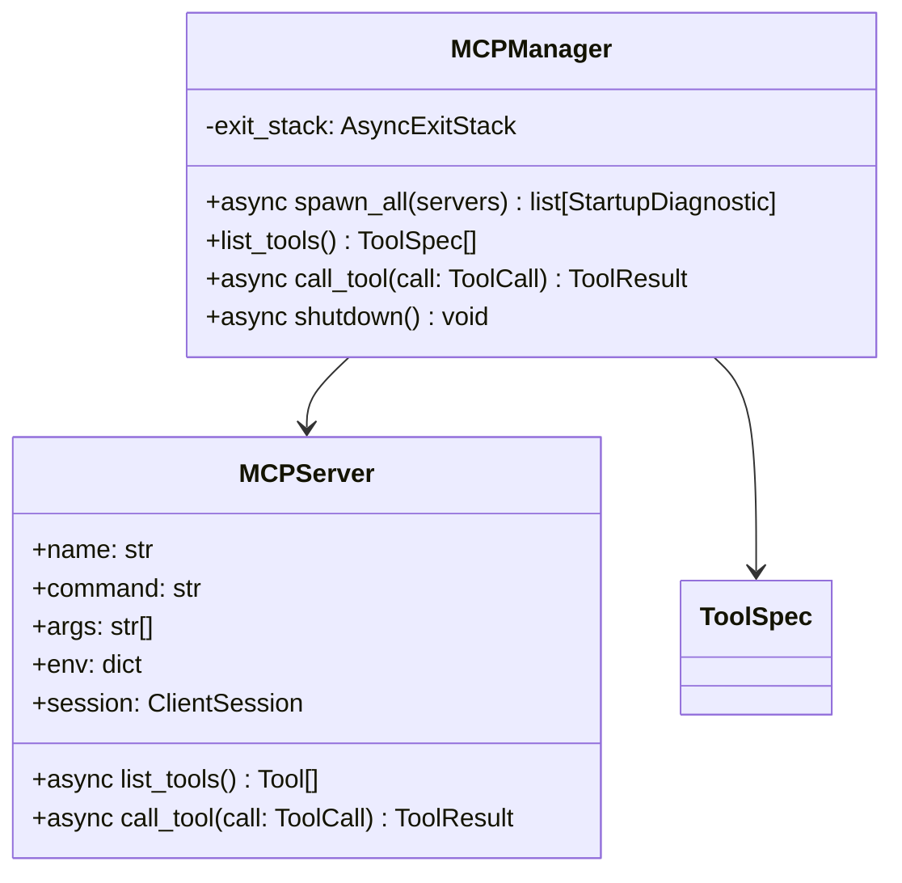

# Service — MCP (`thyca/tools/mcp.py`)

> 6/7. Thuộc `thyca-agent-architecture.md`. Chỉ code khi bạn duyệt `status: in-progress`.

## Summary

Spawn stdio MCP servers with the official Python SDK, keep their async context alive for the process lifetime, list tools under `server__tool`, merge into the registry, and isolate server failures from the loop.

## Class trong module

## Contracts

- Input: `config.mcpServers: {name: {command, args, env}}`.
- `spawn_all`: create `StdioServerParameters(command=..., args=..., env=...)`; enter `stdio_client(params)` and `ClientSession(read, write)` through one long-lived `AsyncExitStack`; `await session.initialize()` before `await session.list_tools()`.
- Prefix every exposed tool as `f"{server}__{tool.name}"`; preserve MCP description/inputSchema, assign resource key `mcp:{server}`, and mark MCP tools non-parallel-safe by default.
- `call_tool(call)`: validate prefix and original tool name, call `await session.call_tool(tool_name, call.arguments)` inside bounded timeout, normalize MCP content to string/JSON and keep `call.id`.
- `spawn_all` returns startup diagnostics for missing binary/initialize/list failure; it does not invent a `ToolResult` without a tool call. A registered tool whose server later dies returns `ToolResult(is_error=True, ...)`.
- `shutdown()` closes all sessions/transports through the exit stack. Reconnect is explicit restart; no hot reload.
- Never pass server stderr into model content; log capped diagnostics without secrets.

## Tasks

| ID | Task | Done | Date |
|----|------|------|------|
| TASK-312 | `thyca/tools/mcp.py`: `StdioServerParameters`, long-lived `AsyncExitStack`, initialize/list, prefix, merge registry, canonical async call | | |
| TASK-313 | Fault tolerance: startup diagnostics, server death, call timeout → typed error không crash loop; shutdown closes every process | | |
| TASK-314 | `skills/create-mcp-tool.md` + `examples/echo` FastMCP 1 tool `ping`: doc config, stderr discipline, lifecycle/restart | | |

Xong khi: `echo__ping` list+call được; official SDK lifecycle initialize/shutdown được test; kill server → registered call trả `is_error`, startup failure chỉ tạo diagnostic; no leaked process; làm theo skill tạo server mới.

## Test Plan

- `examples/echo` list thấy `echo__ping`, schema chuyển đúng sang OpenAI.
- Call `echo__ping` giữ call ID và trả content.
- Spawn missing binary/invalid args/initialize failure → diagnostic, loop vẫn start.
- Kill server / call timeout → typed error, process cleanup, loop không crash.
- Shutdown trong normal exit và `KeyboardInterrupt` không để child process sống.
- Skill tạo server thứ 2 và gọi được sau restart.

## Assumptions

- `mcp` SDK Python, `stdio` only; async.
