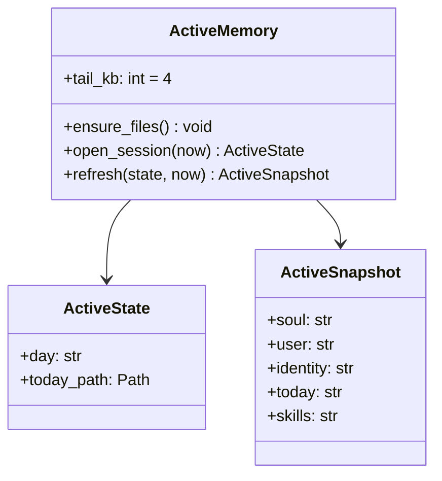

# Service — Memory (`thyca/memory/active.py`)

> 3/7. Thuộc `thyca-agent-architecture.md`. Chỉ code khi bạn duyệt `status: in-progress`.
>
> **Slice này chỉ ActiveMemory.** `memory_*` facade + keyed lock + `~/.thyca` guard thuộc `services/tools.md`. Chunk/cold/index thuộc `l2-memory-retrieval.md`. Không duyệt L2 cùng file này.

## Summary

Active: ensure files, mở process-day state, rồi refresh `SOUL/USER/IDENTITY` + today tail trước mỗi user turn. Previous-day daily không được eager-inject; session JSONL không phải memory file. Markdown dưới `~/.thyca` là nguồn sự thật; ActiveMemory chỉ đọc và tạo file trống.

## Class trong module

Hai class, tách state phiên và snapshot nhét prompt:

| Class | File | Trách nhiệm |
|-------|------|-------------|
| `ActiveMemory` | `active.py` | I/O: `ensure_files`, `open_session`, `refresh`, tail 4KB |
| `ActiveSnapshot` | `active.py` | Entity: `soul`, `user`, `identity`, `today`, `skills` |

`ActiveState` là process-day state (ngày đang mở và path today). Không persist.

## Contracts

- `ensure_files()`: tạo `SOUL.md` / `USER.md` / `IDENTITY.md` / `memory/YYYY-MM-DD.md` nếu thiếu, template ngắn, atomic create (`O_CREAT|O_EXCL` hoặc temp+replace). Dir `~/.thyca` và `~/.thyca/memory` `0700`. Không ghi đè file đã có.
- `open_session(now)`: tính `day` theo `config.timeline.timezone`, tạo state trỏ tới daily hôm nay; không đọc previous-day daily.
- `refresh(state, now)`: đọc lại `SOUL` / `USER` / `IDENTITY` + today tail. Trả `ActiveSnapshot` cho `PromptManager`. Khi timezone day đổi trong process, đổi sang today mới rồi gọi hook `on_day_close(closed_day)` — ActiveMemory **không** implement reindex; L2 đăng ký hook.
- Hot tail của today: UTF-8 bytes, mặc định `limits.hotTailKB` (4, range 1..64). Cắt ở newline hoặc ranh `## HH:mm` gần nhất phía trước ngưỡng; không cắt giữa code point / giữa code fence đã chọn. File ngắn hơn budget → giữ nguyên.
- `SOUL.md`, `USER.md` và `IDENTITY.md`: nhét **cả file** mỗi lượt. Đây là hồ sơ ổn định — không cắt — để prefix system prompt ít đổi, tận dụng prompt cache.
- Daily đã đóng ngày không nằm trong active prompt; agent lấy khi cần qua `memory_search` / `memory_recent` / `memory_get`.
- Today (`timeline_day >= today`) không vào L2. ActiveMemory không chunk, không embed, không đụng `memory.sqlite`.
- ActiveMemory không implement `memory_remember`. Sau khi Tools/L2 ghi file, user turn kế tiếp thấy nội dung mới qua `refresh`.
- Nhắc remember lúc session close (`gap >2h` / exit) **không thuộc** service này.

## Tasks

| ID | Task | Done | Date |
|----|------|------|------|
| TASK-304 | `thyca/memory/active.py`: `ensure_files`, `ActiveState` session-day, per-turn `refresh`, UTF-8-safe tail 4KB, day-rollover hook (không reindex) | x | 2026-08-17 |
| TASK-305 | ~~`thyca/tools/memory.py`: target contract + keyed lock + builtin guard~~ — **moved 2026-08-17** sang `services/tools.md` / L2 `TASK-102` | | |
| TASK-306 | ~~Wiring cold sang `chunk.py` + `cold.py`~~ — **moved 2026-08-17** sang `l2-memory-retrieval.md` | | |

Xong khi: missing files tự tạo, không đè file cũ; `refresh` thấy thay đổi profile và today ở user turn kế; day rollover đổi sang today mới và gọi hook đúng timezone; previous-day daily không vào snapshot; tail >4KB không cắt giữa UTF-8 / fence / giữa `##` session đã chọn; profile không bị cắt dù >4KB.

## Test Plan

- Missing → tạo atomically; file có sẵn không bị đè.
- Per-turn refresh thấy sửa `SOUL`/`USER`/`IDENTITY`/today; sửa file previous-day không làm snapshot đổi.
- Day rollover (mock timezone clock) đổi `ActiveState.day` và `today_path`, gọi hook `on_day_close` đúng `closed_day`.
- Tail >4KB: cắt trước newline hoặc `## HH:mm`, không giữa code point, không giữa fence.
- `ensure_files` permissions `0700` trên `~/.thyca` và `memory/`.

## Assumptions

- `l2-memory-retrieval.md` là nguồn thật cho chunk/lexical/`memory_remember`. Embedding cancelled.
- `PromptManager.build(hot)` ở `services/llm.md` nhận `ActiveSnapshot`; LLM plan không implement ActiveMemory.
- Ranh giới hot đã chốt 2026-09-16: `SOUL`/`USER`/`IDENTITY` = full; daily hôm nay = tail `hotTailKB`. Daily đã đóng ngày chỉ qua memory tools; không hard-cap lúc ghi kiểu Hermes.
