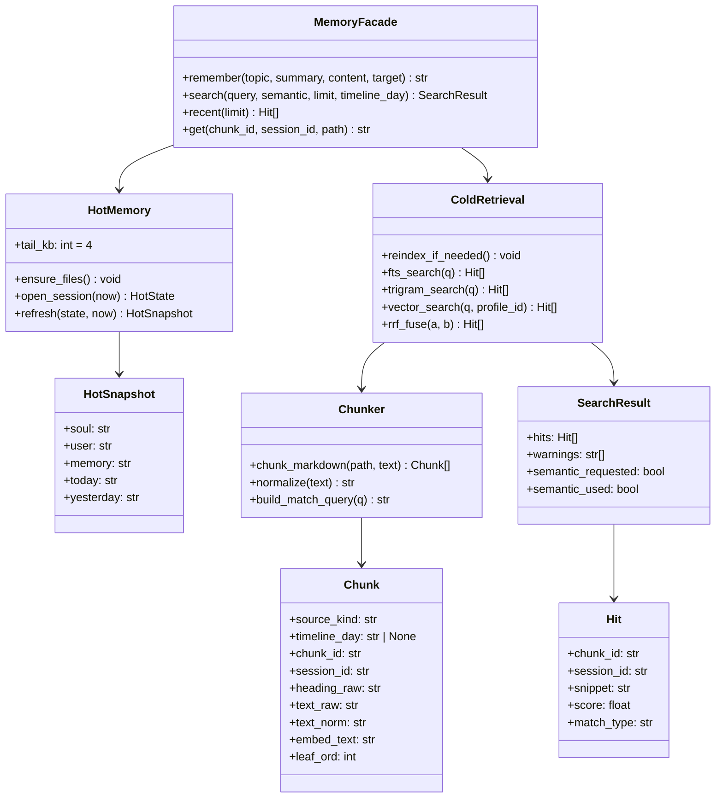

# Service — Memory (`thyca/memory/hot.py` + `thyca/tools/memory.py` facade)

> 3/7. Thuộc `thyca-agent-architecture.md`. Chỉ code khi bạn duyệt `status: in-progress`. Cold chi tiết ở `l2-memory-retrieval.md`.

## Summary

Hot: ensure files, open session snapshot, rồi refresh `SOUL/USER/MEMORY` + today tail trước mỗi user turn; yesterday chỉ đi cùng session-day snapshot. Facade `memory_*` wiring sang L2 hybrid và là writer duy nhất cho `~/.thyca` memory files.

## Class trong module

## Contracts

- `ensure_files()`: tạo `SOUL.md/USER.md/MEMORY.md/memory/YYYY-MM-DD.md` nếu thiếu, bằng template ngắn và atomic create.
- `open_session(now)`: capture session day và yesterday tail; `refresh(state, now)` đọc lại `SOUL/USER/MEMORY` + today tail trước mỗi user turn. Khi timezone day đổi trong process, rotate today/yesterday state rồi trigger closed-day reindex.
- Hot tail tính theo UTF-8 bytes, cắt ở newline/session boundary gần nhất, không giữa code point.
- `memory_remember(topic, summary, content="", target="daily")`: `target` là `daily|user|memory|soul`; code sinh timestamp theo configured timezone. Daily append heading + leaf; canonical target sửa qua temp+fsync+replace.
- Mọi mutation memory giữ keyed lock theo canonical target path. Hai `remember` cùng daily không được interleave hoặc làm mất entry.
- Builtin `write/edit` resolve path và chặn mọi target dưới `~/.thyca`; internal Config/Session/Memory writers không đi qua builtin guard.
- Canonical files luôn indexable với `timeline_day=null`; daily chỉ cold-index khi `timeline_day < today`.
- Cold contract ở `l2-memory-retrieval.md`: leaf không nhúng `session_raw`, `session_id` là pointer, fetch mẹ qua `memory_get(session_id)`.

## Tasks

| ID | Task | Done | Date |
|----|------|------|------|
| TASK-304 | `thyca/memory/hot.py`: `ensure_files`, session-day state, per-turn refresh, UTF-8-safe tail | | |
| TASK-305 | `thyca/tools/memory.py`: explicit target contract, keyed mutation lock; builtin guard blocks `~/.thyca` | | |
| TASK-306 | Wiring cold: delegate sang `memory/chunk.py` + `cold.py` theo L2 plan, không duplicate logic | | |

Xong khi: missing files tự tạo; `remember` daily/canonical đúng target; hai remembers đồng thời đều còn nguyên; `write ~/.thyca` bị chặn; canonical + today thay đổi xuất hiện ở system prompt của user turn kế tiếp; cold search/get đúng L2 contract.

## Test Plan

- Missing → tạo atomically.
- `remember` daily vs explicit canonical targets; target sai reject.
- Hai `remember` đồng thời vào cùng daily → đủ hai complete entries.
- Per-turn refresh thấy canonical/today thay đổi; day rollover đổi today/yesterday đúng timezone.
- Tail >4KB không cắt giữa UTF-8/code block session boundary đã chọn.
- Cold: canonical search + closed-day `search/get(session_id)` theo L2 plan.
- Guard chặn absolute, `~`, `..`, và symlink-resolved paths dưới `~/.thyca`.

## Assumptions

- `l2-memory-retrieval.md` là nguồn thật cho chunk/vector/RRF.
