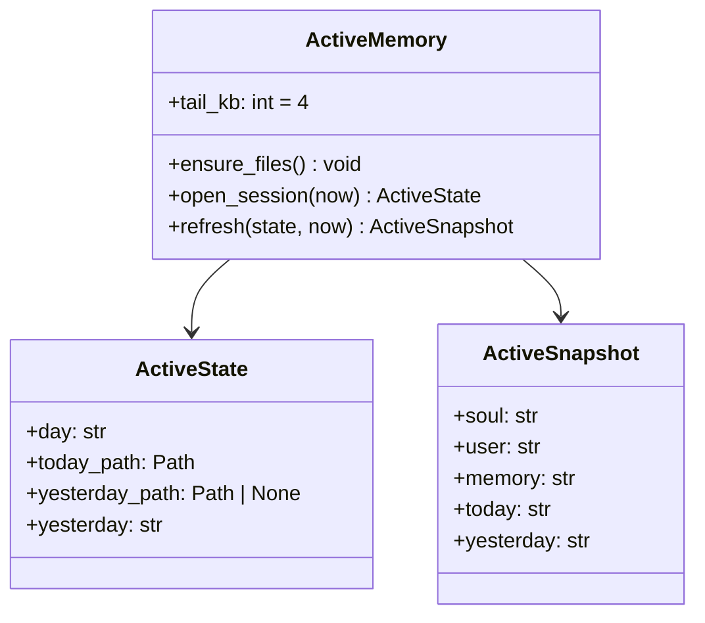

# Service — Memory (`thyca/memory/active.py`)

> 3/7. Thuộc `thyca-agent-architecture.md`. Chỉ code khi bạn duyệt `status: in-progress`.
>
> **Slice này chỉ ActiveMemory.** `memory_*` facade + keyed lock + `~/.thyca` guard thuộc `services/tools.md`. Chunk/cold/index thuộc `l2-memory-retrieval.md`. Không duyệt L2 cùng file này.

## Summary

Active: ensure files, mở session snapshot, rồi refresh `SOUL/USER/MEMORY` + today tail trước mỗi user turn. Yesterday chỉ capture lúc `open_session` / `--continue`. Session JSONL không phải memory file. Markdown dưới `~/.thyca` là nguồn sự thật; ActiveMemory chỉ đọc và tạo file trống.

## Class trong module

Hai class, tách state phiên và snapshot nhét prompt:

| Class | File | Trách nhiệm |
|-------|------|-------------|
| `ActiveMemory` | `active.py` | I/O: `ensure_files`, `open_session`, `refresh`, tail 4KB |
| `ActiveSnapshot` | `active.py` | Entity: `soul`, `user`, `memory`, `today`, `yesterday` |

`ActiveState` là state phiên (ngày đang mở, path today/yesterday, yesterday đã capture). Không persist.

## Contracts

- `ensure_files()`: tạo `SOUL.md` / `USER.md` / `MEMORY.md` / `memory/YYYY-MM-DD.md` nếu thiếu, template ngắn, atomic create (`O_CREAT|O_EXCL` hoặc temp+replace). Dir `~/.thyca` và `~/.thyca/memory` `0700`. Không ghi đè file đã có.
- `open_session(now)`: `day` theo `config.timeline.timezone`. Đọc yesterday tail **một lần** (nếu file hôm qua tồn tại) và giữ trong `ActiveState` đến khi day đổi. Không đọc lại yesterday mỗi turn.
- `refresh(state, now)`: đọc lại `SOUL` / `USER` / `MEMORY` + today tail. Trả `ActiveSnapshot` cho `PromptBuilder`. Khi timezone day đổi trong process: rotate today/yesterday (yesterday mới = today cũ), rồi gọi hook `on_day_close(closed_day)` — ActiveMemory **không** implement reindex; L2 đăng ký hook.
- Hot tail (today, yesterday, và `MEMORY.md`): UTF-8 bytes, mặc định `limits.hotTailKB` (4, range 1..64). Cắt ở newline hoặc ranh `## HH:mm` gần nhất phía trước ngưỡng; không cắt giữa code point / giữa code fence đã chọn. File ngắn hơn budget → giữ nguyên.
- `SOUL.md` và `USER.md`: nhét **cả file** mỗi lượt. Hai file này là hồ sơ ổn định — không cắt — để prefix system prompt ít đổi, tận dụng prompt cache.
- `MEMORY.md`: inject **tail** cùng rule 4KB như daily. File vẫn lớn trên đĩa; phần cũ vào L2. Muốn full file: agent gọi `memory_get(path=MEMORY.md)` (L2/Tools), không thêm cờ inject-full trên ActiveMemory.
- Yesterday vừa hot vừa cold: file `timeline_day < today` **được L2 index**. Hot vẫn inject tail lúc mở session. Không skip index vì đang ở prompt.
- Today (`timeline_day >= today`) không vào L2. ActiveMemory không chunk, không embed, không đụng `memory.sqlite`.
- ActiveMemory không implement `memory_remember`. Sau khi Tools/L2 ghi file, user turn kế tiếp thấy nội dung mới qua `refresh`.
- Nhắc remember lúc session close (`gap >2h` / exit) **không thuộc** service này.

## Tasks

| ID | Task | Done | Date |
|----|------|------|------|
| TASK-304 | `thyca/memory/active.py`: `ensure_files`, `ActiveState` session-day, per-turn `refresh`, UTF-8-safe tail 4KB, day-rollover hook (không reindex) | x | 2026-08-17 |
| TASK-305 | ~~`thyca/tools/memory.py`: target contract + keyed lock + builtin guard~~ — **moved 2026-08-17** sang `services/tools.md` / L2 `TASK-102` | | |
| TASK-306 | ~~Wiring cold sang `chunk.py` + `cold.py`~~ — **moved 2026-08-17** sang `l2-memory-retrieval.md` | | |

Xong khi: missing files tự tạo, không đè file cũ; `open_session` giữ yesterday ổn định trong cùng day; `refresh` thấy thay đổi `SOUL`/`USER` (full) và today/`MEMORY` (tail) ở user turn kế; day rollover đổi today/yesterday đúng timezone và gọi hook một lần; tail >4KB không cắt giữa UTF-8 / fence / giữa `##` session đã chọn; `SOUL`/`USER` không bị cắt dù >4KB.

## Test Plan

- Missing → tạo atomically; file có sẵn không bị đè.
- Per-turn refresh thấy sửa `SOUL`/`USER`/`MEMORY`/today; yesterday không đổi nếu chỉ sửa file hôm qua giữa session.
- Day rollover (mock timezone clock) đổi `ActiveState.day`, yesterday mới = today cũ, hook `on_day_close` đúng `closed_day`.
- Tail >4KB: cắt trước newline hoặc `## HH:mm`, không giữa code point, không giữa fence.
- `ensure_files` permissions `0700` trên `~/.thyca` và `memory/`.

## Assumptions

- `l2-memory-retrieval.md` là nguồn thật cho chunk/vector/RRF/`memory_remember`.
- `PromptBuilder.build(hot)` ở `services/llm.md` nhận `ActiveSnapshot`; LLM plan không implement ActiveMemory.
- Trần nóng đã chốt 2026-08-17: `SOUL`/`USER` = full; `MEMORY` + daily = tail `hotTailKB`. Không hard-cap lúc ghi kiểu Hermes. Lấy full `MEMORY.md` = `memory_get(path)`, không phải cờ ActiveMemory.
