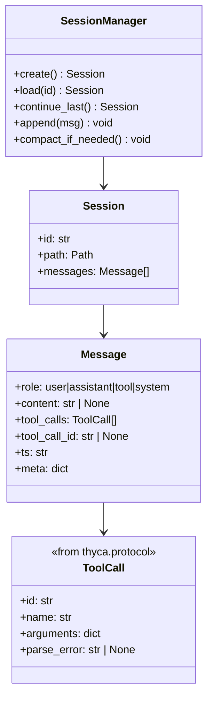

# Service — Session (`thyca/session.py`)

> 2/7. Thuộc `thyca-agent-architecture.md`. Chỉ code khi bạn duyệt `status: in-progress`.

## Summary

Quản `~/.thyca/sessions/*.jsonl`: create/load/durable append, `--continue`, và compaction rule-based bằng atomic rewrite khi vượt `contextTokens`. Session chỉ lưu turn data; system prompt nóng được rebuild khi chạy.

## Class trong module

## Contracts

- File: `~/.thyca/sessions/{YYYY-MM-DDTHH-mm-ss}_{rand4}.jsonl`, mỗi dòng 1 canonical `Message` từ `thyca/protocol.py`.
- `--continue` → file regular có `mtime` lớn nhất trong `sessions/`; thư mục rỗng trả typed `SessionNotFound`, CLI tạo session mới khi không chỉ định ID.
- `append(msg)`: giữ process-local lock, ghi đúng một JSON line, `flush()` + `os.fsync()`. Đây là durable append; không gọi nó là atomic transaction.
- Assistant tool-call message có thể có `content=null`; mỗi `role=tool` phải giữ `tool_call_id`. Loader reject JSON hỏng với path + line number, không silently skip.
- Compaction chỉ cắt ở ranh giới turn hoàn chỉnh: không tách assistant `tool_calls` khỏi toàn bộ tool results tương ứng.
- Khi estimated tokens vượt `limits.contextTokens`, giữ system-marker + newest complete turns dưới 60% limit. Marker deterministic ghi số message/turn bị bỏ và tối đa 1000 ký tự trích từ user/assistant text bị bỏ; không gọi LLM.
- Rewrite qua temp file cùng thư mục → flush/fsync → `os.replace()` → fsync parent directory, dưới cùng session lock. Crash trước replace giữ file cũ; crash sau replace giữ file mới hoàn chỉnh.
- Daily hot tail 4KB do Memory service quản, không trộn vào session compaction.

## Tasks

| ID | Task | Done | Date |
|----|------|------|------|
| TASK-303 | `thyca/session.py`: `create`, strict `load`, durable `append`, `continue_last`, turn-safe atomic `compact_if_needed` | | |

Xong khi: write 3 turns → load lại đủ; `--continue` chọn đúng file; empty sessions xử lý rõ; compaction giữ newest complete turns và không để orphan tool result; simulated failure trước replace không làm hỏng file cũ.

## Test Plan

- Roundtrip user/text assistant và assistant tool-call (`content=null`) + tool results.
- `--continue` chọn max mtime; empty dir và explicit missing ID có behavior riêng.
- Invalid JSONL báo path + line.
- Compaction vượt limit → giữ tail ở complete-turn boundary, không orphan `tool_call_id`.
- Inject failure trước `os.replace` → file cũ vẫn load được; compact thành công → file mới load được.

## Assumptions

- Không LLM summarizer v1; rule-based tail đủ.
