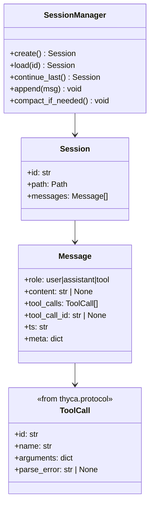

# Service — Session (`thyca/session.py`)

> 2/7. Thuộc `thyca-agent-architecture.md`. Chỉ code khi bạn duyệt `status: in-progress`. Umbrella `thyca-harness-v1.md` vẫn `draft` nên đây là bản chuẩn bị execution-ready (tuân `AGENT_RULES.md:1` — Config là ngoại lệ duy nhất).

## Summary

Quản `~/.thyca/sessions/*.jsonl`: create/load/durable append, `--continue`, và compaction rule-based bằng atomic rewrite khi vượt `contextTokens`. Session chỉ lưu turn data; system prompt nóng được rebuild khi chạy. Prerequisite: `thyca/protocol.py` (canonical `Message`/`ToolCall`) và `thyca/config.py` (`LimitsCfg.contextTokens`, default `32000`, range `1000..200000`).

## Class trong module

`Message.role` trong session chỉ `user|assistant|tool`. `system` chỉ xuất hiện như synthetic compaction marker ở đầu file sau rewrite, không phải hot prompt (hot prompt rebuild mỗi lượt theo `thyca-agent-architecture.md:58`).

## Contracts

- File: `~/.thyca/sessions/{YYYY-MM-DDTHH-mm-ss}_{rand4}.jsonl` với `rand4 = secrets.token_hex(2)` (4 hex lowercase), timestamp theo `config.timeline.timezone` (default `Asia/Ho_Chi_Minh`), wall time local. `id` là stem không extension `YYYY-MM-DDTHH-mm-ss_rand4` (regex `^\d{4}-\d{2}-\d{2}T\d{2}-\d{2}-\d{2}_[0-9a-f]{4}$`). Mỗi dòng 1 canonical `Message` từ `thyca/protocol.py`. Canonical `Message`/`ToolCall` sống ở `thyca/protocol.py` — Session phụ thuộc `protocol.py` (tách TASK-309a hoặc Session tạm định nghĩa và Tools reuse). Sessions dir tự tạo `mkdir(parents=True, exist_ok=True); chmod 0o700` (tái dùng pattern `ensure_thyca_dir()` trong `thyca/config.py:237`), file JSONL `0600`, temp cùng dir `0600`.
- `--continue` quét `sessions/*.jsonl` regular files (`is_file() and not is_symlink()`), sort `st_mtime_ns` desc, tie-break `name` desc. Rỗng hoặc thiếu dir → raise typed `SessionNotFound`; CLI (`thyca/cli.py:17-18` `--continue` vs `--session` mutual exclusive) catch và tạo mới khi không có explicit id. Đồng bộ `services/agent-loop.md:58`.
- `load(id)` validate id regex, `resolve()` và check `parent == sessions_dir` để tránh traversal (`--session ../../etc/passwd`).
- `SessionManager` nhận `sessions_dir: Path = Path.home()/".thyca"/"sessions"` và `limits: LimitsCfg` (từ `Config`). Giữ `self._lock = threading.Lock()` (single-process, như `thyca-agent-architecture.md:117` một process). `append(msg)` và `compact_if_needed()` cùng `with self._lock`. Không dùng `filelock` ở v1 (khác Config dùng `filelock.FileLock`). `append(msg)`: giữ lock, mở file `a`, ghi đúng một JSON line `json.dumps(canonical, ensure_ascii=False)+"\n"`, `flush()` + `os.fsync(f.fileno())`. Đây là durable append; không gọi nó là atomic transaction.
- Loader reject JSON hỏng với path + line number, không silently skip. Validate schema: `role` bắt buộc, `role=tool` phải có `tool_call_id` khớp 1 id trong assistant `tool_calls` trước đó, `content` có thể `null` cho assistant tool-call, `ts` ISO-8601 UTC `YYYY-MM-DDTHH:mm:ssZ` do code sinh, `meta` optional cap 4096 bytes khi serialize. Nửa dòng / thiếu `role` / orphan `tool_call_id` đều báo `path:line`. Error taxonomy: `SessionError` base, `SessionNotFound(path)`, `SessionCorrupt(path, line, cause)` kèm `JSONDecodeError` hoặc schema cause.
- Append crash giữa dòng (không newline, JSON nửa chừng) → loader báo line đó. File không phải regular (symlink/dir/socket) hoặc không khớp `*.jsonl` → `--continue` skip.
- Compaction — turn boundary: không tách assistant `tool_calls` khỏi toàn bộ tool results tương ứng. Định nghĩa *complete turn* = `user? → assistant(+tool_calls) → 0..N tool` messages khép kín sao cho mọi `tool_call_id` trong assistant đều có đủ `role=tool` tương ứng và ngược lại (áp cho nhiều round liên tiếp, không để orphan ở cuối tail). Compaction chỉ cắt tại vị trí `tool` cuối cùng của 1 round hoàn chỉnh.
- Compaction — trigger và giữ tail: `estimate_tokens(msg) = (len(json.dumps(canonical_msg, ensure_ascii=False)) + 3)//4` (heuristic v1, deterministic, không cần tokenizer). Khi `sum(estimate_tokens(m) for m in messages) > limits.contextTokens` (default `32000`, range `1000..200000` per `thyca/config.py:139`), giữ marker `system` + newest *complete turns* sao cho `sum(estimate_tokens(tail)) ≤ 0.6*limits.contextTokens`. Marker deterministic dạng synthetic `Message(role="system", content=f"[compaction: omitted {N} messages/{T} turns; excerpt: {excerpt[:1000]}]")` — lấy `content` của `user`/`assistant` bị cắt join `"\n"` rồi `[:1000]` không cắt giữa surrogate, ghi `omitted_messages`, `omitted_turns`, `omitted_chars`. Nếu 1 turn đã vượt 60% thì giữ 1 turn đó. Không gọi LLM. `compact_if_needed()` được Agent Loop gọi *trước* `assemble` lượt tiếp theo (và không tự gọi trong `append()` để tránh recursive lock), khớp `services/agent-loop.md:62` và `thyca-agent-architecture.md:68`.
- Rewrite: tạo temp `.{id}.tmp.{rand}` cùng dir `0600` → write → `flush/fsync` → `os.replace(tmp, target)` → `fsync(parent_fd)` (mở `os.open(sessions_dir, O_DIRECTORY)`). Dưới cùng `self._lock`. Crash trước replace giữ file cũ; crash sau replace giữ file mới hoàn chỉnh. Đổi `limits.contextTokens` giữa chừng: session cũ vượt ngưỡng mới sẽ compact ở lần gọi tiếp theo.
- Xử lý `ENOSPC`/`EACCES` khi `flush/fsync/replace` → ném `SessionError`/`SessionCorrupt` tương ứng, không swallow.
- Filename collision: 2 `create()` cùng giây dùng `rand4` khác nhau nên không collision (4 hex = 65536 giá trị).
- Daily hot tail 4KB do Memory service quản (`services/memory.md:84`), không trộn vào session compaction. Session không đọc/ghi daily, chỉ quản JSONL.

## Tasks

| ID | Task | Done | Date |
|----|------|------|------|
| TASK-303 | ~~`thyca/session.py`: `create`, strict `load`, durable `append`, `continue_last`, turn-safe atomic `compact_if_needed`~~ — **superseded 2026-08-17** by 303a-d (tách nhỏ để independently verifiable) | | |
| TASK-303a | `thyca/session.py`: `create` + `continue_last` + `load(id)` strict — id regex, dir/permissions `0700/0600`, timestamp theo `timeline.timezone`, `rand4=secrets.token_hex(2)`, empty/missing dir handling, mtime selection skip symlink/subdir/non-jsonl | | |
| TASK-303b | `append` durable (`flush+fsync`) + `load` strict (path+line, schema validation `role`/`tool_call_id`, nửa dòng, orphan check), `SessionNotFound`/`SessionCorrupt` taxonomy | | |
| TASK-303c | `compact_if_needed` trigger (`estimate_tokens` deterministic `ceil(len(json)/4)`, `> limits.contextTokens`) + turn-safe tail (`user?→assistant→tool*` khép kín) + giữ `≤60%` + marker deterministic 1000c | | |
| TASK-303d | Atomic rewrite (temp `0600` + `flush/fsync` + `os.replace` + `fsync` parent dir) + crash safety + `threading.Lock` — inject failure trước/sau replace | | |

Xong khi: write 3 turns → load lại đủ (kèm `ts`/`meta`); `--continue` chọn đúng file max mtime và skip symlink/subdir; empty/missing sessions xử lý rõ; `load` reject invalid schema với path:line; compaction giữ newest complete turns dưới 60% và không để orphan `tool_call_id`, marker đúng 1000c; simulated failure trước replace không làm hỏng file cũ, sau replace file mới load được và parent fsync được gọi; `sessions` `0700`/JSONL `0600`; `id` traversal bị chặn; `estimate_tokens` deterministic.

## Test Plan

- Roundtrip user/text assistant và assistant tool-call (`content=null`) + tool results với `ts` ISO-8601 và `meta` cap.
- `--continue` chọn max `st_mtime_ns` (tie `name` desc), skip subdir/symlink/non-jsonl; empty dir và missing dir → `SessionNotFound`; explicit missing id → `SessionNotFound`/`SessionCorrupt` riêng.
- Invalid JSONL (nửa dòng, thiếu `role`, orphan `tool_call_id`) báo `path:line`.
- Concurrent `append` 10 threads + `compact_if_needed` interleaving → không mất/interleave dòng.
- Token estimate determinism (cùng message → cùng estimate) + compaction vượt limit → giữ tail ở complete-turn boundary, không orphan, marker đúng 1000c, giữ `≤60%`; single turn vượt 60% vẫn giữ 1 turn.
- Inject failure trước `os.replace` (mock) → file cũ vẫn load được; compact thành công → file mới load được; verify `fsync(parent_fd)` được gọi.
- Permissions: `sessions` `0700`, JSONL `0600` (như `tests/test_config.py:86-89`).
- `load` với valid JSON nhưng invalid schema (thiếu `role`, `tool_call_id` cho `role=tool`) → `SessionCorrupt`.
- `id` traversal (`../`) bị chặn.

## Assumptions

- Không LLM summarizer v1; rule-based tail đủ.
- Single-process, Linux target, Python 3.14 (`pyproject.toml:10` `requires-python >=3.14`), flat `thyca/` (`pyproject.toml:34` `packages = ["thyca"]`), `~/.thyca` home data, `cwd` workspace. Config done (`limits.contextTokens` `1000..200000` inject vào `SessionManager`).
- `protocol.py` là prerequisite của Session (tách TASK-309a) hoặc Session tạm định nghĩa `Message/ToolCall` và Tools sẽ reuse.
- Daily hot tail 4KB do Memory quản, Session không đọc/ghi daily.
