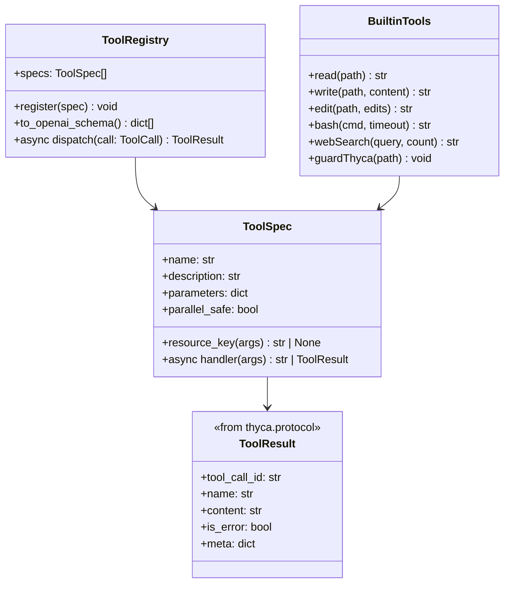

# Service — Tools (`thyca/tools/registry.py` + `thyca/tools/builtin/`)

> 5/7. Thuộc `thyca-agent-architecture.md`. Chỉ code khi bạn duyệt `status: in-progress`.

## Summary

Registry chuyển canonical `ToolCall` thành OpenAI schema/async dispatch. Builtins gồm `read/write/edit/bash/web_search`; `write/edit` chặn `~/.thyca`. Read-only calls được parallel; mutating calls serialize theo resource key.

## Class trong module



## Contracts

```python
async def read(path: str) -> str: ...
async def write(path: str, content: str) -> str: ...
async def edit(path: str, edits: list[dict[str, str]]) -> str: ...
async def bash(command: str, timeout: int = 30) -> str: ...
async def web_search(query: str, count: int = 5) -> str: ...
```
- `ToolRegistry.dispatch(call)` là async duy nhất. Nó validate JSON schema/arguments, giữ `call.id`, catch expected tool errors, cap result và luôn trả canonical `ToolResult`; handler không tự invent `tool_call_id`.
- `resource_key(args)` trả canonical key cho file/memory/server. Registry luôn lock các calls cùng key, kể cả read-vs-write; calls khác key vẫn overlap. Tool không có key chỉ được overlap khi `parallel_safe=True`; MCP mặc định dùng per-server key vì MCP schema không khai báo side effect.
- `write/edit` expand `~`, resolve parent/target và reject mọi resolved path dưới `Path.home()/".thyca"`; symlink escape test bắt buộc. Internal memory/config/session writers không đi qua builtin này. Ngoài vùng `~/.thyca`, v1 vẫn cho path absolute hoặc relative như product spec.
- `edit` yêu cầu mỗi `oldText` match đúng một non-overlapping region; mismatch không ghi file. Write/edit dùng temp+replace khi thay cả file.
- `bash`: POSIX, `cwd=os.getcwd()`, timeout kill process group, cap combined stdout/stderr tail 20KB, giữ exit code/timed_out trong meta.
- `web_search`: Tavily qua `httpx` nếu `TAVILY_API_KEY` có; thiếu key trả typed tool error, không giả kết quả. `count` clamp 1..10; normalize title/url/snippet và cap response.
- `to_openai_schema()`: `[{type:"function", function:{name, description, parameters}}]`; schema phải có required/additionalProperties rõ cho từng tool.

## Tasks

| ID | Task | Done | Date |
|----|------|------|------|
| TASK-309 | `thyca/protocol.py` + `tools/registry.py`: canonical types, ToolSpec, OpenAI schema, async dispatch, error/result caps | | |
| TASK-310 | `thyca/tools/builtin/read.py + write.py + edit.py + bash.py`: impl, protected-home guard, atomic edit/write, resource locks, bash timeout/process-group cleanup | | |
| TASK-311 | `thyca/tools/builtin/web_search.py`: Tavily request/normalization, missing-key error | | |

Xong khi: schema đúng; canonical call ID đi xuyên dispatch; read-only calls parallel; two writes cùng resource serialize; two memory writes không mất dữ liệu; protected-home bypass bị chặn; bash timeout không để child process sống; web search thiếu key/lỗi HTTP trả tool error.

## Test Plan

- OpenAI schema shape + invalid/extra arguments.
- `ToolResult.tool_call_id == ToolCall.id` cho success/error/malformed arguments.
- Protected-home guard: `~`, absolute, `..`, symlink; non-memory `/tmp` path vẫn theo v1 contract.
- Hai calls cùng key (read/write và write/write) serialize; calls khác key/read-only thật sự overlap; output order test ở agent loop.
- Edit match zero/multiple/overlap không ghi một phần.
- Bash stdout/stderr cap, exit code, timeout và child cleanup.
- Tavily mocked success/empty/401/429/missing key; không dùng live web trong unit test.

## Assumptions

- Không sandbox bash v1; Linux POSIX.
