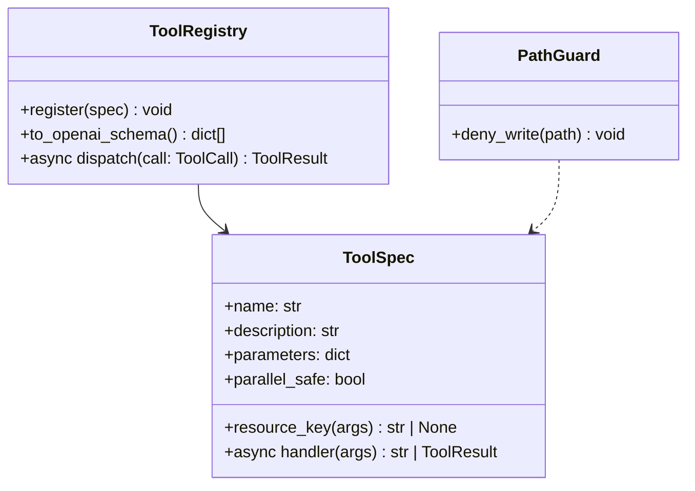

# Service — Tools (`thyca/tools/registry.py` + `thyca/tools/builtin/`)

> 5/7. Thuộc `thyca-agent-architecture.md`.
>
> **Review 2026-08-20:** đổi guard + tách 3 kho nhớ. Chưa code TASK-309+ cho đến khi bạn chốt. Sau duyệt: sub-agent theo từng TASK, không gộp.

## Summary

Registry biến `ToolCall` → schema OpenAI + `dispatch`. Hai họ tool:

1. **CRUD / máy:** `read` `write` `edit` `bash` `web_search`
2. **Memory L2:** `memory_remember` `memory_search` `memory_recent` `memory_get` (facade đã có)

Ba kho nhớ **không trộn format**:

| Kho | File | Ai ghi | Format |
|-----|------|--------|--------|
| L2 daily / MEMORY | `memory/YYYY-MM-DD.md`, `MEMORY.md` | chỉ `memory_remember` | heading + bullet |
| User | `USER.md` | CRUD `write`/`edit` | hồ sơ, **không** bullet L2 |
| Soul / Identity | `SOUL.md`, `IDENTITY.md` | CRUD `write`/`edit` | persona, **không** bullet L2 |

`write`/`edit` **cấm** L2 + `sessions/` + `config.json` + `memory.sqlite`. **Được** `SOUL.md` / `IDENTITY.md` / `USER.md` và mọi path ngoài các file đó.

Code lệch: `MemoryFacade.remember(target="soul"|"user")` đang append `- summary` — sửa ở TASK-325 (reject hoặc bỏ target; không bullet).

## Class trong module



`ToolCall` / `ToolResult` chỉ ở `thyca/protocol.py`. `MemoryFacade` đã ở `thyca/tools/memory.py` — đăng ký, không viết lại.

## Contracts

```python
async def read(path: str) -> str: ...
async def write(path: str, content: str) -> str: ...
async def edit(path: str, edits: list[dict[str, str]]) -> str: ...
async def bash(command: str, timeout: int = 30) -> str: ...
async def web_search(query: str, count: int = 5) -> str: ...
```

- `dispatch`: validate args, giữ `call.id`, cap result, luôn `ToolResult`; handler không invent `tool_call_id`.
- `resource_key`: lock cùng key (kể cả read-vs-write). Không key → chỉ overlap khi `parallel_safe=True`.
- **PathGuard (write/edit):** expand `~`, resolve, chặn symlink thoát. Deny nếu resolved path là:
  - `~/.thyca/config.json`
  - dưới `~/.thyca/sessions/`
  - `~/.thyca/memory.sqlite` (và `-wal`/`-shm`)
  - dưới `~/.thyca/memory/` (daily L2)
  - `~/.thyca/MEMORY.md`
- Allow: `~/.thyca/SOUL.md`, `IDENTITY.md`, `USER.md`; cwd; `/tmp`; path tuyệt đối khác.
- `read` được đọc L2 (không ghi).
- `edit`: mỗi `oldText` đúng một vùng không chồng; mismatch không ghi. Write/edit = temp+replace.
- `bash`: POSIX, `cwd=getcwd()`, timeout giết process group, cap 20KB, meta exit/timed_out. **Không** sandbox — `bash` có thể lách PathGuard; chấp nhận v1.
- `web_search`: Tavily + `TAVILY_API_KEY`; thiếu key = tool error; `count` 1..10.
- `memory_remember` v1: `target` chỉ `daily` | `memory`. `user`/`soul` → lỗi rõ, không append.
- `to_openai_schema()`: `{type:function, function:{name,description,parameters}}` + required/additionalProperties.
- CLI: `stage.tools = registry.to_openai_schema()`; `Act` dùng `registry.dispatch`. Bỏ `_NoTools`.
- `PromptManager.rules_section` đổi cho khớp guard (được sửa SOUL/USER/IDENTITY; cấm L2/session/config).

## Tasks

### GOAL-001: Registry

| ID | Task | Done | Date |
|----|------|------|------|
| TASK-309 | `tools/registry.py`: ToolSpec, schema, async dispatch, cap, lock theo resource_key. `protocol.py` đã có types — không định nghĩa lại | x | 2026-08-20 |

### GOAL-002: Builtin CRUD / máy

| ID | Task | Done | Date |
|----|------|------|------|
| TASK-310 | `read`/`write`/`edit` + PathGuard. ~~`bash`~~ bỏ — phức tạp, để sau | x | 2026-08-20 |
| TASK-311 | ~~`web_search` Tavily~~ — **abandoned 2026-08-20**: web search qua MCP sau | | 2026-08-20 |

### GOAL-003: Memory tools + sửa remember

| ID | Task | Done | Date |
|----|------|------|------|
| TASK-324 | Đăng ký facade: `memory_remember/search/recent/get` vào registry | x | 2026-08-20 |
| TASK-325 | `remember`: chỉ `daily`/`memory`. Bỏ/reject `user`/`soul` (không còn append bullet vào SOUL/USER) | x | 2026-08-20 |

### GOAL-004: Nối loop

| ID | Task | Done | Date |
|----|------|------|------|
| TASK-326 | Cli/Act dùng registry; `--debug` in `tools=N` thật; rules_section khớp guard | x | 2026-08-20 |

Xong khi: schema + id xuyên suốt; write SOUL ok; write daily/MEMORY/session/config bị chặn (kể cả `~` / `..` / symlink); `remember(target="soul")` lỗi; hai write cùng file serialize; bash timeout sạch; Tavily mock; `thyca --debug` `tools>0`.

## Test Plan

- Schema + args thừa/thiếu.
- `ToolResult.tool_call_id == ToolCall.id` success/error.
- Guard: deny daily, MEMORY.md, sessions, config, sqlite; allow SOUL/IDENTITY/USER và `/tmp`.
- Symlink từ `/tmp` vào `memory/2026-08-20.md` → deny write.
- `remember(target="user"|"soul")` raise; `daily` vẫn heading+bullet.
- Hai write cùng path serialize; read khác path overlap.
- Edit 0/nhiều/overlap match → không ghi dở.
- Bash cap / exit / timeout.
- Tavily mock; không live web.

## Assumptions

- Không sandbox `bash` v1.
- Linux POSIX.
- `forget`/`reinforce` chưa đăng ký tool v1 (facade giữ, không schema).
- MCP sau (`services/mcp.md` vẫn draft).
