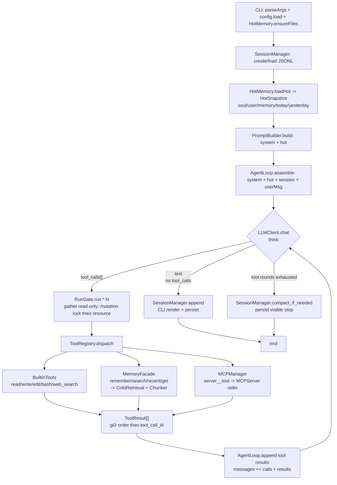

# Thyca — Kiến trúc chung (1 process, flat `thyca/`)

> Plan này là **mục lục kiến trúc**. Chi tiết thi công nằm ở `services/*.md`. Không duplicate contract/task sang đây — chỉ link.

## Summary

`thyca-ai` là harness cá nhân terminal, cảm hứng `pi` (loop nhỏ, ít abstraction). Một process Python `thyca`, loop `user -> LLM -> run(call)` với read-only concurrency và mutation locks, tools `(builtin ∪ mcp)`, hot memory nhét prompt, cold memory qua L2 hybrid. `~/.thyca` là home data. Không `src/` (như `another-brain`).

**Success v1:** `thyca -p "ping"` trả text qua OpenAI-compat; REPL + `--continue` giữ session; builtin + MCP qua cùng `run(call)`; hot/cold memory đúng; session JSONL + compaction.

Tham chiếu:
- Product spec: `thyca-harness-v1.md` — source of truth cho scope và success v1
- Accepted decision: `../decisions/2026-08-15-l2-hybrid-v1.md`
- Cold retrieval: `l2-memory-retrieval.md` — executable contract cho chunk/schema/reindex/retrieval

## Flat layout (không `src/`)

```
thyca-ai/
  pyproject.toml           # hatchling, packages = ["thyca"], thyca = "thyca.cli:main"
  thyca/                   # package duy nhất, không src/
    protocol.py            # canonical Message / ToolCall / ToolResult wire types
    cli.py                 # REPL + argparse
    config.py              # -> services/config.md
    session.py             # -> services/session.md
    memory/
      hot.py               # -> services/memory.md
      chunk.py             # -> l2-memory-retrieval.md
      cold.py              # -> l2-memory-retrieval.md
    llm/
      client.py            # -> services/llm.md
      prompt.py            # -> services/llm.md
    tools/
      registry.py          # -> services/tools.md
      builtin/             # -> services/tools.md
      mcp.py               # -> services/mcp.md
      memory.py            # facade -> services/memory.md
    agent/
      loop.py              # -> services/agent-loop.md
      run.py               # seam -> services/agent-loop.md
  ~/.thyca/                # runtime, không commit
  tests/
```

> `another-brain/pyproject.toml` chứng minh không cần `src/`: `packages = ["another_brain"]` flat vẫn lên PyPI.

## Activity tổng — giữa các module



Class tổng giữa module **dùng activity này**, không vẽ class tổng. Class chỉ vẽ **trong** từng `services/*.md`.

## Services — checklist duyệt từng phần

> Mỗi dòng là 1 service file riêng. Chỉ đánh `[x]` khi bạn duyệt. Code service đó chỉ khi `status: in-progress`.

| # | Service | File | Mô tả ngắn | Status |
|---|---------|------|------------|--------|
| 1 | **Config** | `services/config.md` | `~/.thyca/config.json` (JSON 1 file, đọc ở `~/.thyca`), `provider/embedding/mcpServers/timeline/limits`, resolve `apiKeyEnv` | ✅ done 2026-08-14 (TASK-301/302) |
| 2 | **Session** | `services/session.md` | JSONL `sessions/*.jsonl`, `create/load/append`, `--continue`, compaction rule-based | ✅ in-progress 2026-08-17 (4-class model, TASK-303a-d) |
| 3 | **Memory** | `services/memory.md` | Hot (`SOUL/USER/MEMORY/daily` + tail 4KB) + facade `memory_*` wiring sang L2 | ☐ draft |
| 4 | **LLM** | `services/llm.md` | 1 client `httpx` OpenAI-compat + `prompt.py` build system prompt | ☐ draft |
| 5 | **Tools** | `services/tools.md` | `ToolRegistry` + builtin `read/write/edit/bash/web_search` + guard `~/.thyca` | ☐ draft |
| 6 | **MCP** | `services/mcp.md` | stdio spawn, `server__tool` prefix, lifecycle, fault tolerance | ☐ draft |
| 7 | **Agent Loop** | `services/agent-loop.md` | `loop max 10` assemble/think/run/persist, `run(call)` seam, `cli.py` wiring | ☐ draft |
| — | **Cold (L2)** | `l2-memory-retrieval.md` | Leaf chunks, FTS+trigram+vector, RRF k=60, lazy day-close, canonical files always indexed | ☐ draft |

**Checklist duyệt (copy ra issue/PR):**

- [x] 1. Config — `services/config.md` done 2026-08-14
- [x] 2. Session — duyệt `services/session.md` 2026-08-17 (execution-ready, 303a-d)
- [ ] 3. Memory — duyệt `services/memory.md` + `l2-memory-retrieval.md`
- [ ] 4. LLM — duyệt `services/llm.md`
- [ ] 5. Tools — duyệt `services/tools.md`
- [ ] 6. MCP — duyệt `services/mcp.md`
- [ ] 7. Agent Loop — duyệt `services/agent-loop.md`

Thứ tự đề xuất code:

1. `Config` — done.
2. `Session -> HotMemory -> LLM`.
3. `protocol.py -> ToolRegistry + builtins`.
4. `MemoryFacade -> L2 lexical`; sau đó L2 semantic/model profile.
5. `MCP`.
6. `Agent Loop + CLI wiring` và E2E vertical slice.

Mỗi service phải có unit/integration evidence trước khi service kế tiếp dựa vào contract của nó. Không bắt `MemoryFacade` hoàn tất trước `ToolRegistry`, vì facade là tool handler.

## Assumptions (chung)

1. Kế thừa product spec đã cập nhật và accepted decision L2 hybrid; nếu leaf plan mâu thuẫn, sửa leaf plan trước khi code.
2. 1 provider OpenAI-compat; `httpx` đủ, không `openai` SDK. Core async cho MCP + gather.
3. Cold <10k leafs — exact cosine, không ANN.
4. `~/.thyca` là home data, `cwd` là workspace. `bash` không sandbox v1.
5. MCP chỉ `stdio`, reconnect = restart process.
6. Compaction rule-based, không LLM; rewrite phải atomic và chỉ cắt ở turn boundary.
7. Secret qua `env/apiKeyEnv`.
8. Linux target; FTS `unicode61 remove_diacritics 2`, RRF `k=60`.
9. `run(call)` là seam duy nhất cho gate. `dispatch(call)` giữ canonical `tool_call_id`; mutation serialize theo resource.
10. Flat `thyca/`, YAGNI: không plugin loader/provider catalog/vector DB/TUI/subagent.
