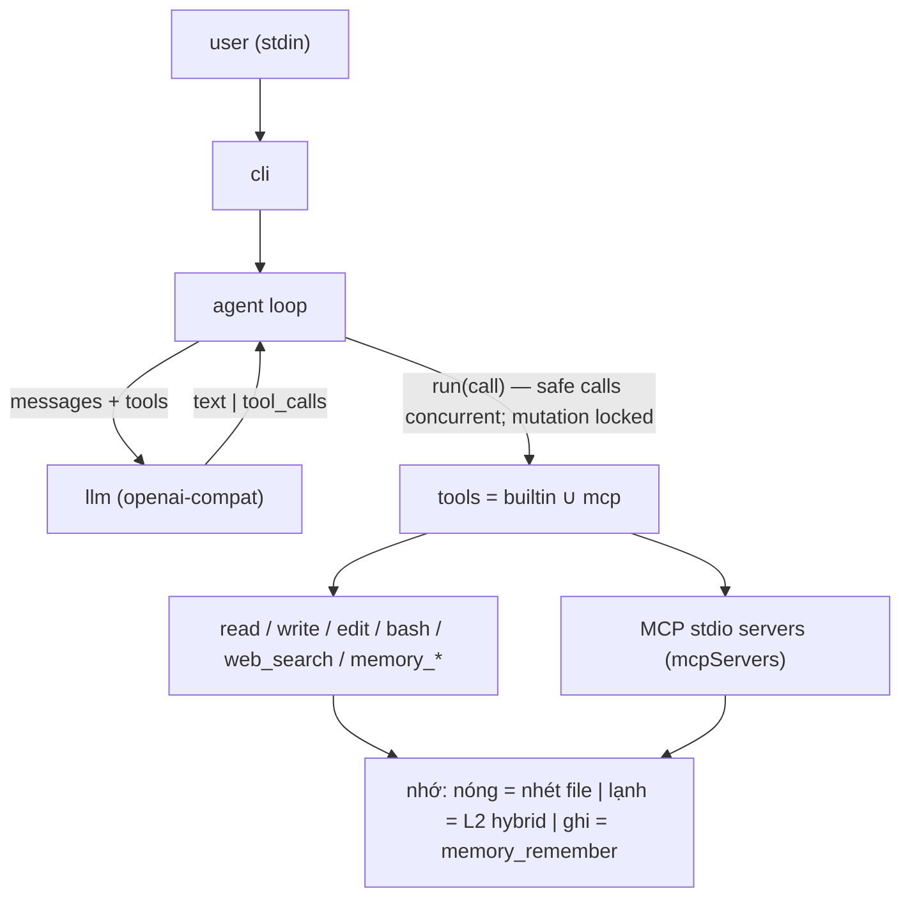
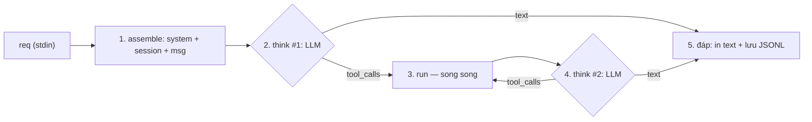

# Thyca v1 — personal assistant harness

## Summary

Thyca là harness trợ lý cá nhân trong terminal. Cảm hứng **pi** (vòng lặp nhỏ, ít abstraction), không phải coding agent và không clone OpenClaw/Hermes.

Đối chiếu đã kiểm (2026-08-13):

| Hệ | Lõi | Bài học cho Thyca |
|---|---|---|
| **pi** | 4 tool, session JSONL, skill = markdown + CLI. Cố ý **không MCP** | Giữ vòng lặp và sự tối giản. Bỏ triết lý "no MCP" |
| **Hermes** | 60+ tool, 20 kênh chat, cron, subagent, skill tự sinh | Quá dày. Lấy ý memory bền, không lấy bề mặt |
| **OpenClaw** | plugin harness, MCP catalog, nhiều package | MCP đúng hướng. Registry/plugin thì không |

Năng lực đến từ **tool**, không từ framework. MCP là nguồn tool hạng nhất. Nhớ = file markdown + session; nóng/lạnh là cửa đọc, không phải hai kho.

### Sản phẩm v1 làm được

User mở `thyca`, nói chuyện. Agent:

1. Giữ hội thoại trong session JSONL.
2. Gọi tool: đọc/ghi file, chạy lệnh máy, tìm trên web.
3. Gọi tool từ MCP server khai trong config.
4. Nhớ việc quan trọng bằng cách ghi file markdown.
5. Tìm lại việc cũ bằng L2 hybrid (`memory_search`): lexical FTS5 + trigram trước, semantic vector/RRF khi agent cần.
6. Viết thêm một MCP server nhỏ rồi tự nối vào.
7. Tool chạy thẳng, không hỏi. (v1 bỏ gate — cắm lại sau qua seam `run`.)

Không có trong v1: web UI, Telegram/Discord, subagent, plan mode, GUI popup, todo built-in, catalog hàng chục provider, nhạc/ảnh trong core, memory MCP bên thứ 3, cổng xác nhận gate.

Nhạc/ảnh = MCP hoặc skill sau khi lõi chạy. Memory bên thứ 3 (another-brain) cắm sau vì cùng tên tool `memory_*`.

### Hình dạng kỹ thuật



Một process. Không plugin SDK. Không extension runtime. Tool in-process hoặc MCP stdio.

**Vòng lặp** (toàn bộ "harness"):

```
messages = [system, ...session]
loop:                                  # tối đa 10 vòng tool rồi dừng
  reply = llm(messages, tools)
  if no tool_calls: show text; save; stop
  results = await asyncio.gather(*(run(c) for c in calls))
  append assistant tool_calls + results theo đúng thứ tự khai báo
  # registry serializes mutating resources; loop does not assume all calls are safe
```

**Một lượt từ req đến đáp** (các pha):



%% 2–4 lặp tối đa 10 vòng tool rồi dừng

- Số think tối thiểu 1, tối đa 1 + 10.
- Nhiều tool_calls trong 1 think được gather; chỉ read-only tools chạy đồng thời, mutating tools serialize theo resource. Kết quả luôn ghép đúng thứ tự khai báo.
- Không pha planner riêng, không prefetch memory, không reflection ẩn, không subagent.
- Reasoning của model (nếu provider có) nằm trong call; harness không quản lý, chỉ thấy text hoặc tool_calls.

Mọi tool (builtin và MCP) đi qua một chỗ `run(call)`. v1 chạy thẳng, không hỏi — đây là **seam** để cắm `gate` (allow/ask/deny) lại sau v1.

**System prompt** ngắn: vai trò, quy tắc tool, rồi nhét cửa nóng. Skill = file markdown agent được phép `read`, không phải registry.

### Nhớ: một kho file, hai cửa đọc

Không có ba kho. Session = hội thoại đang chạy. Markdown = nhớ bền. Nóng/lạnh là cách đọc cùng file đó.

| Cửa | Đọc gì | Khi nào |
|---|---|---|
| **Nóng** | `SOUL.md` + `USER.md` + `MEMORY.md` | Mỗi lượt, phải ngắn |
| **Nóng (mở session)** | thêm `memory/YYYY-MM-DD.md` hôm nay (+ hôm qua nếu có) | Một lần lúc start / `--continue` |
| **Lạnh** | L2 hybrid trên markdown ở `~/.thyca`: FTS5 + trigram mặc định; vector/RRF khi `semantic=true` | Tool `memory_search` / `memory_recent` / `memory_get` |
| **Ghi** | L2 (`memory/ngày.md`, `MEMORY.md`) chỉ `memory_remember`. `write`/`edit` cấm L2 + session + config; **được** SOUL/IDENTITY/USER | Daily/MEMORY = heading+bullet. USER/SOUL/IDENTITY = persona/hồ sơ, không bullet |

File luôn-có (giữ ít):

```
~/.thyca/
  config.json          # provider + mcp servers
  SOUL.md              # agent là ai
  USER.md              # user là ai
  MEMORY.md            # sự thật / quyết định đã chắt
  memory/
    YYYY-MM-DD.md      # nhật ký ngày (lạnh; nóng chỉ hôm nay+hôm qua lúc mở session)
  sessions/*.jsonl
  memory.sqlite        # L2 derived index (FTS/trigram/vector metadata), không phải nguồn sự thật
```

Luật:

- Agent không nhớ trong đầu model. Muốn bền thì gọi `memory_remember`. Muốn tìm lại (không nằm ở cửa nóng) thì `memory_search`.
- File md là nguồn. sqlite chỉ index. Xóa md → hết hit.
- Nhớ là claim. Search không hit → nói không nhớ, không bịa.
- Đổi ý: sửa dòng cũ trong `USER.md`/`MEMORY.md`, không chồng mâu thuẫn.
- `memory_remember` chỉ `daily` / `memory` (L2). Hồ sơ/persona: `write`/`edit` `USER.md` / `SOUL.md` / `IDENTITY.md`.

Sao another-brain ở **mặt tool** (`search`, `recent`, `get`, `remember`). L2 v1 giữ cùng surface `memory_*`, nhưng engine là leaf-level FTS5 + trigram + vector/RRF. Agent tự quyết lần gọi semantic thứ hai; không có prefetch hay auto-fallback ngầm.

**Không có dispatch ẩn.** Câu user đi thẳng vào prompt; việc có cần tìm nhớ cũ không, rút keyword gì, gọi lexical hay semantic — **LLM quyết định** qua tool_calls. Assemble chỉ ghép system + session + msg mới, không tự chèn cold context.

**Cách tìm lạnh (v1, chốt):**

- `memory_search(..., semantic=false)` chạy lexical FTS5 + trigram trên leaf chunks.
- Khi lexical rỗng/sai ý định/thiếu ngữ nghĩa, agent có thể paraphrase và gọi lại `semantic=true`; tool chạy lexical + vector rồi RRF.
- Daily hôm nay là HOT và chưa index; daily đã đóng mới chunk. `SOUL.md`, `USER.md`, `MEMORY.md` luôn indexable và không mang `timeline_day`.
- Search trả leaf evidence + `session_id`; cần context mẹ thì agent gọi `memory_get(session_id)`.
- Reindex dùng mtime/size + hash; markdown là nguồn, `memory.sqlite` là index suy ra. Không watch daemon.

Chi tiết executable nằm ở `l2-memory-retrieval.md` và decision `../decisions/2026-08-15-l2-hybrid-v1.md`.

### Tool v1

Builtin:

- `read`, `write`, `edit` — file.
- `bash` — lệnh máy. POSIX. Không sandbox.
- `web_search` — một HTTP search (Tavily hoặc tương đương, key trong env). Đủ cho "tìm thông tin".
- `memory_remember`, `memory_search`, `memory_recent`, `memory_get`

**Cửa xác nhận: v1 không có.** Tool chạy thẳng với quyền user, không hỏi trước khi chạy `bash`. Muốn có lại: cắm policy allow/ask/deny vào `run(call)`; contract gate sẽ được lập khi bắt đầu v2, không dựa vào git history chưa tồn tại.

MCP:

- Config giống Claude Desktop: `mcpServers` → stdio (`command` + `args` + `env`).
- Tool hiện vào model với tên `server__tool`.
- Lỗi 1 server không chết process.
- Transport: **stdio only**. HTTP/SSE sau.

Tạo tool mới = agent viết một process stdio MCP (Python, dùng `mcp` SDK FastMCP) + thêm entry `config.json` + reconnect. Không có API "đăng ký tool động" trong core. Có một skill markdown `skills/create-mcp-tool.md` chỉ cách làm.

### Stack (mặc định)

- **Python 3.14 + uv.** Không TS/Node (đảo 2026-08-13 — user rành Python hơn).
- **Viết loop riêng.** Không dùng framework agent (no LangChain/Semantic Kernel). Không fork pi.
- LLM: **một** client OpenAI-compatible (`baseUrl`, `apiKey`, `model`) qua `httpx` (hoặc `openai` SDK nếu cần). DeepSeek / OpenRouter / llama.cpp đều vào cửa này.
- MCP: `mcp` (official Python SDK) — stdio client.
- Retrieval: `sqlite3` + FTS5 (`unicode61 remove_diacritics 2`), `rapidfuzz` cho typo, Harrier q4 ONNX/OpenAI embedding + exact cosine + RRF. Không vector database/ANN.
- CLI: stdin/stdout + `input()` / readline. Chưa TUI.
- Quản lý: `uv` (đã cài 0.11.26). Project là package Python, entry point `thyca`.
- Linux trước. macOS nếu chỉ dùng POSIX. Windows không hứa v1.

Không: Electron, web server, plugin loader, provider catalog, vector DB, Docker-as-runtime.

### Ranh giới đúng/sai

- Cửa nóng phải nhỏ. Hồ sơ dài → agent chắt vào `USER.md`/`MEMORY.md`, không nhét cả daily cũ hay lịch sử session.
- L2 semantic hỏng/thiếu model: search trả lexical results kèm warning, không bịa nhớ. File md là nguồn; sqlite chỉ index.
- MCP server chết giữa chừng: tool đó lỗi, loop còn lại chạy.
- `bash` chạy trên máy user, quyền user. Không bọc container ở v1. Cảnh báo này giữ nguyên, không rút gọn.
- Secret chỉ qua env hoặc field `env` của MCP config. Không commit key.
- v1 không có cửa xác nhận: `bash` chạy ngay, quyền user. Chấp nhận rủi ro; seam `run` để cắm gate sau.

## Tasks

### GOAL-001: Khóa ý tưởng và skeleton repo

| ID | Task | Done | Date |
|----|------|------|------|
| TASK-001 | Đã chốt: tự thiết kế loop, CLI v1. Gate đã chốt rồi đảo — v1 bỏ gate (2026-08-13). Đổi `status` thành `in-progress` khi duyệt toàn plan | | |
| TASK-002 | Skeleton flat `thyca/` + entry point `thyca`; chưa agent loop | ✅ | 2026-08-14 |
| TASK-003 | `README.md` gốc: mục đích, trạng thái Config-only, lệnh dev đã verify | ✅ | 2026-08-15 |

### GOAL-002: Vòng lặp + session + 1 model

| ID | Task | Done | Date |
|----|------|------|------|
| TASK-004 | Client OpenAI-compat: chat completions + tool calls. Config `~/.thyca/config.json` (`baseUrl`, `apiKey` env, `model`) | | |
| TASK-005 | Loop: gửi messages, gather tool calls qua `run(call)`; registry serialize mutation và giữ order; lặp đến khi hết tool call. In text ra stdout | | |
| TASK-006 | Session JSONL dưới `~/.thyca/sessions/`. `--continue` mở session gần nhất | | |

Xong khi: `thyca -p "ping"` ra text; `thyca` rồi nói một câu, thoát, `--continue` còn ngữ cảnh.

### GOAL-003: Tool hệ thống

| ID | Task | Done | Date |
|----|------|------|------|
| TASK-007 | `read` / `write` / `edit` / `bash` | | |
| TASK-008 | `web_search` qua một provider HTTP, key env. Không kết quả thì nói không có, không bịa | | |


Xong khi: agent liệt kê file cwd, ghi một file, search một câu fact.

### GOAL-004: MCP stdio

| ID | Task | Done | Date |
|----|------|------|------|
| TASK-009 | Đọc `mcpServers` trong config, spawn stdio, list tools, prefix `server__` | | |
| TASK-010 | Gọi tool MCP từ loop. Server lỗi lúc start hoặc lúc call → báo tool error, không crash | | |
| TASK-011 | Skill `skills/create-mcp-tool.md`: template server Python stdio (FastMCP) 1 tool, cách thêm config, cách reconnect (restart process v1) | | |

Xong khi: một server mẫu `echo` trong `examples/` nối được; agent gọi `echo__ping`. Agent làm theo skill tạo server thứ hai và gọi được sau restart.

### GOAL-005: Memory nóng + ghi

| ID | Task | Done | Date |
|----|------|------|------|
| TASK-012 | Lúc start: tạo `SOUL.md` / `USER.md` / `MEMORY.md` / daily hôm nay nếu chưa có (template ngắn). Mỗi lượt nhét SOUL+USER+MEMORY. Lúc mở session thêm daily hôm nay (+ hôm qua nếu có) | | |
| TASK-013 | `memory_remember(topic, summary, content="", target="daily")`: daily locked append; target `user|memory|soul` atomic rewrite. Builtin write/edit không được ghi dưới `~/.thyca` | | |

Xong khi: "nhớ là tôi uống cà phê không đường" → dòng trong daily; session mới cùng ngày thấy ở cửa nóng; "nhớ bền: tôi ở Hà Nội" → `USER.md` hoặc `MEMORY.md`.

### GOAL-006: Memory lạnh L2 hybrid

| ID | Task | Done | Date |
|----|------|------|------|
| TASK-014 | ~~Index FTS5 `1 file = 1 row`, không embedding/chunk~~ — **superseded 2026-08-15** bởi leaf-level L2 contract `TASK-101..111`; giữ ID làm lịch sử | | |
| TASK-015 | ~~MATCH AND + path/line API cũ~~ — **superseded 2026-08-15** bởi `memory_search(semantic=...)` + `memory_get(chunk_id/session_id/path)` trong L2 plan | | |

Xong khi: lexical bắt accent/typo; semantic bắt paraphrase ở ngày đã đóng; canonical files search được; xóa md làm mất hit; đổi embedding profile không tái dùng vector cũ; thiếu model fallback lexical.

### GOAL-007: CLI đủ dùng hàng ngày

| ID | Task | Done | Date |
|----|------|------|------|
| TASK-016 | REPL readline. Cờ `--print` / `-p`, `--continue`, `--session`, `--model`. Không TUI | | |
| TASK-017 | Compaction tối thiểu: cắt session khi vượt ngưỡng token ước lượng — giữ system + N lượt cuối, ghi tóm tắt 1 đoạn vào đầu session. Không LLM summarizer ở v1 | | |

Xong khi: dùng được như chat hàng ngày trên Linux, không nổ khi session dài vừa phải.

## Test Plan

Unit/integration test chạy bằng `pytest`; mỗi GOAL còn phải có bằng chứng chạy tay cho boundary thật (LLM/MCP/model) ghi vào commit hoặc review note.

- GOAL-002: `-p` one-shot; `--continue` nhớ câu trước.
- GOAL-003: `write` trong cwd; `write` `/tmp/...`; `bash echo ok`; `bash rm -rf /tmp/x` — đều chạy thẳng, không hỏi; search trả URL/snippet hoặc "không có".
- GOAL-004: `examples/echo` list + call; tắt binary echo → tool error, loop sống; làm theo skill tạo server mới.
- GOAL-005: 4 file tồn tại sau first run (SOUL/USER/MEMORY/daily); remember mặc định đổi daily; remember target user đổi `USER.md`; prompt lượt sau chứa nội dung nóng mới.
- GOAL-006: chạy toàn bộ test plan của `l2-memory-retrieval.md`, gồm schema smoke test, canonical files, lexical/semantic, profile invalidation và missing-model fallback.
- GOAL-007: session cắt khi dài; `--model` đổi model trong config override.

Unit/integration tests không cần live LLM/network. Mỗi GOAL có evidence command/output; E2E model thật chỉ opt-in cho boundary provider/MCP/model pull.

## Assumptions

Ghi để review. Sai thì sửa plan trước khi code.

1. **Python 3.14 + uv**, loop viết mới. Không TS/Node, không bọc pi, không agent framework.
2. **CLI only.** Không Telegram/Discord/web ở v1.
3. **Một provider OpenAI-compat.** Không catalog.
4. **`~/.thyca`** là home data. Cwd là workspace file.
5. **Tên CLI `thyca`.**
6. **Nhạc/ảnh không vào core.** Làm bằng MCP sau.
7. **another-brain không nối v1.** Chỉ sao tên tool `memory_*`.
8. **Lạnh v1 = L2 hybrid.** FTS5 + trigram là lexical path; vector/RRF chạy khi `semantic=true`. Markdown là kho; sqlite chỉ index.
9. **stdio MCP only.**
10. **v1 không có gate.** Tool chạy thẳng; read-only calls có thể chạy song song, mutating calls serialize theo resource. Muốn xác nhận sau này: cắm policy vào seam `run(call)`.
11. **Không subagent, không background bash, không plan mode.**
12. **Linux là target thật.**
13. **Compaction v1 = cắt + 1 đoạn tóm tắt rule-based**, không gọi LLM để tóm.
14. **Tạo MCP tool = skill + file + restart**, không hot-reload.
15. **web_search = Tavily** nếu user đã có key; nếu không, GOAL-003 hỏi lại 1 provider.

## Đã chốt (2026-08-13, cập nhật 2026-08-15)

1. Stack: tự thiết kế, loop viết mới. **Python 3.14 + uv** (đảo TS/Node 2026-08-13 — user rành Python).
2. Kênh: CLI đủ v1.
3. An toàn: gate đã chốt rồi **đảo** — v1 bỏ gate, tool chạy thẳng (2026-08-13). Seam `run` để cắm lại sau.
4. Nhớ: một kho markdown. Nóng = SOUL+USER+MEMORY mỗi lượt, daily hôm nay(+hôm qua) lúc mở session. Lạnh = L2 hybrid leaf-level, lazy day-close; canonical files luôn indexable.
5. Tool: read-only calls có thể chạy song song; mutating calls phải serialize theo resource.

Còn mở (không chặn duyệt nếu im): các câu hỏi gate cũ (MCP có hỏi không, bash pattern nào) gác lại đến khi cắm lại gate.

Duyệt toàn plan = đổi `status` thành `in-progress`.
