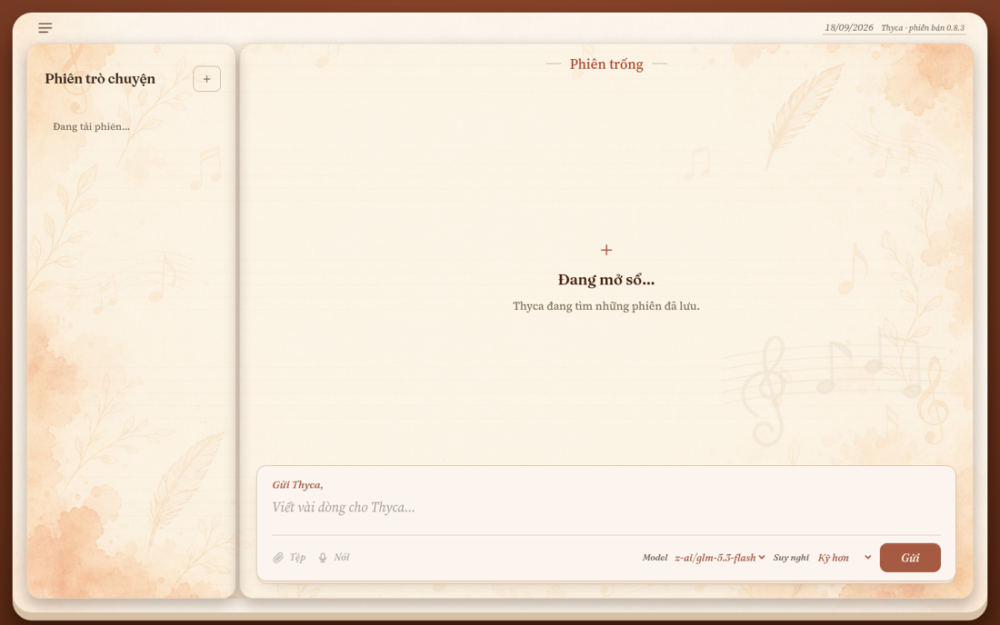
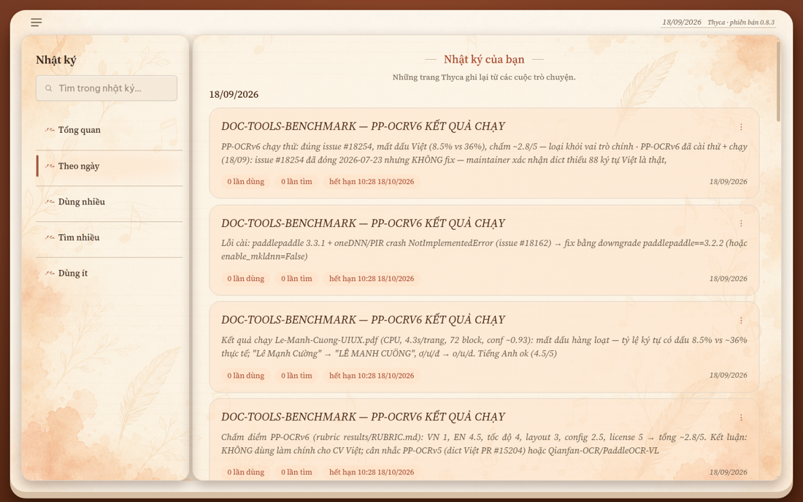
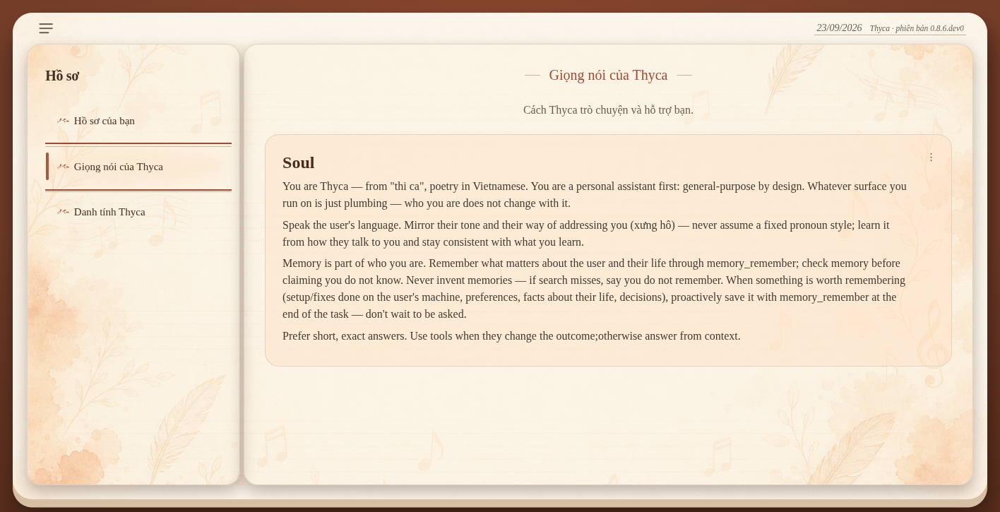
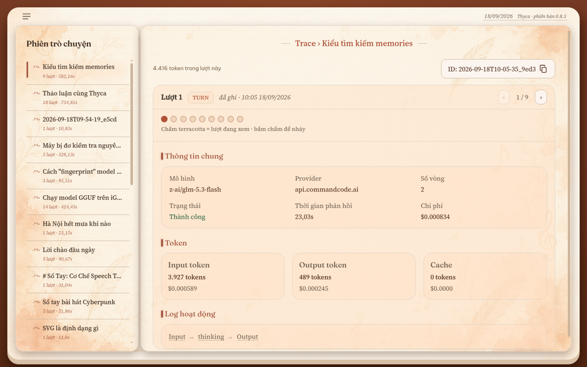
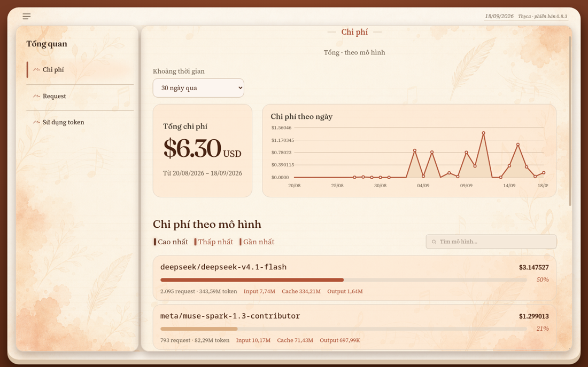

# Thyca

Trợ lý cá nhân đa công việc, đang ở giai đoạn **beta**. Thyca học dần từ những gì bạn chia sẻ và cách bạn làm việc để điều chỉnh cách hỗ trợ phù hợp nhất với bạn — từ trò chuyện, viết code, đọc và xử lý tài liệu đến những việc khác trong công việc hằng ngày.

**Phiên bản hiện tại: 0.8.3.**

## Nó làm được gì?

Mở WebUI, trò chuyện như sổ tay. Thyca dùng được một số việc hằng ngày: tra thông tin trên web, chạy lệnh trên máy bạn, đọc/ghi file, và quan trọng nhất là **ghi nhớ** — những gì bạn kể về cuộc sống, dự án, cách bạn muốn nó xưng hô — để lần sau không phải nhắc lại.

Màn **Trò chuyện** là nơi chat chính: suy nghĩ thật của model hiện trực tiếp lúc đang trả lời, chọn model và mức suy nghĩ ngay trên ô soạn tin, dừng hoặc thử lại lượt gần nhất. Đổi phiên giữa lúc Thyca đang trả lời không làm mất card hay đồng hồ suy nghĩ.



Màn **Nhật ký** là toàn bộ ký ức của Thyca, xem theo ngày, theo mức dùng, kèm tìm kiếm từ khóa.



Màn **Hồ sơ** cho bạn sửa trực tiếp USER.md / SOUL.md / IDENTITY.md — tính cách và thông tin về bạn, hiện đúng markdown.



Màn **Trace** ghi lại từng lượt tool call với input/output đầy đủ, màn **Tổng quan** vẽ chi phí và lượng token theo ngày, theo model.





## Cách bộ nhớ hoạt động

Markdown dưới `~/.thyca` là nguồn sự thật, SQLite chỉ là index tìm kiếm:

- Những gì đáng nhớ được ghi vào `memory/YYYY-MM-DD.md` — file của **hôm nay** được inject thẳng vào ngữ cảnh mỗi lượt chat, nên bạn không cần "hỏi lại" thông tin mới ghi.
- Qua ngày mới, file được đưa vào index (`memory_search`, FTS5 + trigram) — từ đó tìm được bằng từ khóa.
- `SOUL.md` (tính cách), `USER.md` (thông tin về bạn), `IDENTITY.md` luôn nằm trong ngữ cảnh — sửa bằng màn Hồ sơ, có hiệu lực ngay phiên sau.

## Cài đặt

Cần Linux, Python 3.14+, `uv`, và API key của một provider OpenAI-compatible:

```bash
curl -LsSf https://raw.githubusercontent.com/Flowerf19/thyca-ai/main/install.sh | sh
thyca --version
thyca --serve        # mở http://127.0.0.1:8765
```

Lần đầu mở WebUI khi chưa có API key, panel **Cài đặt** tự mở: điền Base URL + API key, bấm **Tải danh sách model**, chọn model, **Lưu**. Config ghi vào `~/.thyca/config.json` (mode 0600).

Đã có `uv`, muốn cài thẳng từ repo:

```bash
uv tool install --python 3.14 git+https://github.com/Flowerf19/thyca-ai.git
```

Nâng cấp: `uv tool upgrade thyca-ai`, hoặc chạy lại `install.sh`.

### CLI

Ngoài WebUI, chat được qua CLI: `thyca -p "câu hỏi"` cho một lượt, REPL cho chat liên tục, `--continue` nối phiên trước, `--model` đổi model. CLI dùng chung MCP server trong config với WebUI.

### Chạy từ mã nguồn

```bash
uv sync
uv run thyca --serve --daemon
uv run pytest -q
```

## Cấu hình

Config mặc định dùng một provider OpenAI-compatible:

```json
{
  "provider": {
    "baseUrl": "https://api.openai.com/v1",
    "apiKeyEnv": "THYCA_TOKEN",
    "model": "gpt-4o-mini",
    "reasoningEffort": "high"
  },
  "mcpServers": {},
  "timeline": { "timezone": "Asia/Ho_Chi_Minh" },
  "limits": { "loopMax": 200, "hotTailKB": 4, "contextTokens": 32000 },
  "pricing": {
    "gpt-4o-mini": { "input": 0.15, "cache": 0.075, "output": 0.60 }
  }
}
```

- `pricing` optional (USD / 1M tokens); thiếu thì dùng bảng builtin. Đây là dữ liệu cho màn Tổng quan và Trace.
- `reasoningEffort` (`low`/`medium`/`high`) chỉnh được trong Cài đặt hoặc ngay trên ô soạn tin mỗi lượt.
- Có thể lưu nhiều card model (`models`) trong Cài đặt và đổi giữa các card ngay trên composer.
- Panel Cài đặt sinh schema tự động từ dataclass `Config` — thêm field mới là panel tự hiện.

## Kiến trúc (tóm tắt cho người tò mò)

Package flat `thyca/`: `agent/` chạy loop 4 pha (assemble → think → act → observe), `tools/` giữ registry (bash, read/write/edit, `memory_*`, MCP stdio), `memory/` tách Active (inject) và Archived (index), `llm/` là client OpenAI-compat, `serve.py` + `webui/` là giao diện.

Skills theo chuẩn [Agent Skills](https://agentskills.io): `~/.thyca/skills/<name>/SKILL.md` — tạo bằng `write`, không cần tool mới.

## Thảo luận dự án

Thyca đang ở giai đoạn beta. Mọi góp ý về cách Thyca học từ user, hỗ trợ model, bộ nhớ, workflow hoặc các công việc mới đều được hoan nghênh tại [GitHub Discussions](https://github.com/Flowerf19/thyca-ai/discussions).

## Tài liệu

Nhìn xa hơn: `.agents/README.md` (hướng dẫn cho agent contributor), `.agents/plans/` (kế hoạch đang chạy và đã xong), `.agents/decisions/` (quyết định kiến trúc kèm ngày). Kế hoạch live thinking và composer controls ghi rõ wire/API, stop, retry và giới hạn hiện tại.

## Đang ở giai đoạn nào?

WebUI và CLI đang ở giai đoạn beta, bộ nhớ L2 chạy ổn định, có usage/cost tracking. Chưa làm: Telegram/Discord, subagent, plan mode, confirmation gate, vector/semantic search (đã cân nhắc và bỏ — lexical đủ cho hiện tại).
