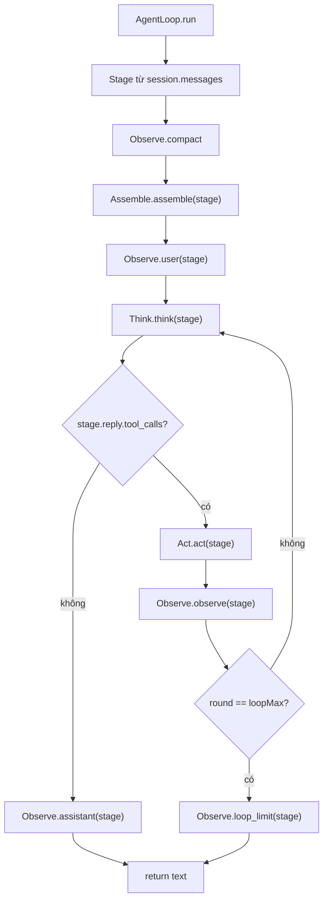
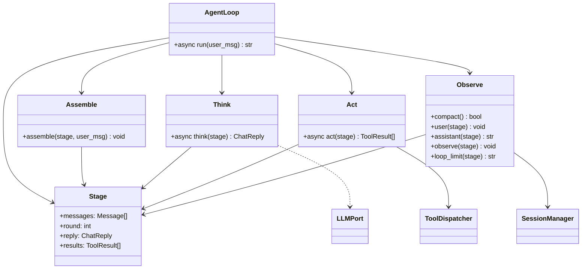

# Agent — assemble / think / act / observe

Bốn pha thao tác một `Stage` chung. `loop.py` tạo stage rồi gọi bốn class. Không HTTP, không builtin. `Message` / `ToolCall` / `ToolResult` ở `thyca/protocol.py`. `Cli` ở `thyca/cli.py`.

Không `thyca/agent.py` shim.

## Class

| Class | File | Việc |
|-------|------|------|
| `Stage` | `stage.py` | workspace lượt: `messages`, `round`, `reply`, `results` |
| `Assemble` | `assemble.py` | `assemble(stage, user_msg)` |
| `Think` | `think.py` | `think(stage)` → ghi `stage.reply` |
| `Act` | `act.py` | `act(stage)` → ghi `stage.results` |
| `Observe` | `observe.py` | compact / user / assistant / observe / loop_limit |
| `AgentLoop` | `loop.py` | tạo `Stage`, vòng `loopMax` |

```text
thyca/agent/
  stage.py
  assemble.py
  think.py
  act.py
  observe.py
  loop.py
  README.md
```

## Vòng một lượt





## Ranh giới

| Việc | Không nằm đây |
|------|----------------|
| Session JSONL I/O thô | `thyca/sessions/` |
| Hot files | `thyca/memory/active.py` |
| Tool handlers | `thyca/tools/` |
| OpenAI HTTP | `thyca/llm/client.py` (sau) |
| REPL / `-p` | `thyca/cli.py` |
