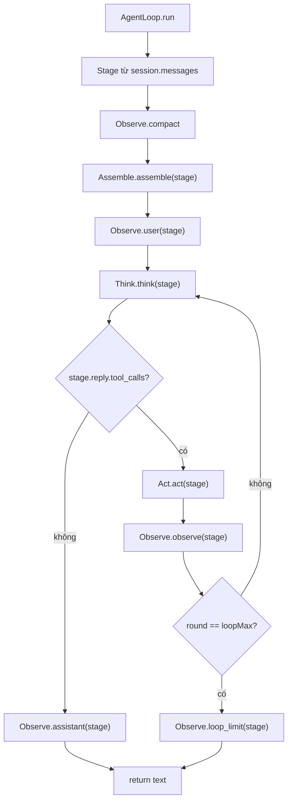
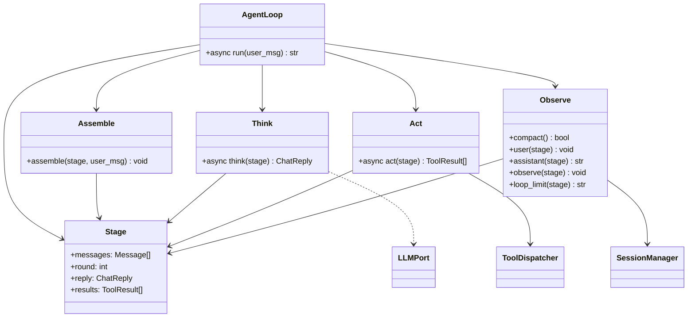

# Agent — assemble / think / act / observe

Bốn pha thao tác một `Stage` chung. `loop.py` tạo stage rồi gọi bốn class. Không HTTP, không builtin. `Message` / `ToolCall` / `ToolResult` ở `thyca/core/protocol.py`. Consumers: `thyca/app/` (M8: `Act`/`Assemble`/`AgentLoop`/`Observe`/`Think`/`LLMPort`), `thyca/serve/bridge.py` (M7: `TurnEvent`/`ThinkingDelta`/`ContentDelta`), `thyca/sessions/wire.py` + `thyca/serve/trace_api.py` (M5/M7: `skill_name_for_call`).

Không `thyca/agent.py` shim.

## Class

| Class | File | Việc |
|-------|------|------|
| `Stage` | `stage.py` | workspace lượt: `messages`, `round`, `reply`, `results` |
| `Assemble` | `assemble.py` | `assemble(stage, user_msg)` |
| `Think` | `think.py` | `think(stage)` → ghi `stage.reply` |
| `Act` | `act.py` | `act(stage)` → ghi `stage.results` (hàm module `_build_result` đóng gói `ToolResult`) |
| `Observe` | `observe.py` | compact / user / assistant / observe / loop_limit (persist qua `SessionManager`; meta/message builders nằm ở `meta.py`) |
| `AgentLoop` | `loop.py` | tạo `Stage`, vòng `loopMax` (callback `_reasoning_callback`/`_content_callback`, cost `_resolve_cost` là hàm module) |

```text
thyca/agent/
  stage.py       # Stage dataclass (shared workspace một lượt)
  assemble.py    # Assemble (inject PromptManager tường minh ở call-site)
  think.py       # Think + LLMPort Protocol (DIP — giữ nguyên)
  thinking.py    # ThinkingDelta
  reply.py       # ContentDelta
  act.py         # Act + ToolDispatcher Protocol (DIP — giữ nguyên)
  observe.py     # Observe (chỉ persist; builders ở meta.py)
  meta.py        # pure builders: assistant_meta / tool_message / reasoning[_details], không I/O
  events.py      # TurnEvent / EventSink / emit_event (contract event)
  loop.py        # AgentLoop orchestrate 4 pha
  README.md
```

## Vòng một lượt





## Ranh giới

| Việc | Không nằm đây |
|------|----------------|
| Session JSONL I/O thô | `thyca/sessions/` |
| Hot files | `thyca/memory/active.py` |
| Tool handlers | `thyca/tools/` |
| OpenAI HTTP | `thyca/llm/` |
| REPL / `-p` / chat app | `thyca/app/` |

## Ranh giới mới sau refactor (M1)

- `meta.py` pure, không I/O: `Observe` chỉ còn persist qua `SessionManager` + `_order_results`; mọi message/meta construction nằm ở `meta.py`, test được độc lập.
- Grammar skill (`^[a-z0-9]+(-[a-z0-9]+)*$`, max 64) do M6 (`thyca/skills/store.py`) sở hữu; `skill_event.py` đã dọn về `thyca/skills/` và import canonical từ `.store` — M1 (`act.py`) chỉ dùng public API (`skill_name_for_call`, `public_skill_name`).
- `Think` (`LLMPort`) và `Act` (`ToolDispatcher`) inject qua Protocol — giữ nguyên làm mẫu DIP; production call-site truyền `PromptManager()` tường minh vào `Assemble` (default `None` giữ lại cho backward-compat vì tests dựng `Assemble()` zero-arg).
