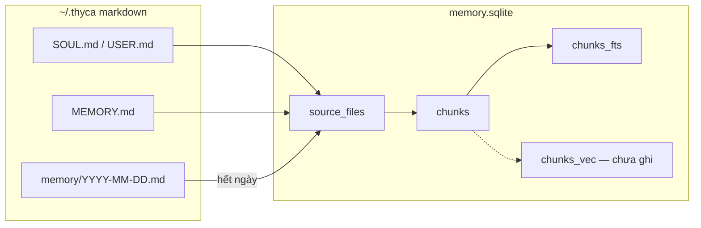

# Memory storage

Markdown dưới `~/.thyca` là nguồn sự thật. SQLite chỉ là mục lục. Vector không bao giờ ghi vào `.md`.

Mẫu đủ chữ + sqlite + chỗ vector: [`memories/example_store/`](../../memories/example_store/).

```text
~/.thyca/
  SOUL.md              # hồ sơ agent — Active full, index ngay, không TTL
  USER.md              # hồ sơ user — như SOUL
  MEMORY.md            # nhớ bền — Active tail 4KB, index ngay, có TTL
  memory/
    YYYY-MM-DD.md      # nhật ký ngày
  memory.sqlite        # index derived (FTS + sau này vec)
  sessions/*.jsonl     # hội thoại — không phải memory file
```



## File markdown

| File | Active (prompt) | Archived (index) | TTL / forget |
|------|-----------------|------------------|--------------|
| `SOUL.md` | cả file | ngay | không |
| `USER.md` | cả file | ngay | không |
| `MEMORY.md` | tail 4KB | ngay | có — hết hạn hoặc `forget` xóa khối `##` |
| `memory/hôm nay.md` | tail 4KB | **chưa** | ghi được; search L2 chưa thấy |
| `memory/ngày đã đóng.md` | hôm qua: tail lúc mở session | chunk + FTS | như MEMORY |

Một entry daily/MEMORY:

```md
## 08:00 — ăn sáng bún bò <!-- thyca {"id":"a1b2c3d4","imp":3,"exp":"2026-09-12T01:00:00Z"} -->
- Ăn bún bò Huế ở quán X
```

Hiện code vẫn ghi `thyca:id imp= exp=` (cùng nghĩa). Chốt format: JSON trong comment; strip comment lúc inject.

`imp`: 1=3 ngày, 2=1 tuần, 3=1 tháng (default), 4=3 tháng, 5=6 tháng.

## `memory.sqlite`

Không commit. Xóa `.md` → cascade hết hàng của file đó.

| Chỗ | Lưu gì | LLM thấy? |
|-----|--------|-----------|
| `meta` | `schema_version` | không |
| `source_files` | path, daily/canonical, ngày, mtime/size | không |
| `chunks` | một leaf: chữ, hash, `expires_at` | không — `get` lấy `text_raw` |
| `chunks_fts` | FTS5 trên `text_raw` (bỏ dấu lúc match) | không — snippet chữ có dấu |
| `chunks.embedding` / `chunks_vec` | vector 640-d — **chưa ghi** (GOAL-003) | không |

Ba cột chữ trên `chunks`:

| Cột | Việc |
|-----|------|
| `text_raw` | FTS + `get` + snippet (`cà phê`) |
| `text_norm` | trigram typo (`ca phe`) |
| `embed_text` | payload embed sau này (`title` + leaf) |

## Không lưu ở đâu

| Thứ | Không nằm ở |
|-----|-------------|
| Vector | `.md`, tool result, session JSONL |
| Session hội thoại | `memory/*.md` — nằm `sessions/*.jsonl` |
| Daily hôm nay | `chunks` / FTS |
| API key / embedding raw | log, JSONL meta |
