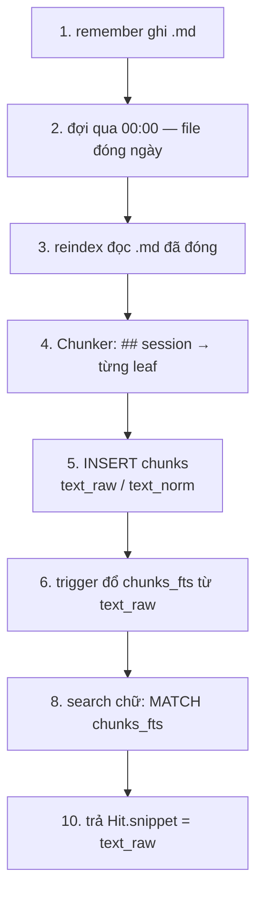

# L2 — markdown, SQLite (lexical; vector bị gỡ)

Một nguồn chữ, một file mục lục, hai lối tìm chữ (FTS5 + trigram). Embedding runtime đã gỡ (580ae03) — semantic path không nằm trong code; kiến trúc hybrid giữ frozen trong `.agents/plans/l2-memory-retrieval.md`.

Mẫu: [`memories/example_store/`](../../memories/example_store/).

```text
~/.thyca/memory/YYYY-MM-DD.md   # sự thật — 1 file = 1 ngày
~/.thyca/memory.sqlite          # mục lục derived — FTS5 + trigram (vector đã gỡ)
```

`memory.sqlite` không commit. Xóa `.md` → xóa hàng của file đó. Xóa sqlite → rebuild từ `.md`.

## Ai ghi, ai đọc

```text
remember / forget / reinforce  ──ghi──►  .md only
reindex                        ──đọc .md, ghi──►  memory.sqlite
search / get(id)               ──đọc──►  memory.sqlite only
get(path)                      ──đọc──►  .md thô
```

L2 không đọc `.md` khi search. LLM không SQL. Vector đã gỡ khỏi runtime (580ae03); kiến trúc semantic giữ frozen trong L2 plan.

Daily **hôm nay** chưa vào sqlite — prompt Active đã có chữ. Qua `00:00` file đóng ngày → `reindex` mới cắt leaf.

## Các bước — từ `.md` đến hit

`source_files` không nằm trên đường này. Nó là sổ phụ ở bước 5 (1 hàng/file: path, mtime, cascade khi xóa `.md`).



Triển khai theo số: 1–6 + 8 + 10 đã có. Bước vector (embed + cosine) đã bị gỡ 580ae03 — xem GOAL-007 trong L2 plan.

Hai lối tìm cùng trỏ một `chunk_id`. Khác câu hỏi, không khác kho.

| Hỏi | Đi đâu | Cần số? |
|-----|--------|---------|
| Có chữ `cà phê` / `ca phe`? | `chunks_fts` | không |
| Gõ sai `thit quya`? | `chunks.text_norm` (Python, chưa có bảng) | không |
| Ý `món nướng hôm nọ` ≈ `thịt quay`? | — | frozen trong L2 plan (580ae03 gỡ) |

## Một leaf xuyên ba lớp

```md
# 2026-08-13
## 08:00 — ăn sáng bún bò <!-- thyca {"id":"a1b2c3d4","imp":3,"exp":"2026-09-12T01:00:00Z"} -->
- Ăn bún bò Huế ở quán X, 45k, khá ngon
- Nói chuyện với Luna về đồ án
```

Hai bullet → hai hàng `chunks`. Heading là session; comment JSON là tem máy (`id`/`imp`/`exp`). Parser chung: `thyca/memory/heading.py`. Sqlite **copy** id/exp ra cột; `heading_raw` / prompt đã strip comment.

```text
.md  ──Chunker──►  Chunk
                     ├─ text_raw      FTS + get + snippet
                     └─ text_norm     typo
                          │
                          ▼
                   INSERT chunks
                          └─ trigger → chunks_fts(text_raw)
```

`embed_text` đã bị gỡ khỏi `Chunk` (580ae03); vector là kiến trúc frozen trong L2 plan.

## `chunks` giữ gì

| Cột | Việc |
|-----|------|
| `chunk_id` / `session_id` | `ngày#entry#leaf` / `ngày#entry` |
| `text_raw` | chữ có dấu — FTS + snippet |
| `text_norm` | bỏ dấu, thường — typo |
| `content_hash` | sha256 structural — diff reindex |
| `expires_at` / `forgotten_at` | TTL lifecycle (GOAL-006) |

`chunks_fts` khớp không dấu (`unicode61`), trả snippet **có dấu**.

Schema v3 không còn cột `embedding`/`profile_id` — vector là kiến trúc frozen trong L2 plan (GOAL-007).

## Không nằm ở đây

| Thứ | Không nằm ở |
|-----|-------------|
| Vector | runtime — đã gỡ (580ae03); chỉ còn trong L2 plan frozen |
| Hội thoại | `memory/*.md` — nằm `sessions/*.jsonl` |
| Daily hôm nay | `chunks` / FTS |
