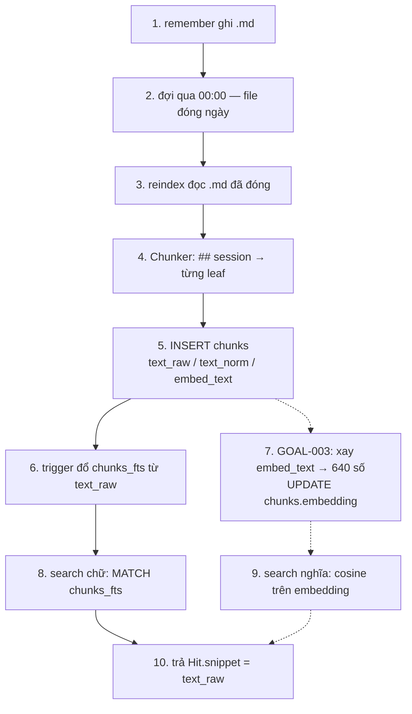

# L2 — markdown, SQLite, sqlite-vec

Một nguồn chữ, một file mục lục, hai lối tìm. Vector không bao giờ ghi vào `.md`.

Mẫu: [`memories/example_store/`](../../memories/example_store/).

```text
~/.thyca/memory/YYYY-MM-DD.md   # sự thật — 1 file = 1 ngày
~/.thyca/memory.sqlite          # mục lục derived — FTS + (sau này) vec
```

`memory.sqlite` không commit. Xóa `.md` → xóa hàng của file đó. Xóa sqlite → rebuild từ `.md`.

## Ai ghi, ai đọc

```text
remember / forget / reinforce  ──ghi──►  .md only
reindex                        ──đọc .md, ghi──►  memory.sqlite
search / get(id)               ──đọc──►  memory.sqlite only
get(path)                      ──đọc──►  .md thô
```

L2 không đọc `.md` khi search. LLM không SQL. Số (vector) không vào tool result.

Daily **hôm nay** chưa vào sqlite — prompt Active đã có chữ. Qua `00:00` file đóng ngày → `reindex` mới cắt leaf.

## Các bước — từ `.md` đến hit

`source_files` không nằm trên đường này. Nó là sổ phụ ở bước 5 (1 hàng/file: path, mtime, cascade khi xóa `.md`).



Triển khai theo số: 1–6 + 8 + 10 đã có. 7 + 9 chưa. Số nằm `chunks.embedding` BLOB — không tạo `chunks_vec` ở v1.

Hai lối tìm cùng trỏ một `chunk_id`. Khác câu hỏi, không khác kho.

| Hỏi | Đi đâu | Cần số? |
|-----|--------|---------|
| Có chữ `cà phê` / `ca phe`? | `chunks_fts` | không |
| Gõ sai `thit quya`? | `chunks.text_norm` (Python, chưa có bảng) | không |
| Ý `món nướng hôm nọ` ≈ `thịt quay`? | `chunks.embedding` | có — chưa gắn |

## Một leaf xuyên ba lớp

```md
# 2026-08-13
## 08:00 — ăn sáng bún bò <!-- thyca {"id":"a1b2c3d4","imp":3,"exp":"2026-09-12T01:00:00Z"} -->
- Ăn bún bò Huế ở quán X, 45k, khá ngon
- Nói chuyện với Luna về đồ án
```

Hai bullet → hai hàng `chunks`. Heading là session; comment JSON là tem máy (`id`/`imp`/`exp`). Parser chung: `thyca/memory/heading.py`. Sqlite **copy** id/exp ra cột; `heading_raw` / prompt đã strip comment.

```text
.md  ──Chunker──►  Chunk
                     ├─ text_raw      FTS + get + snippet
                     ├─ text_norm     typo
                     └─ embed_text    chỉ để xay 640 số (title + leaf)
                          │
                          ▼
                   INSERT chunks
                          ├─ trigger → chunks_fts(text_raw)
                          └─ sau này  → embed(embed_text) → chunks.embedding
```

`embed_text` không phải thứ agent đọc.

## `chunks` giữ gì

| Cột | Việc |
|-----|------|
| `chunk_id` / `session_id` | `ngày#entry#leaf` / `ngày#entry` |
| `text_raw` | chữ có dấu — FTS + snippet |
| `text_norm` | bỏ dấu, thường — typo |
| `embed_text` | nguyên liệu vector |
| `expires_at` | copy từ comment heading |
| `embedding` | BLOB dự phòng — hiện `NULL` |

`chunks_fts` khớp không dấu (`unicode61`), trả snippet **có dấu**.

Vector = cột `chunks.embedding`. Reindex upsert theo `chunk_id`: cùng `embedding_hash` thì giữ BLOB.

## Không nằm ở đây

| Thứ | Không nằm ở |
|-----|-------------|
| Vector | `.md`, snippet, session JSONL |
| Hội thoại | `memory/*.md` — nằm `sessions/*.jsonl` |
| Daily hôm nay | `chunks` / FTS / vec |
