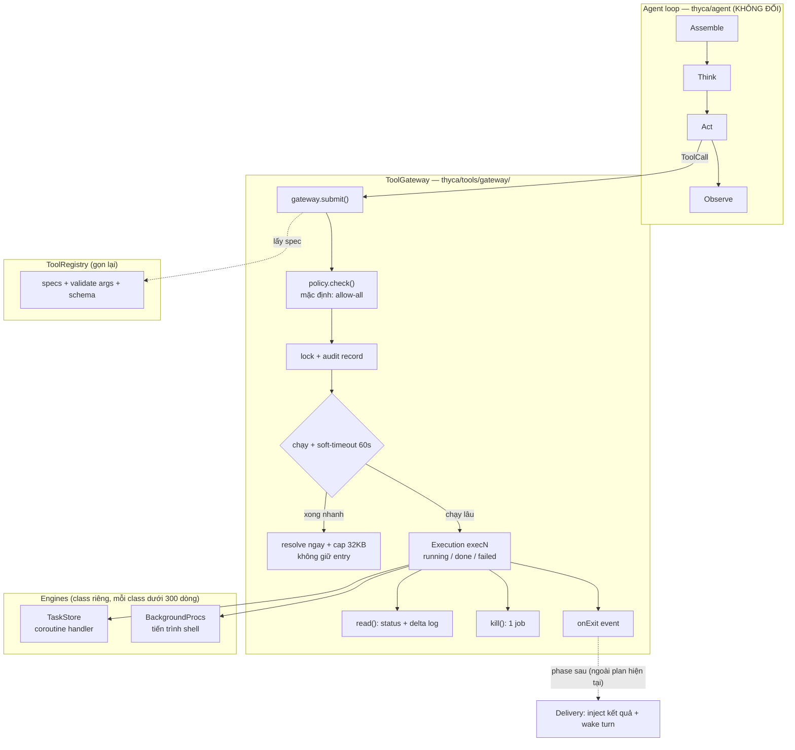
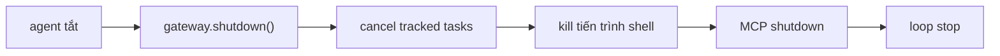

# ToolGateway

Cửa thực thi duy nhất cho mọi tool Thyca: một đường `submit`, một loại
execution record, một backend cho việc nền, một lệnh shutdown. Thiết kế chi
tiết: `.agents/plans/tool-gateway-unified-execution.md`.

## Kiến trúc



Shutdown thống nhất một lệnh:



## Bố cục package

```text
thyca/tools/gateway/
  __init__.py    # re-export ToolGateway, Execution
  gateway.py     # ToolGateway: submit/read/kill/shutdown
  execution.py   # Execution record + status + id gen (execN)
  policy.py      # policy hook + allow-all default
  background.py  # BackgroundProcs: engine tiến trình shell
  README.md      # file này
```

Engines: `TaskStore` giữ nguyên vị trí, `BackgroundProcs` dời về
`gateway/background.py`. Gateway import cả hai.

## Contract cốt lõi

- Mọi tool đi qua `submit()`; việc nhanh resolve ngay, việc chậm thành
  tracked `Execution` với id thống nhất `execN`.
- `policy.check()` chạy ở cửa vào, mặc định cho qua hết (rule thật là
  feature riêng sau này).
- `read()` trả trạng thái + log, chỉ phần mới từ lần xem trước (delta).
- Mọi reply cap 32KB tổng, chia đầu 8KB + đuôi 24KB; bị cắt là phải kèm
  marker ghi số byte ẩn + cách đọc tiếp.
  Muốn đọc full: `read(id, offset, limit)` phân trang theo dòng trong buffer giữ
  lại (1MB đầu, quá thì báo gap thật — không giữ vô hạn, không bịa).
- `kill()` dừng một tracked execution; `shutdown()` dọn sạch tất cả.
- `onExit` event để dành cho delivery/fire-and-continue (phase sau).
